# 2015级项目实训成果展示 

##  《love-pet》  - HTML5与移动互联网开发

our first cooperation

* [Github](https://github.com/weixiaoming120/love-pet) 

### 项目简介

**I宠app**是一个集记录宠物日常、宠物健康、实现领养、寄养宠物等功能为一体的宠物APP,红色的界面，以及简单易懂的操作是本app的一大特色

### 项目成员

* 魏小明 (项目经理，产品，服务器代码开发，测试) 
    * Email: <876343215@qq.com>
    * Github : [https://github.com/weixiaoming120](https://github.com/weixiaoming120)
* 张萌 (服务器代码开发，原型设计，测试) 
    * Email: <843354450@qq.com>
    * Github : [https://github.com/Monmeng](https://github.com/Monmeng)
* 张娜 (服务器端代码开发 ， 原型设计， 测试 )
    * Email: <1508956045@qq.com  >
    * Github : [https://github.com/Zhangna3moli](https://github.com/Zhangna3moli)
* 窦昕茹（客户端代码开发、测试、原型设计）
    * Email: <1172010644@qq.com>
    * Github : [https://github.com/douoooou](https://github.com/douoooou)
* 王子冰 (客户端代码开发  测试  原型设计)
    * Email: <2119285613@qq.com>
    * Github : [https://github.com/wangzibingmy](https://github.com/wangzibingmy)
    
    
### 运行效果
#### 前端
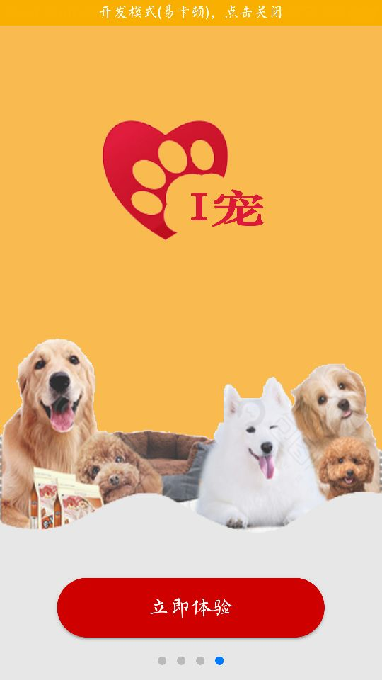
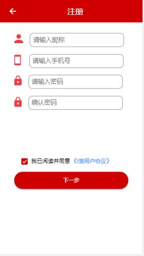
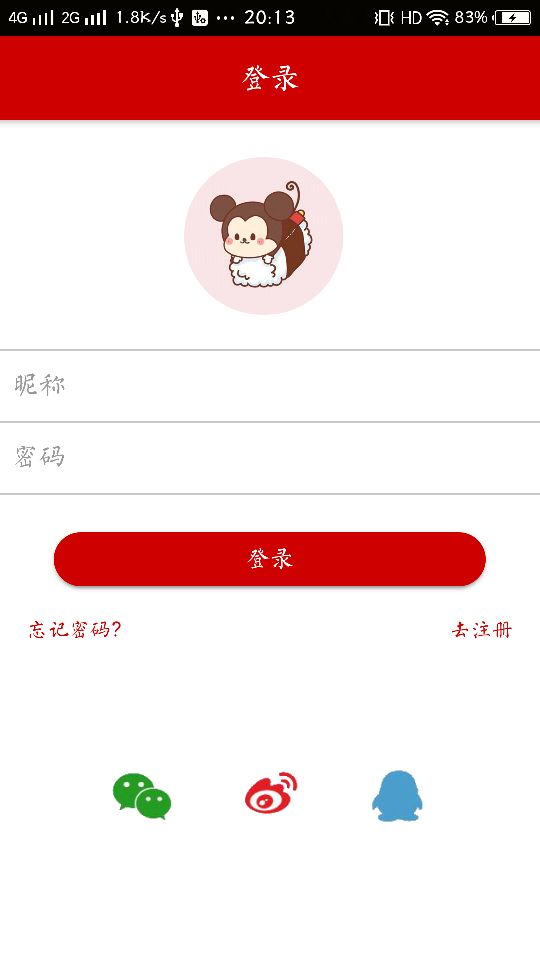
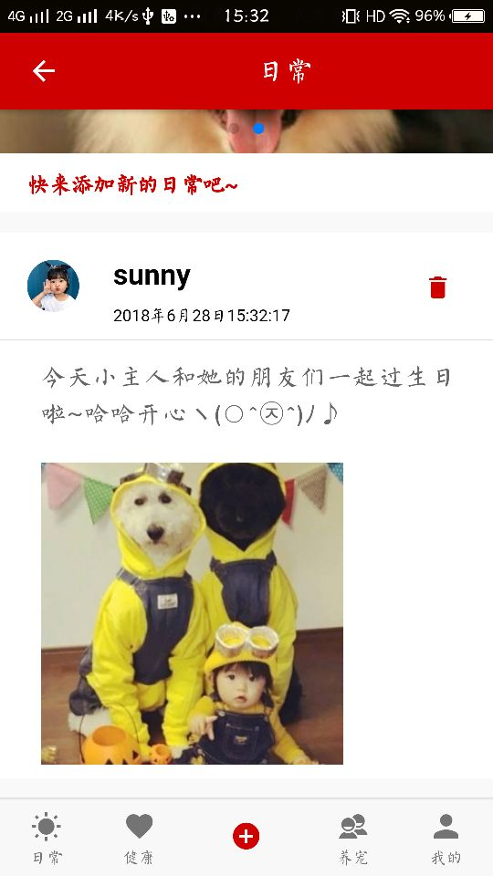
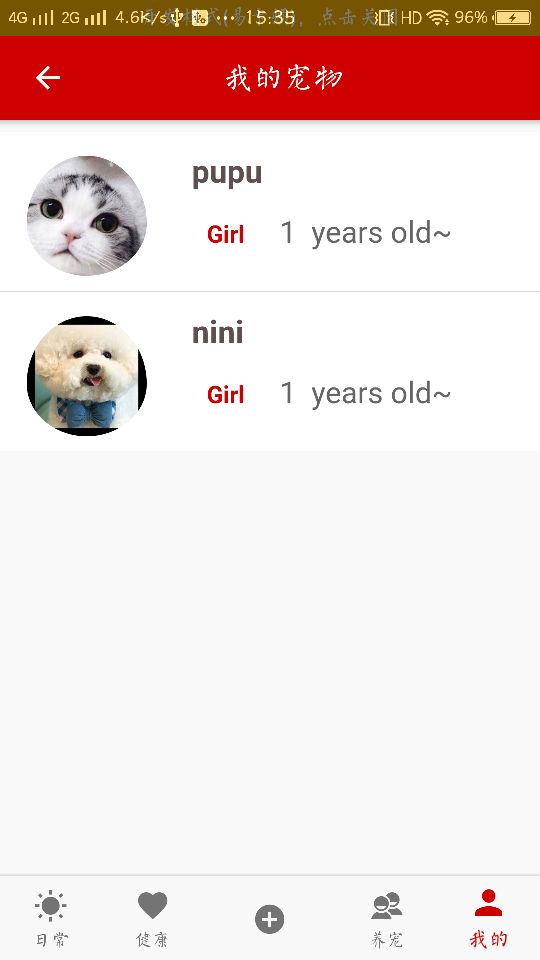
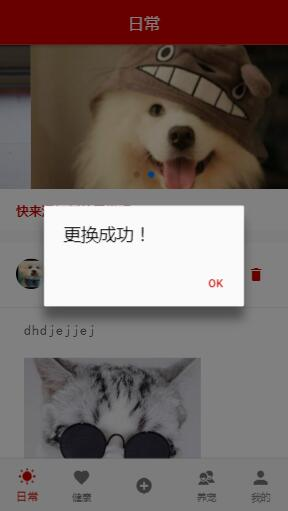
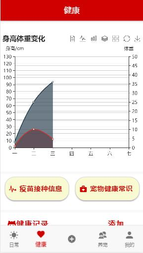
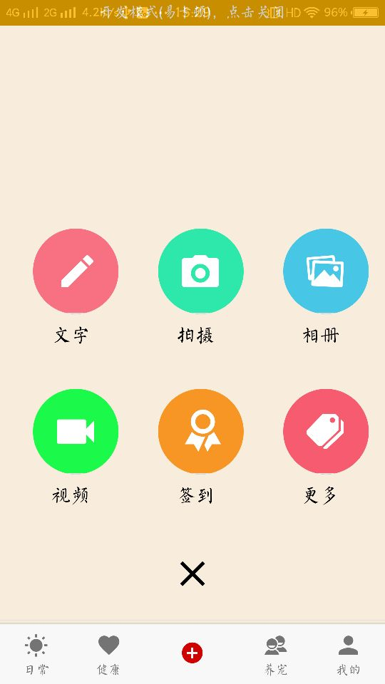
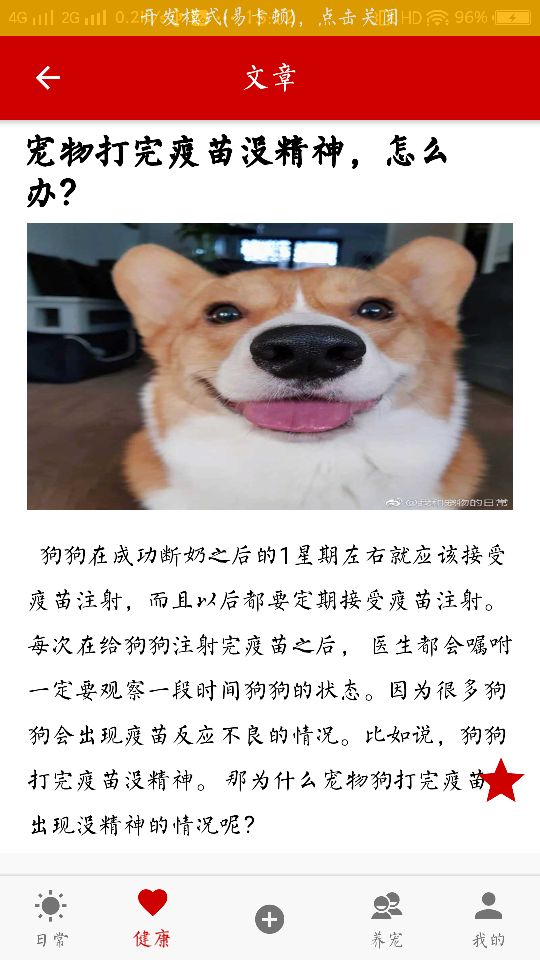
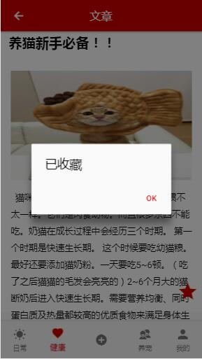
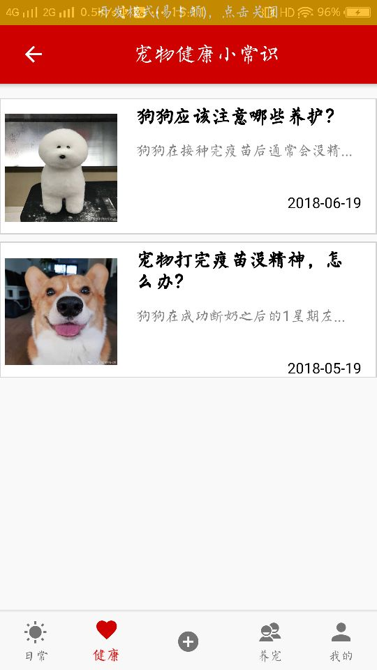
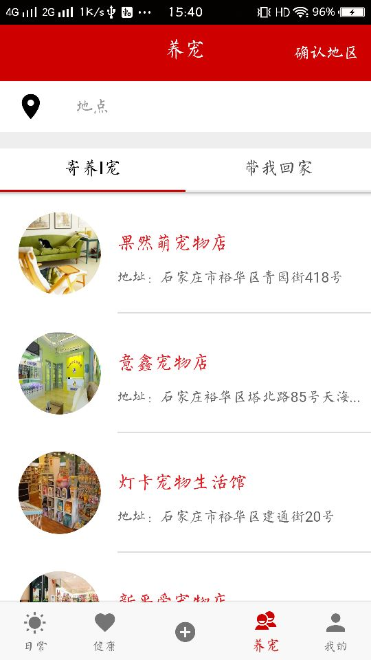
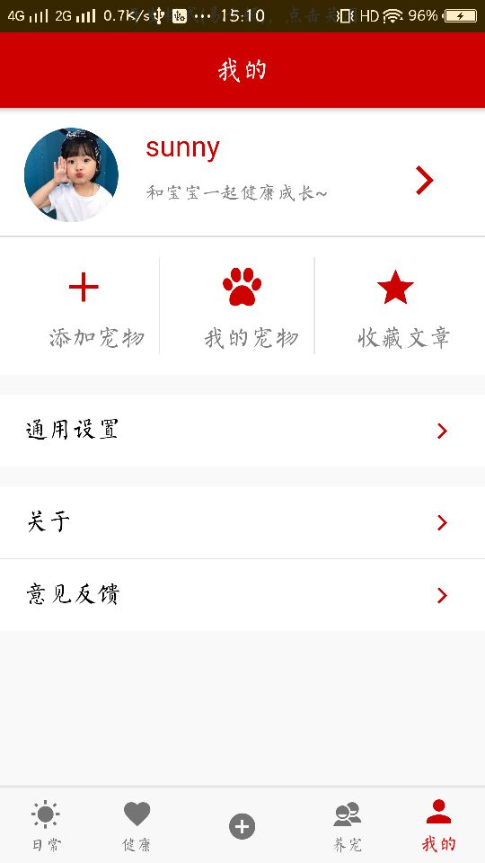
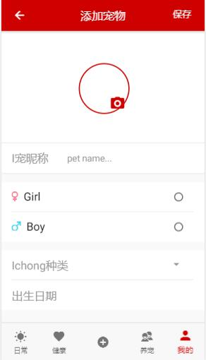

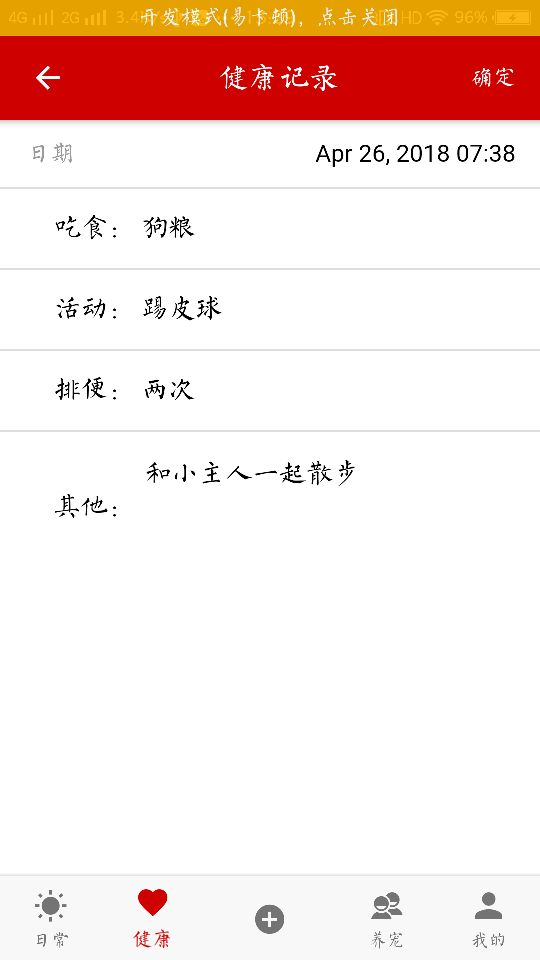
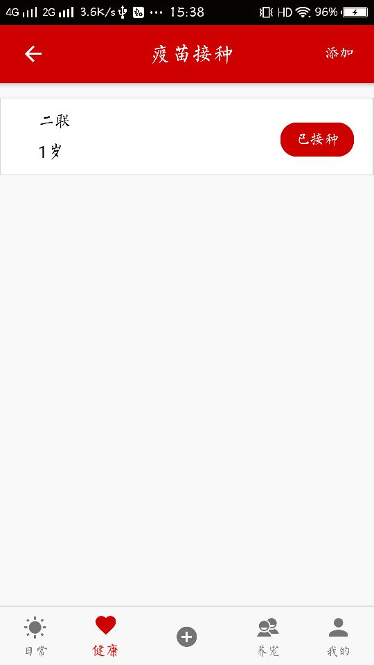

#### 后台管理系统
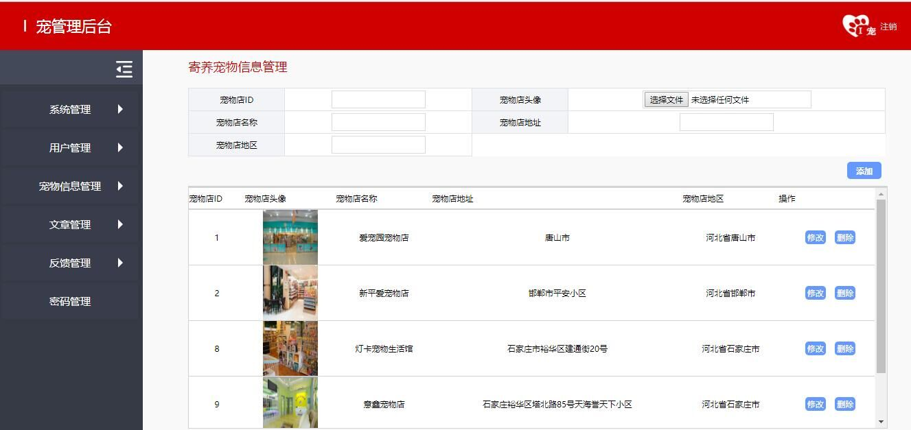
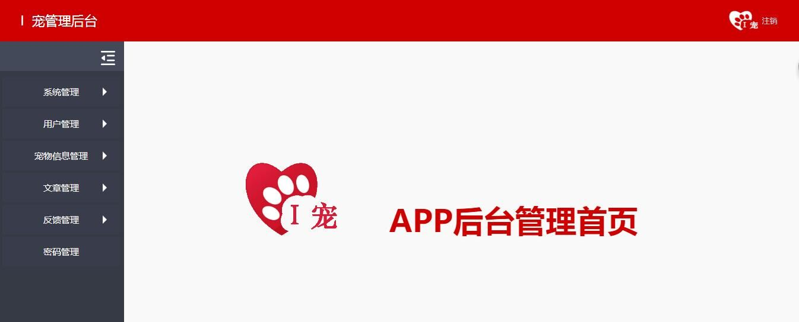

