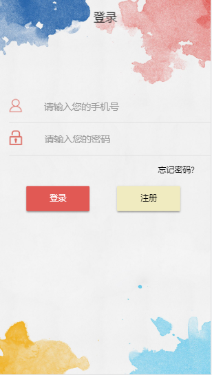
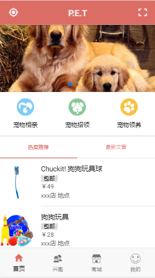
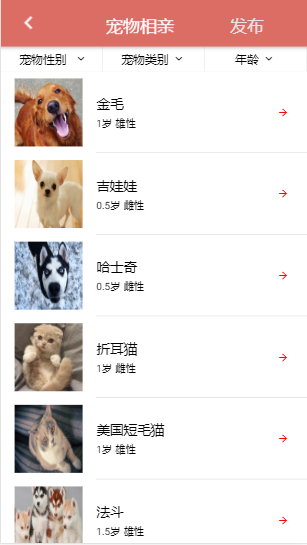
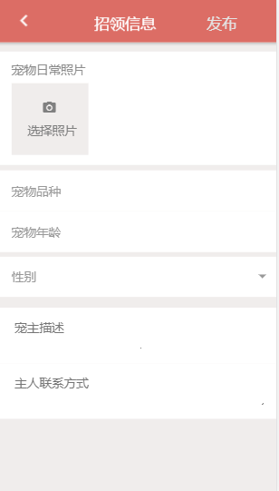
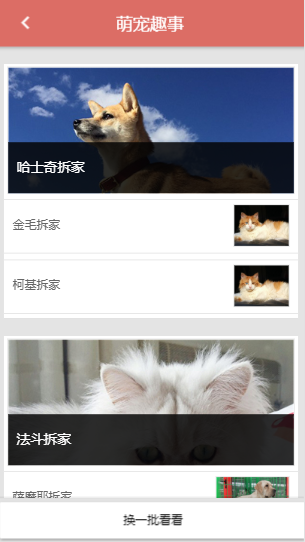
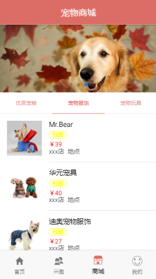
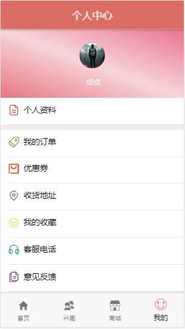



# 2015级项目实训成果展示 

##  《PET》  - HTML5与移动互联网开发

### 仓库地址：[https://github.com/ObjectsTeam/PET](https://github.com/ObjectsTeam/PET)

### 项目简介

随着当今生活水的提高，人们对于宠物的需求及相关的宠物用品的重视度也日益提升，但在宠物行业发展的同时，也出现了大量被遗弃的流浪宠物。由爱心人士或官方创办的流浪宠物收容所也应运而生，但由于宣传力度以及人们的重视程度不足。大量的被收容的流浪宠物在救助站内的不到领养面临到期安乐死的命运。

本app旨在通过网络运营的方式，为宠物救助站及收容所提供一个专业且统一的网络平台，用于对爱心社会人士提供流浪宠物的寄养、领养及宠物转售、以及其他的与宠物饲养相关的功能。
  
### 项目成员

* 张意诚（项目负责人，UI设计，数据库设计，客户端代码开发，服务端代码开发）
    * 学号：2015015215
    * Email：<1239271010@qq.com>
    * Github：[https://github.com/zhangyicheng95](https://github.com/zhangyicheng95)
    
* 张兵（客户端代码开发）
    * 学号：2015015214 
    * Email：<1013784073@qq.com>
    * Github：[https://github.com/zhangbing1612](https://github.com/zhangbing1612)
    
* 王洪章（客户端代码开发）
    * 学号：2015015243   
    * Email：<1055394048@qq.com>
    * Github：[https://github.com/Marionettess](https://github.com/Marionettess)
        
* 王一丁（客户端代码开发，测试）
    * 学号：2015015498      
    * Email：<18332162353@163.com>
    * Github：[https://github.com/wangyiding97](https://github.com/wangyiding97)
            
* 霍彦儒（客户端代码开发，测试）
    * 学号：2015015259        
    * Email：<408074739@qq.com>
    * Github：[https://github.com/HuoYanru](https://github.com/HuoYanru)
                
* 王炜（客户端代码开发）
    * 学号：2015015286          
    * Email：<2944982361@qq.com>
    * Github：[https://github.com/wangwei12](https://github.com/wangwei12)
### 项目截图
  
  
  
  
  
  
  
  
