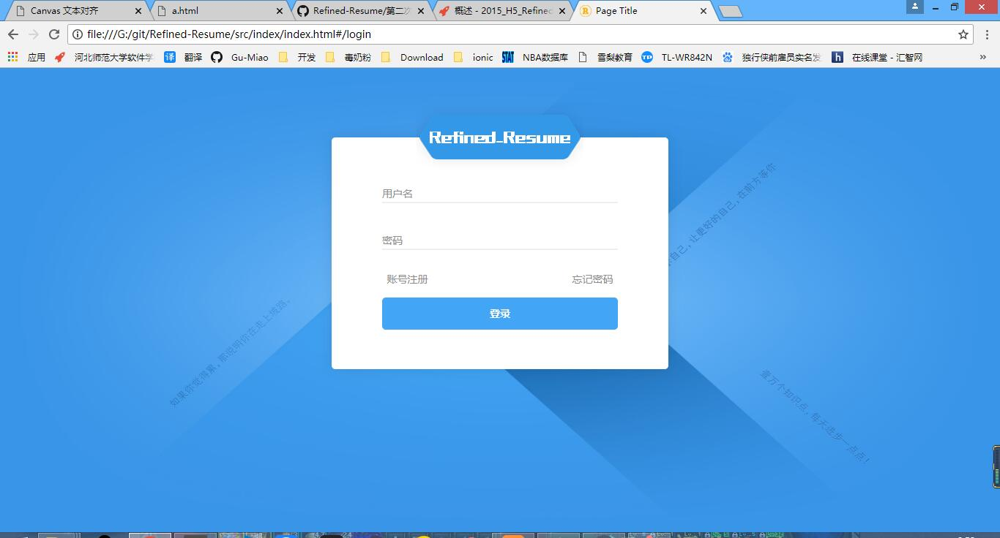
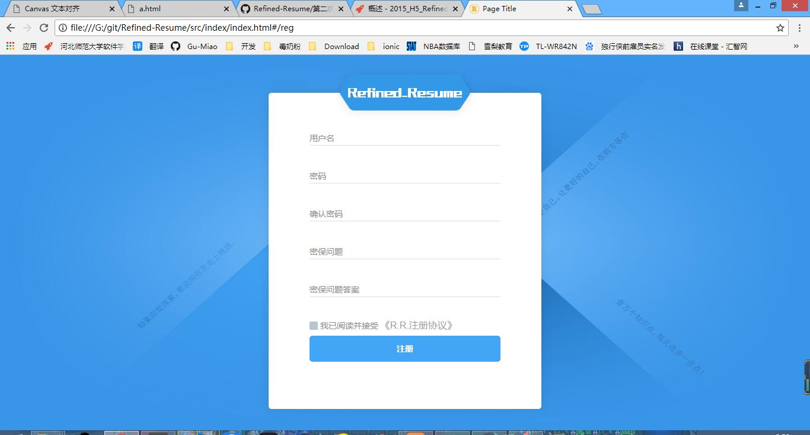
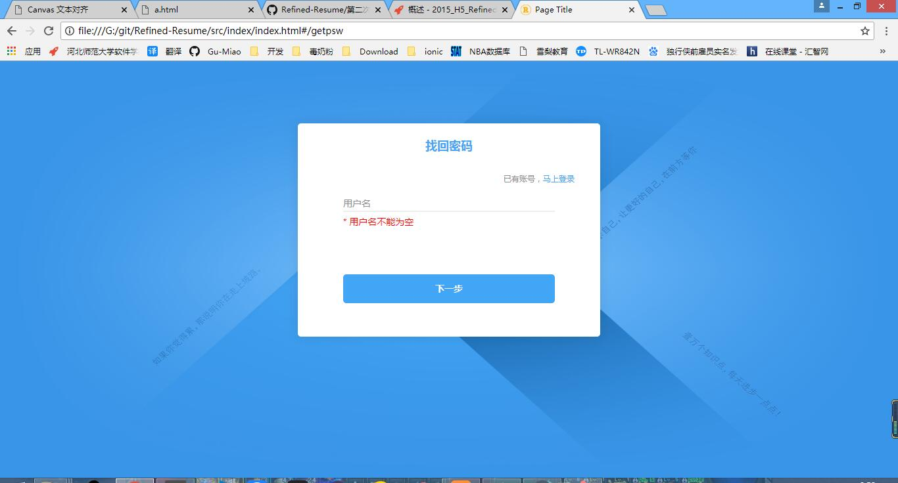
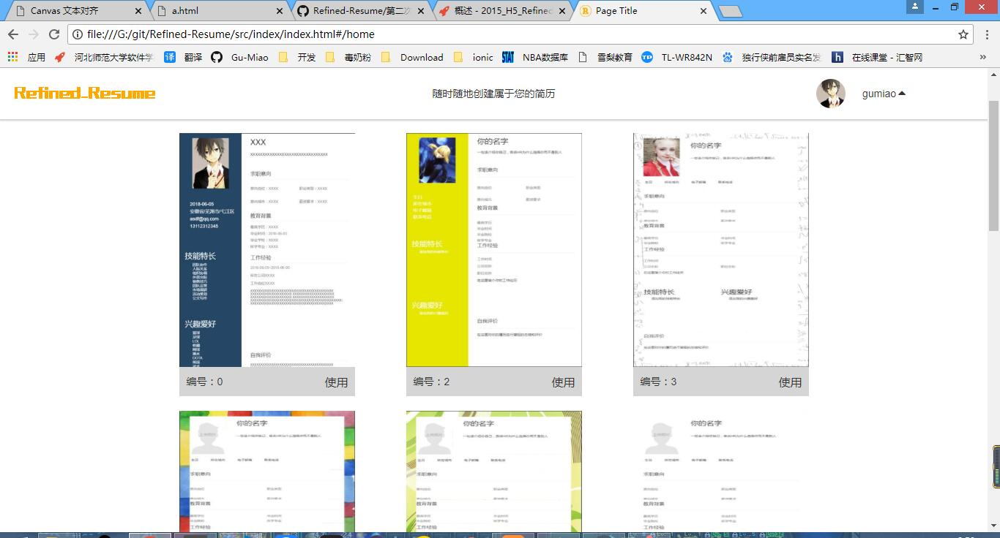
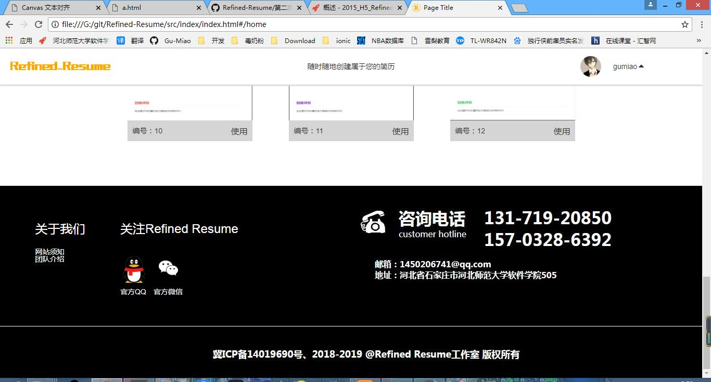
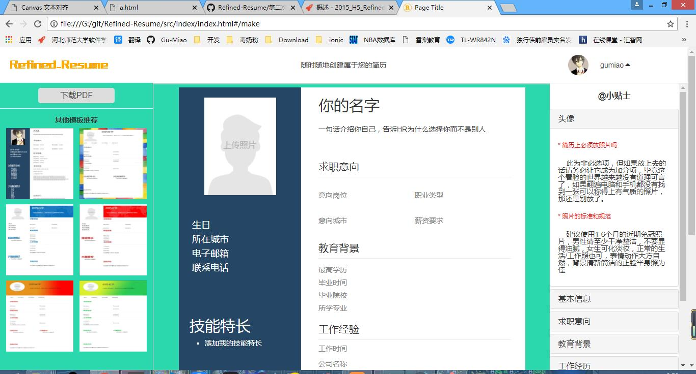
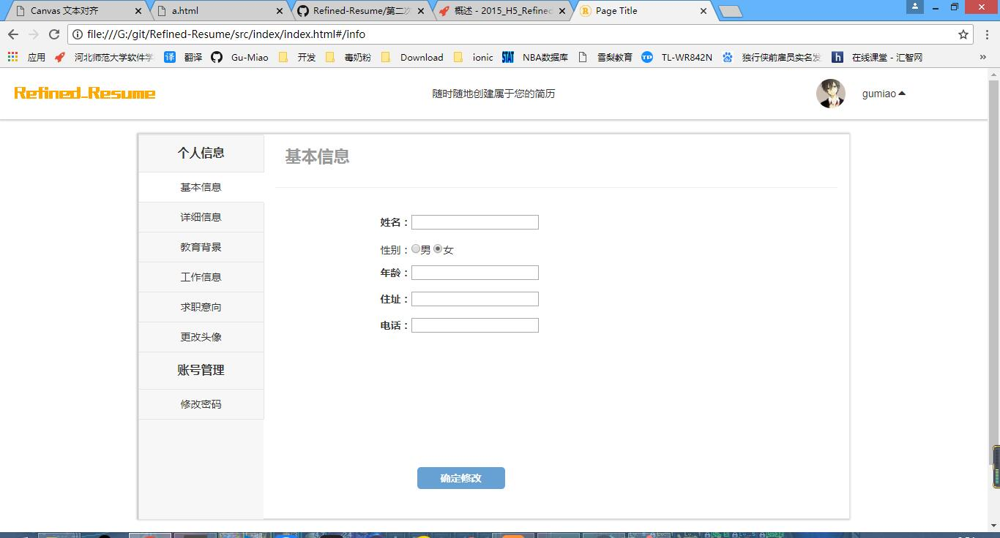



# 2015级项目实训成果展示 

##  《Refined Resume》  - HTML5与移动互联网开发

* [Github](https://github.com/gu-miao) 

### 项目简介

**Refinde Resume**是一款面向求职者的在线制作个人简历的网站

对大学毕业生来说，求职的头一件大事就是做好个人求职简历。个人简历是求职者给招聘国家单位发的一份简要介绍。包含自己的基本信息：姓名、性别、年龄、民族、籍贯、学历、联系方式，以及自我评价、工作经历、学习经历、荣誉与成就、求职愿望、对这份工作的简要理解等等。以简洁重点为最佳标准。在一般找工作都是在通过网络来找，因此一份良好的个人简历对于获得面试机会至关重要。  
Refinde Resume面向所有用户提供高效、个性的简历设计服务。为职场新人提供个人简历模板下载服务,打造最适合的简历。在简历的编写过程中，提醒用户突出重点，提示易错信息，布局结构条理清晰，突出用户的个性。

### 项目成员

* 谷淼 
    * Email: <1450206741@qq.com>
    * Github : [https://github.com/gu-miao](https://github.com/gu-miao)
* 张高翔 
    * Email: <1694474987@qq.com>
    * Github : [https://github.com/duoleyisui](https://github.com/duoleyisui)
* 刘京 
    * Email: <295062608@qq.com>
    * Github : [https://github.com/peanut](https://github.com/peanut)

### 用户面向

对个人简历有需求的求职者或者个人

### 分工

任务|负责人
-|-
核心技术|谷淼，刘京，张高翔
HTML|张高翔
CSS|刘京
JS|刘京，张高翔
后台|谷淼
数据库|谷淼

### 运行效果

