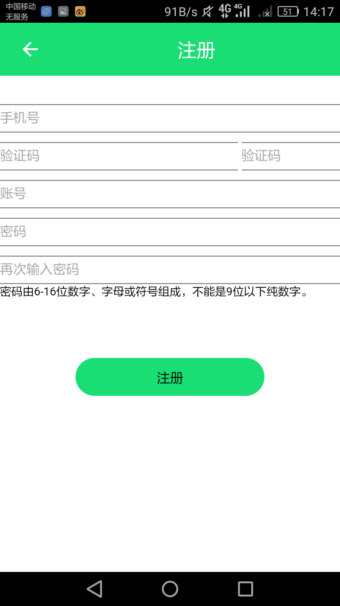
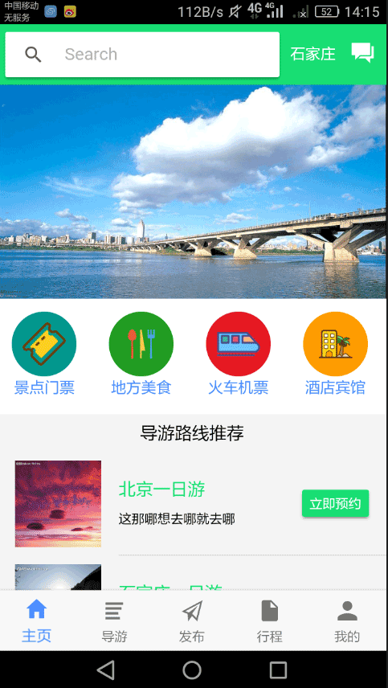
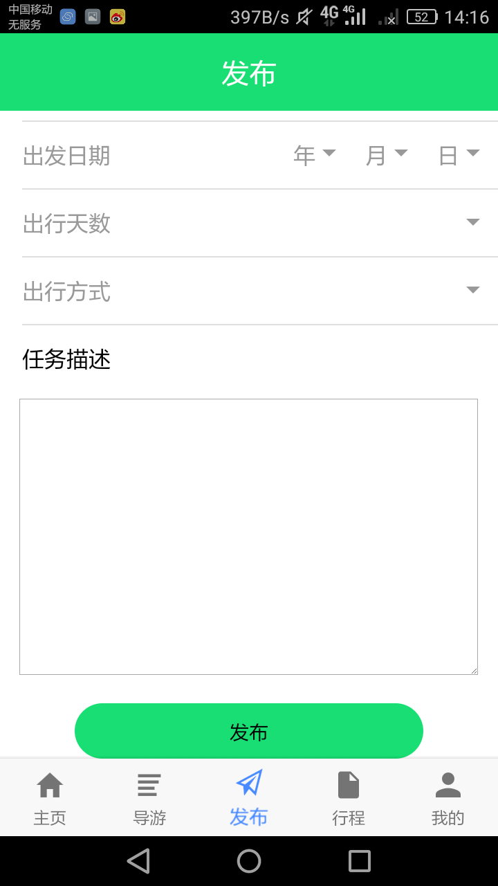
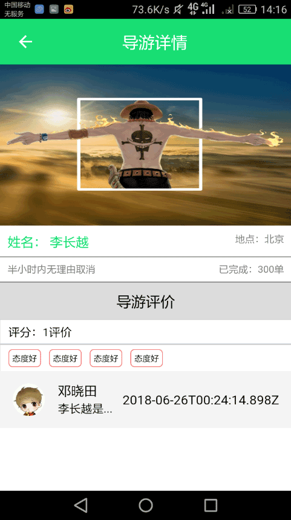



# 2015级项目实训成果展示 

##  《全民旅游》  - HTML5与移动互联网开发

* [Github](https://github.com/zhangxinsong/qmly) 

### 项目简介

**全民旅游**本产品是一款针对游客直接面对导游的旅游 APP。
2016 年 8 月 3 日，中国互联网络信息中心（CNNIC）在京发布第 38 次《中国互联网 络发展状况统计报告》。报告显示，截至 2016 年 6 月，中国网民规模达 7.10 亿，互联网 普及率达到 51.7%，手机网民规模达 6.56 亿。 同时，移动互联网塑造的社会生活形态进 一步加强，网上支付，电子商务应用的快速发展不断拓展和丰富线下消费模式和支付场景， 使得平台化，场景化，智能化成为互联网发展新方向。 2016 年我国国内旅游人次 44.4 亿，同比上升 11%。国家旅游局预计 2017 年全年国内 旅游人数同比增长 10%。2016 年我国出境旅游人数 1.22 亿人次，同比增长 4.3%；预计 17 年同比增长 4%。虽然增速仍维持低位，但近期东南亚局部认为高速增长，而港澳和欧 洲恢复也较为明显。根据“十三五”旅游业发展规划，国内旅游人数年均增速目标为 9.9%， 未来五年仍维持平稳增长。 在旅游业发展的情况下，人们的生活水平日益提高，因此对于旅游的需求日益增长， 而且旅游的方式已经不能满足目前人们的需求。在这种情况下，我们这款 APP 可以满足 任何人旅游的需求。如今的旅游方式只有旅游团和自驾游，旅游团旅游的方式虽然安全， 但是形式单一，不能满足人们的意愿，而且旅游团的以经济实惠为理由欺骗游客，旅游的 服务与其所述不符。之前爆出的强买强卖的行为使好多人游客不在相信旅游团的旅游方式。 自驾游是现在较主流的旅游方式，但是游客对出行地点不熟悉，很可能受到当地商户的蒙 骗，而且一般景点周围的东西或者宾馆酒店都会存在价格偏高的行为，所以我们 APP 给 游客提供专业的一对一的服务，而且可以自行与导游商议旅游行程，我们的导游也可以根 据您的需求来指定属于您的旅游行程。而且在导游的领导下，不会让您受到被骗的行为， 一切根据你的需求来制定。我们的导游都是对当地的文化和景点等非常熟悉的本地人。
全民旅游旨在为大学生提供一个方便，快捷的二手交易平台，如今大学生同校二手交易主要运用QQ作为媒介发布消息，消息浏览不便且信息更新不及时，过程繁琐。全民旅游采用了一种新型独特的商品展示方式，以地图为载体，在卖家发布商品的地点直接展示商品，商品信息浏览更加方便直观，商品信息实时更新，除了有新型地图页商品展示方式，传统的列表显示方式依然存在。全民旅游还实现了实时聊天的功能，使双方的交易更加方便、快捷。

### 项目成员

* 张新松 (项目经理，产品，UI设计，客户端代码开发) 
    * Email: <648831686@qq.com>
    * Github : [https://github.com/zhangxinsong](https://github.com/zhangxinsong)
* 邓晓田 (服务器代码开发，产品) 
    * Email: <1726297786@qq.com>
    * Github : [https://github.com/1726297786](https://github.com/1726297786)
* 李尚文 (客户端代码开发，测试)
    * Email: <742954900@qq.com>
    * Github : [https://github.com/lishangwen6](https://github.com/lishangwen)
* 李长越 (客户端代码开发，测试)
    * Email: <412753100@qq.com>
    * Github : [https://github.com/lichangyue](https://github.com/lichangyue)

### 运行效果

