# 2015级项目实训成果展示 

##  《悦动》  - HTML5与移动互联网开发

### 项目地址

* [前端Github](https://github.com/Sunhuizhe/yuedong-project)

* [后台Github](https://github.com/GuoLiBin6/review)

### 项目简介

生活水平在提高，学生坐在教室学习，白领坐在办公室办公，很多人一天下来也没有多少运动量，对身体健康有明显的影响。

**悦动**为喜爱运动者提供了一个信息交流的平台。你可以在这里发布活动，让别的小伙伴参加。也可以和别的小伙伴约一场酣畅淋漓的运动。

### 项目成员

1. 耿康宁（项目经理）

   * Email:948891770@qq.com
 
   * [Github:https://github.com/gengkangning](https://github.com/gengkangning)

2. 郭丽斌（后台代码开发，测试，UI）

   * Email:782518577@qq.com
 
   * [Github](https://github.com/GuoLiBin6)
 
3. 孙慧喆（前端代码开发，测试，UI）

   * Email:674277449@qq.com
 
   * [Github](https://github.com/Sunhuizhe)

4. 黄纯浩（前端代码开发）

   * Email:1575994297@qq.com
 
   * [Github](https://github.com/hh970304)
 
### 项目截图
 
 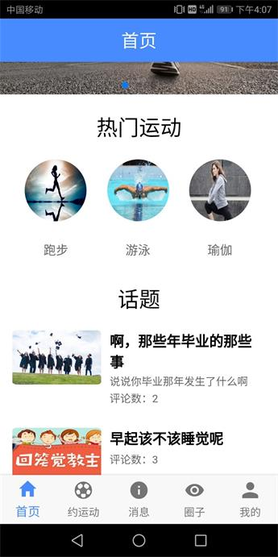
 
 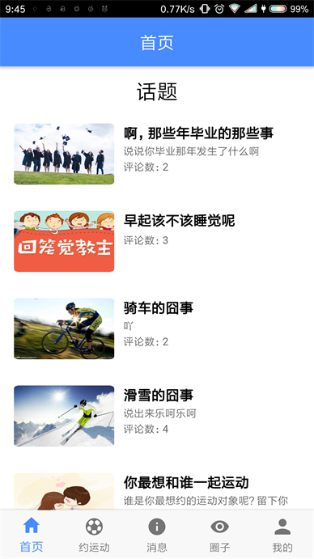
 
 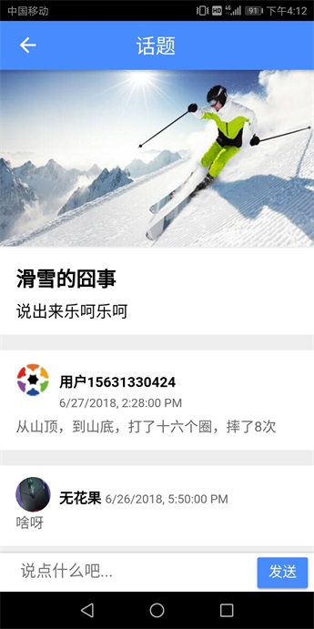
 
 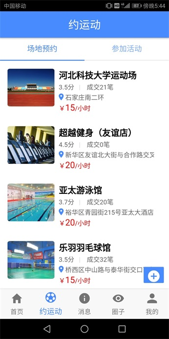
 
 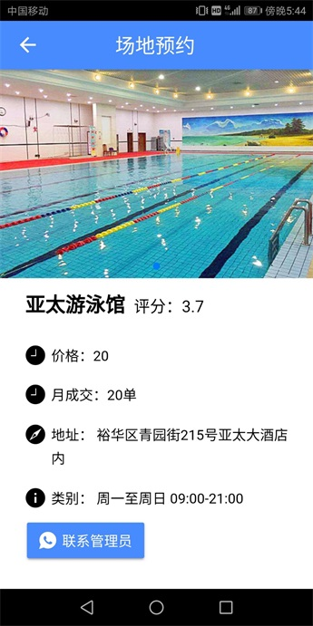
 
 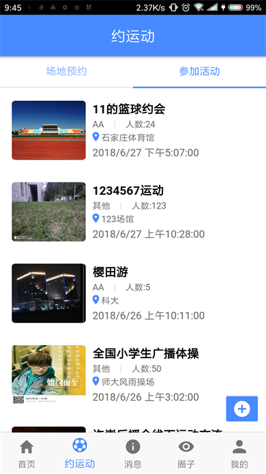
 
 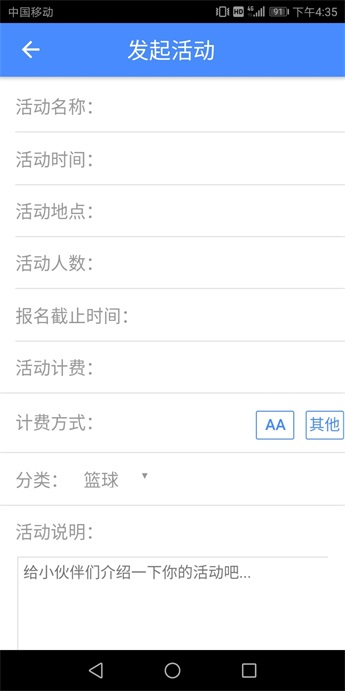
 
 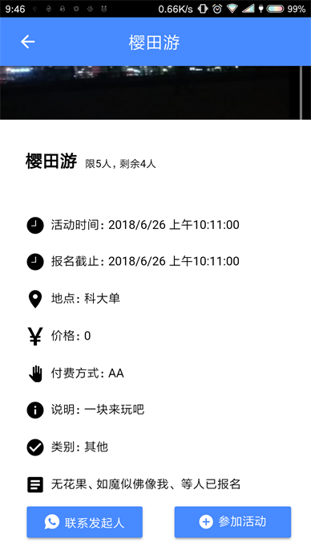
 
 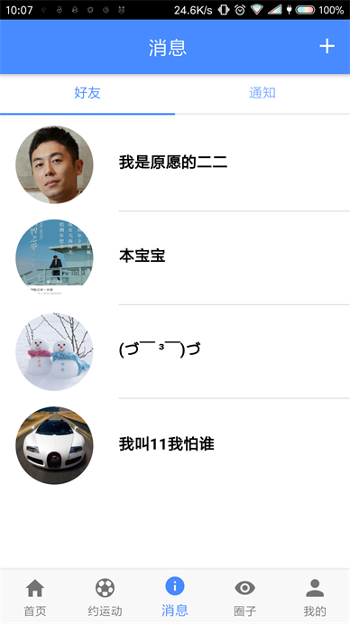
 
 
 
 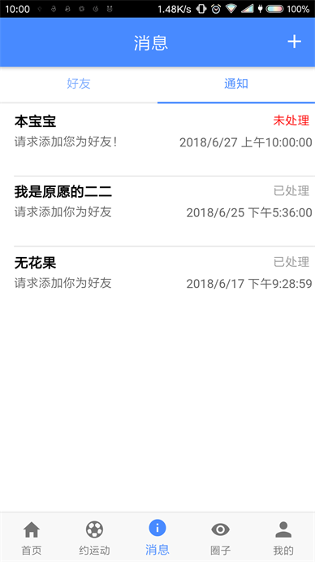
 
 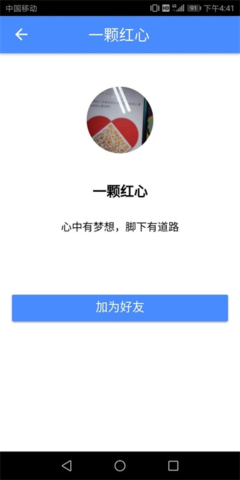
 
 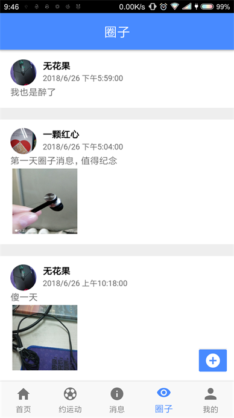
 
 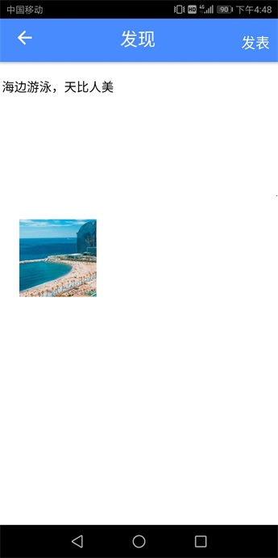
 
 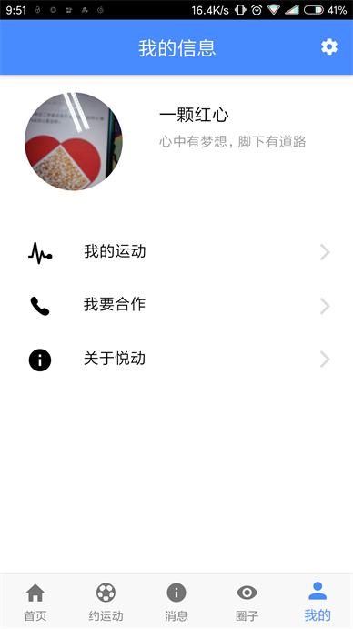
 
 
