# 2015级项目实训成果展示 

##  《 易·直聘(YI_Directhire)》  - HTML5与移动互联网开发

+ [Github](https://github.com/LiuYJia/YI_Directhire)

### 项目简介

**易·直聘**是一款可实现简历投递、职位发布与获取、人员与职位收藏，简易实时聊天与附近职位获取功能的求职招聘APP。
  
在互联网迅速发展的大背景下，新一代的人逐渐成为劳动市场的主力军，随着获取信息方式的改变，在招聘与求职方面出现了以往不同的方式，这一代人更愿意从相关APP软件商获取相关信息，**易·直聘**便旨在提供这一信息来源。

### 项目成员

+ 刘永佳（Manager/Developer）   
   + Email：1158502533@qq.com
   + Github：https://github.com/LiuYJia
+ 魏巍（Developer）
   + Email：827045489@qq.com
   + Github：https://github.com/Mrweiwei
+ 冯露露（Developer）
   + Email：2277196352@qq.com
   + Github：https://github.com/fengluluf
+ 邢佳蕾（Developer）
   + Email：2461539948@qq.com
   + GIthub：https://github.com/xingjialei

### 技术栈
+ 前端：AngualrJS+Ionic
+ 后台：Node.js+Express+Ejs+Bootstrap
+ 数据库：Mysql
## 运行效果
&nbsp;&nbsp;&nbsp;&nbsp;&nbsp;&nbsp;&nbsp;&nbsp;
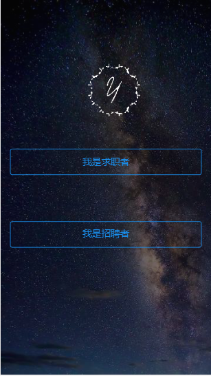&nbsp;&nbsp;&nbsp;&nbsp;&nbsp;&nbsp;&nbsp;&nbsp;
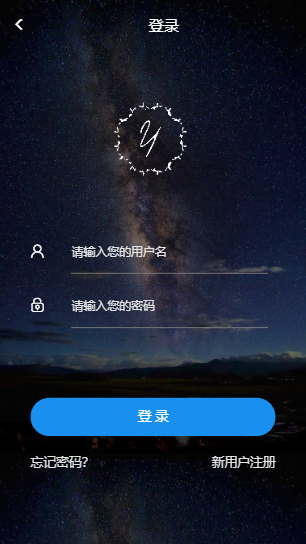&nbsp;&nbsp;&nbsp;&nbsp;&nbsp;&nbsp;&nbsp;&nbsp;
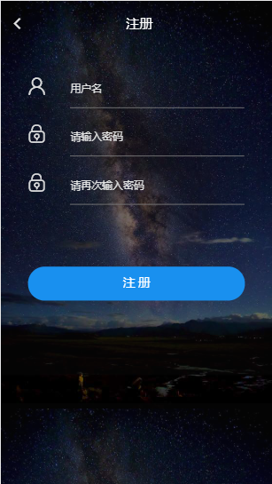&nbsp;&nbsp;&nbsp;&nbsp;&nbsp;&nbsp;&nbsp;&nbsp;
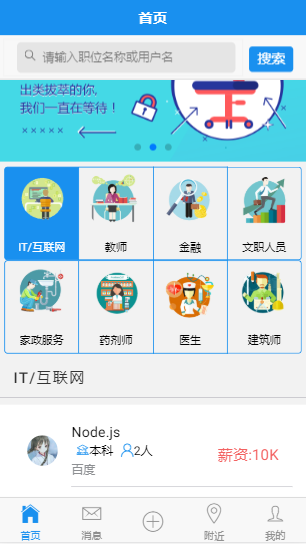&nbsp;&nbsp;&nbsp;&nbsp;&nbsp;&nbsp;&nbsp;&nbsp;
&nbsp;&nbsp;&nbsp;&nbsp;&nbsp;&nbsp;&nbsp;&nbsp;
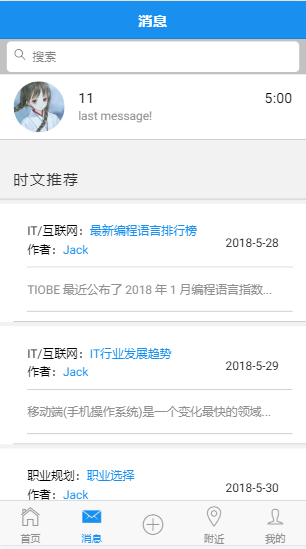&nbsp;&nbsp;&nbsp;&nbsp;&nbsp;&nbsp;&nbsp;&nbsp;
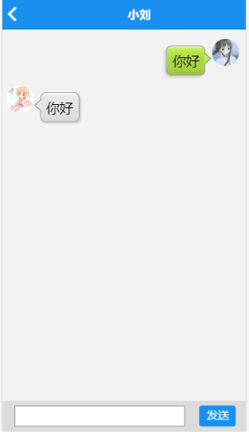&nbsp;&nbsp;&nbsp;&nbsp;&nbsp;&nbsp;&nbsp;&nbsp;
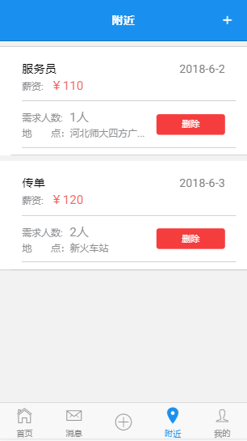&nbsp;&nbsp;&nbsp;&nbsp;&nbsp;&nbsp;&nbsp;&nbsp;
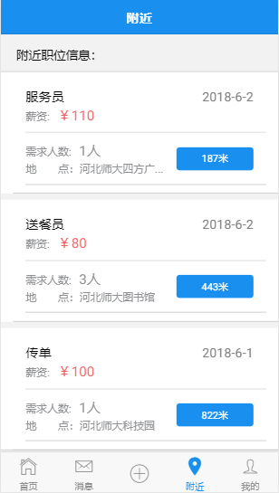&nbsp;&nbsp;&nbsp;&nbsp;&nbsp;&nbsp;&nbsp;&nbsp;
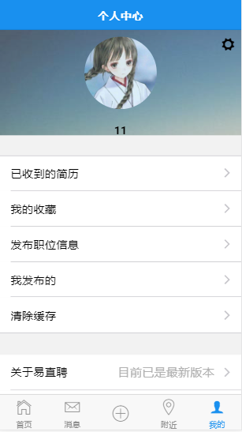&nbsp;&nbsp;&nbsp;&nbsp;&nbsp;&nbsp;&nbsp;&nbsp;
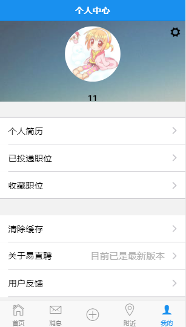&nbsp;&nbsp;&nbsp;&nbsp;&nbsp;&nbsp;&nbsp;&nbsp;
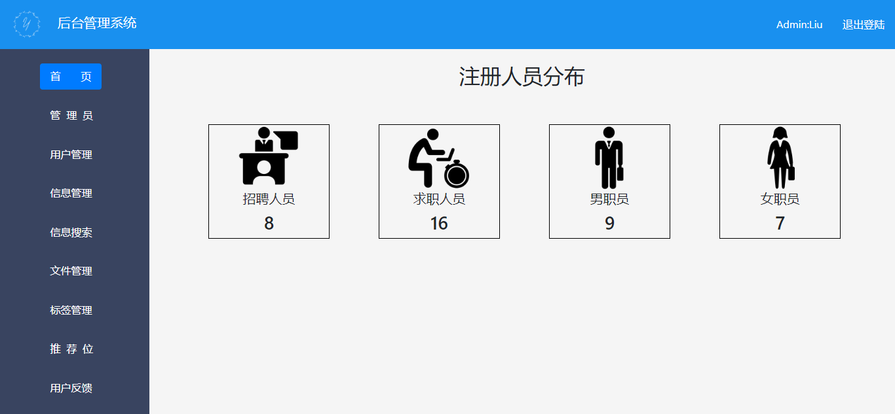&nbsp;&nbsp;&nbsp;&nbsp;&nbsp;&nbsp;&nbsp;&nbsp;
