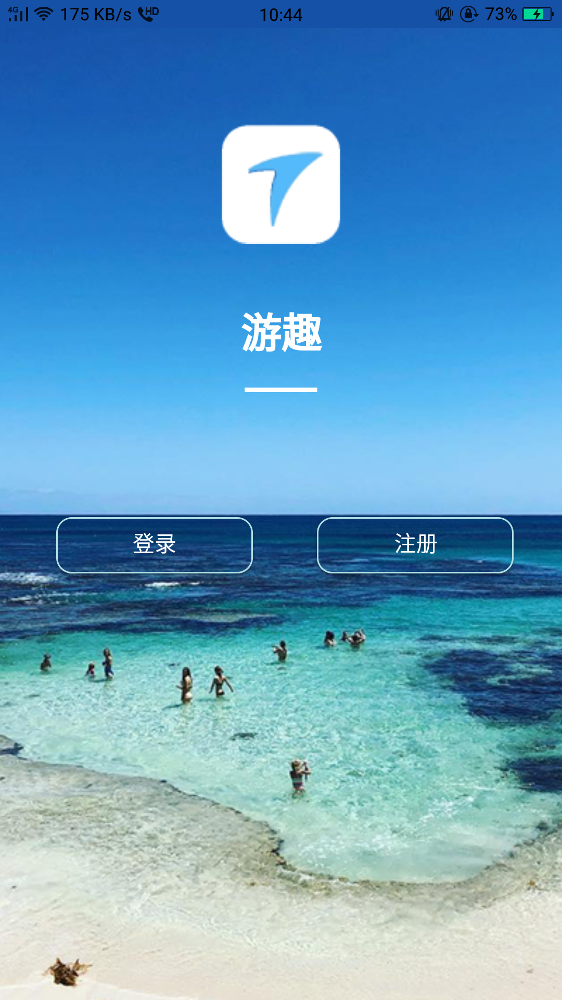
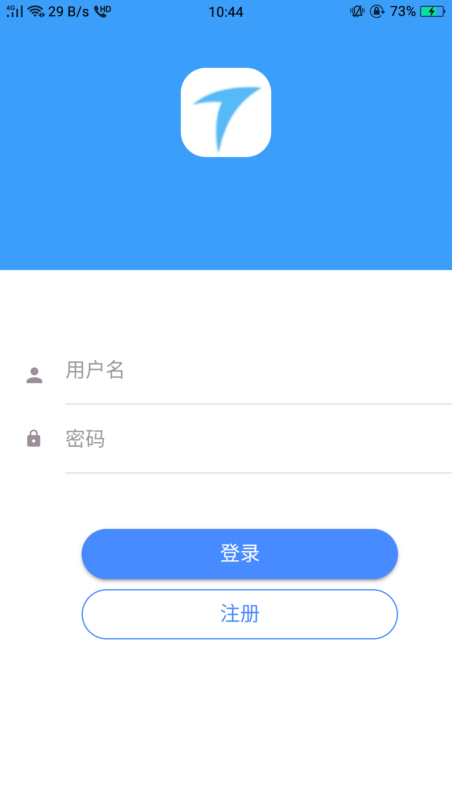
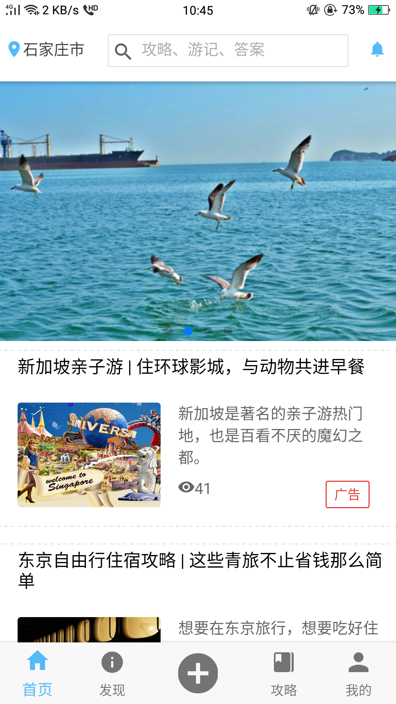
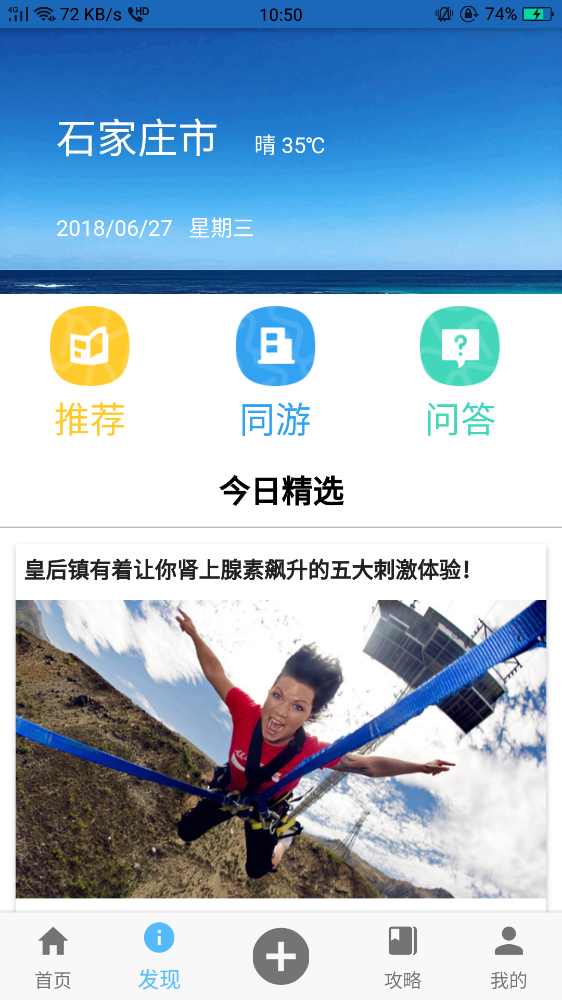
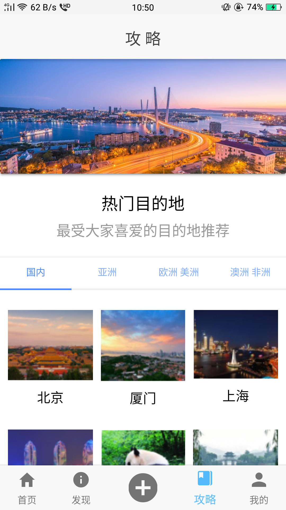
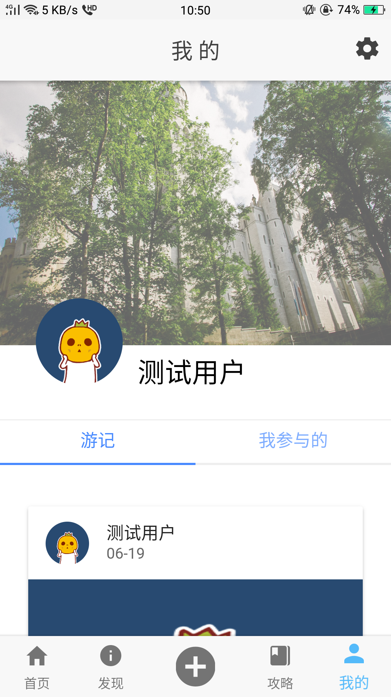
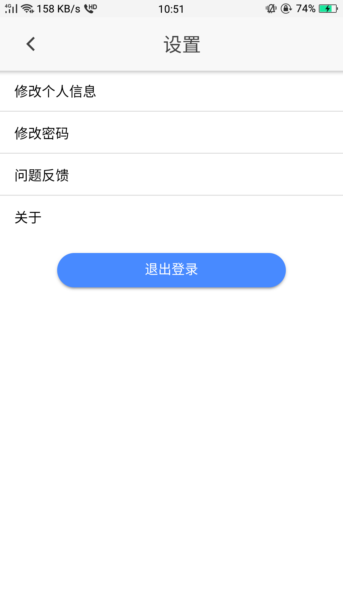
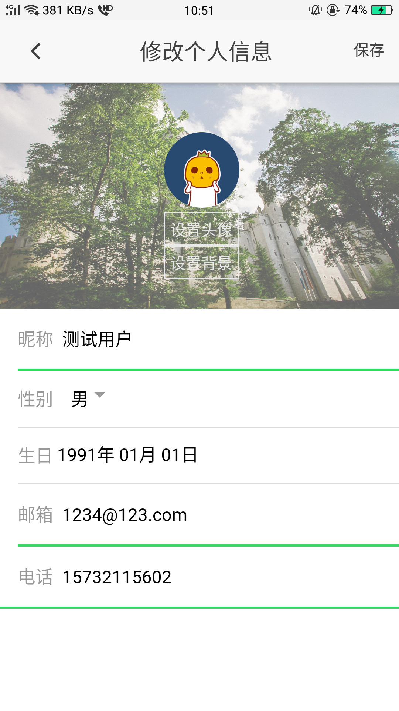
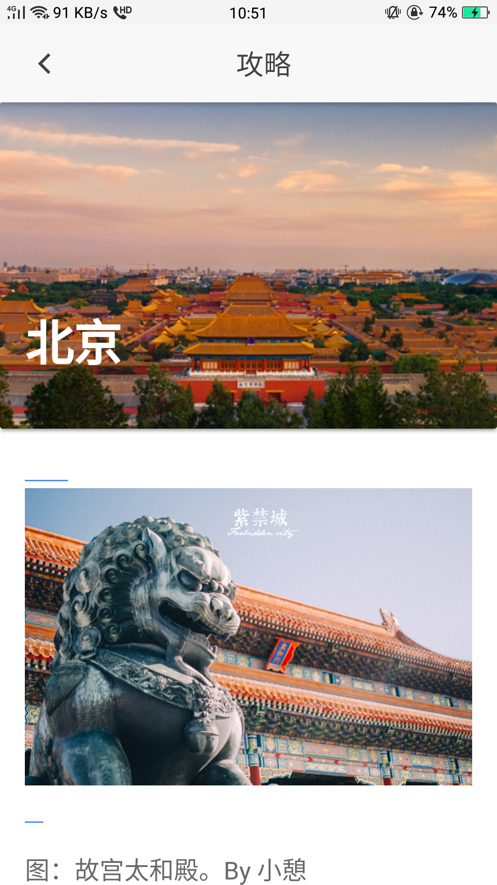
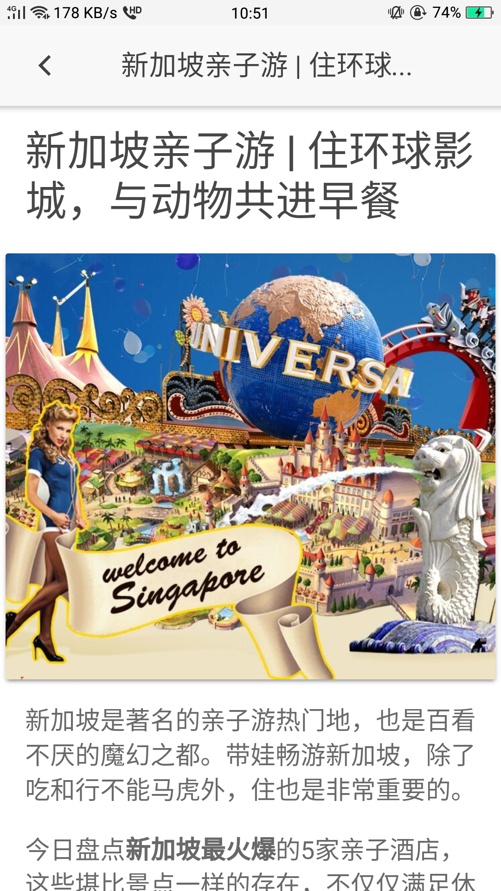

# 2015级项目实训成果展示 

##  《游趣》  - HTML5与移动互联网开发

- Github：[https://github.com/mengqj/youqu](https://github.com/mengqj/youqu)

### 项目简介

**游趣**是一款集分享旅行生活，旅行攻略，问答交流，互动娱乐于一体的旅游社交APP。

游趣是专门为需要出门旅行、热爱旅行，喜欢交友、分享旅行生活的群体打造，用户年龄集中在18-55岁之间。旨在记录旅行轨迹、图文并茂地分享旅行见闻、完整生成游记的旅行社交。致力于通过移动互联网技术的发展帮助人们更便捷地探索世界、发现精彩、分享生活。

### 项目成员
* 孟秋建 （项目经理 ， 客户端代码开发）
    * Email: <2931602191@qq.com>
    * Github: [https://github.com/mengqj](https://github.com/mengqj)
* 薛佳炜  (服务器代码开发 ， 测试)
     * Email: <763782172@qq.com>
     * Github: [https://github.com/xuejiawei1](https://github.com/xuejiawei1)
* 谷文佳  （客户端代码开发 ， 测试）
     * Email: <1023478561@qq.com>
     * Github: [https://github.com/guwenjia](https://github.com/guwenjia)
* 高静   （客户端代码开发 ， 测试）
     * Email：<646040659@qq.com>
     * Github: [https://github.com/gaojing1226](https://github.com/gaojing1226)
* 刘怡洁   (客户端代码开发 ， 测试)
     * Email: <951014453@qq.com>
     * Github: [https://github.com/yijieliu](https://github.com/yijieliu)
     
### 运行效果
  
  
  
  
  
  
  
  
  
  
  
  
  
  
  
  

