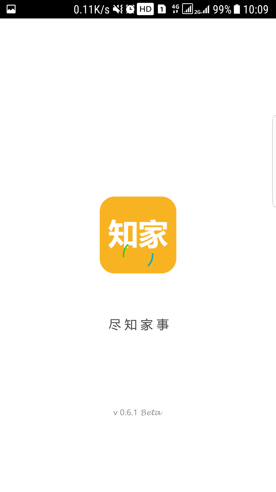
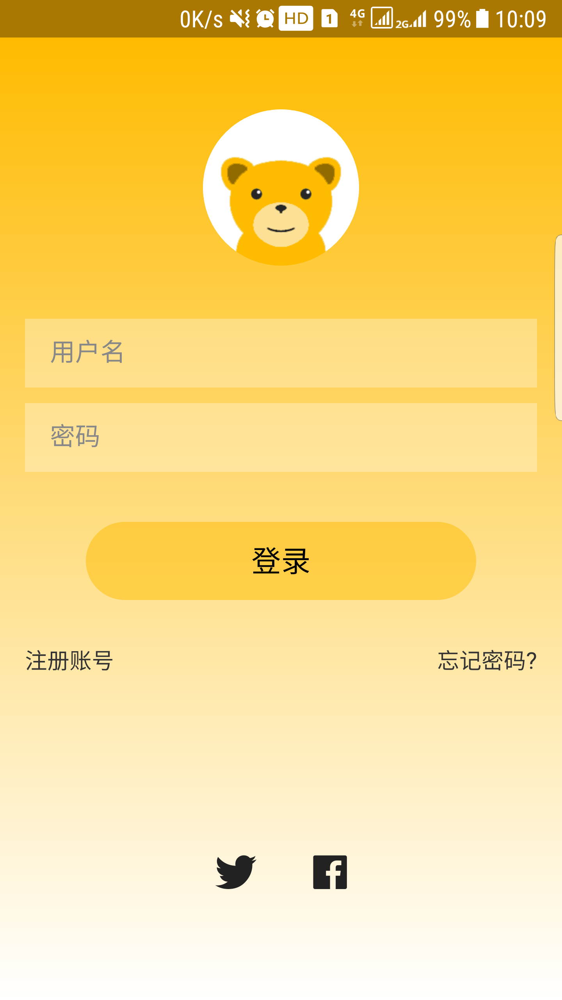
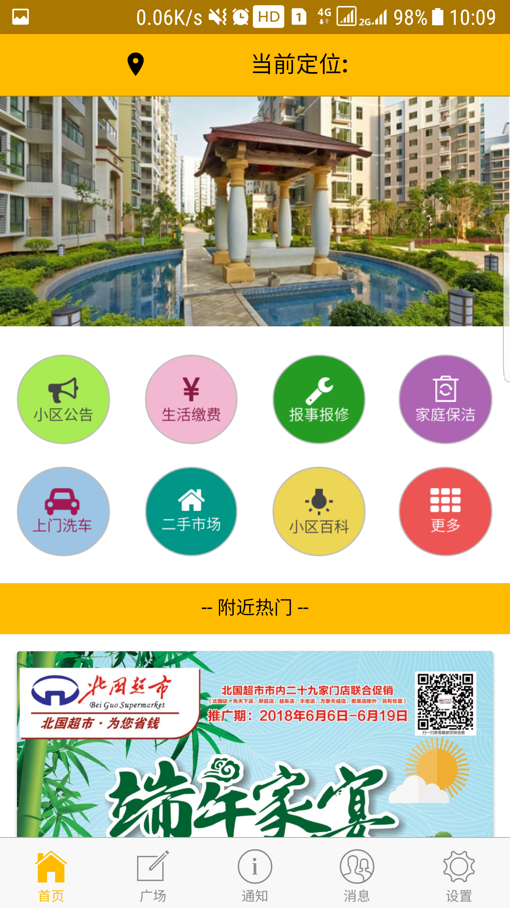
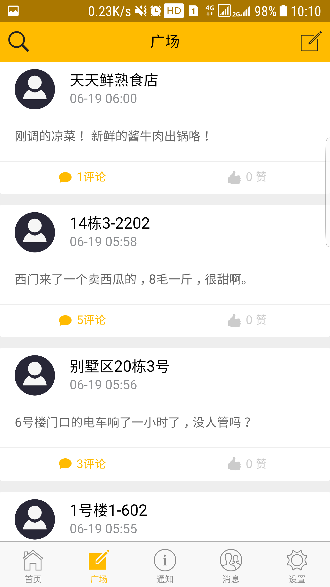
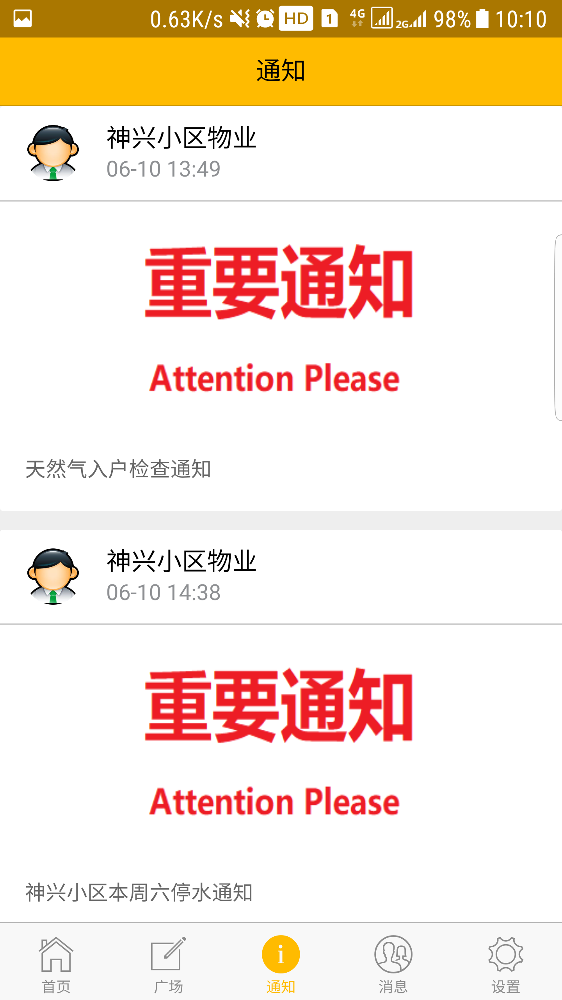
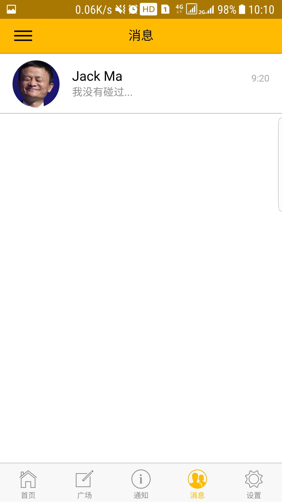
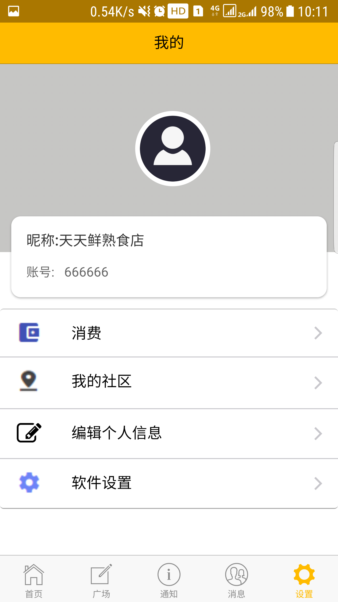
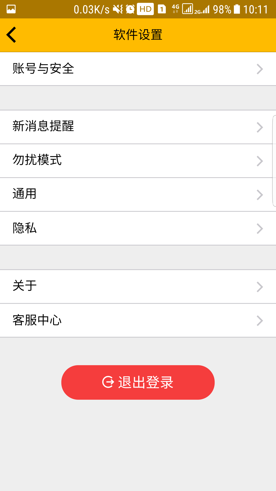

# 2015级项目实训成果展示 

##  《知家》  - HTML5与移动互联网开发

> 知家致力于最优秀的小区生活论坛，同时为业主提供最方便、最值得信任的居家服务。

-  [Github](https://gihtub.com/201505wuzixin/zhijia)  
 - [知家官网](http://www.mazw.xin/)
 

### 项目简介  
知家项目是一款面向城市小区业主以及物业，集物业管理，小区公告，业主论坛，家庭服务，生活缴费于一体的社区交流 APP。  有了知家，用户可以足不出户，第一时间了解自己小区的动态，最快时间获悉小区重要公告，停水、停电、小区物业都在“掌握”之中；有了知家，用户也可以与小区邻居实时交流，分享生活，互通信息，是业主们真实、温暖、精彩的网上家园；有了知家，用户可以和邻居互相置换二手物品，交流育儿经验，一起拼车，一起寻找给力的家政等。  

知家就是这样一款为全体业主着想的“邻里生活好管家”！   
知家项目主要以线上运营为主，客户在 APP 上进行用户注册，填写基本个人信息后即可加入到所在小区的大家庭。 
  
 
### 项目功能   
•	知家广场：产品主要的功能，可以通过添加标题、内容、照片来发布话题，随时随地分享社区生活，监督物业工作。    
•	小区公告：足不出户，居民即可及时收到小区公告信息。  
•	报事报修：社区中的任何问题都可以在报事报修中反馈，尔后物业公司收到后予以处理。  
•	物业缴费：选择缴纳月费，即可通过微信、支付宝等平台支付物业费。  
•	生活服务：代取快递，家庭保洁，上门洗车等  
•	投诉建议：对物业公司的意见或建议都可发布提交，从而物业部门予以改进。  
 
### 项目成员  

吴子鑫（项目经理，代码开发）  
- Email：[1123116007@qq.com](1123116007@qq.com)  
- Github：[https://github.com/201505wuzixin/](https://github.com/201505wuzixin/)     

吴晓桐（UI设计师，客户端代码开发）  
- Email：[974124343@qq.com](974124343@qq.com)  
- Github：[https://github.com/WuXiaoTon](https://github.com/WuXiaoTon)  

马占文（服务端代码开发，测试）  
- Email：[mazw2016@hotmail.com](mazw2016@hotmail.com)  
- Github：[https://github.com/Mxtzz](https://github.com/Mxtzz)  

耿浩洋(客户端代码开发，测试)  
- Email：[1098485613@qq.com](1098485613@qq.com)  
- Github：[https://github.com/genghaoyang](https://github.com/genghaoyang)  

张珊珊（测试）  
- Email：[1046105096@qq.com](1046105096@qq.com)  
- Github：[https://github.com/zhangshans3](https://github.com/zhangshans3)  

梁子悦（测试）  
- Email：[907977545@qq.com](907977545@qq.com)  
- Github：[https://github.com/liangziyue](https://github.com/liangziyue)   
 
### 视频演示

    

  
### 运行效果

  
   
  
  
  
    
  
   
  

