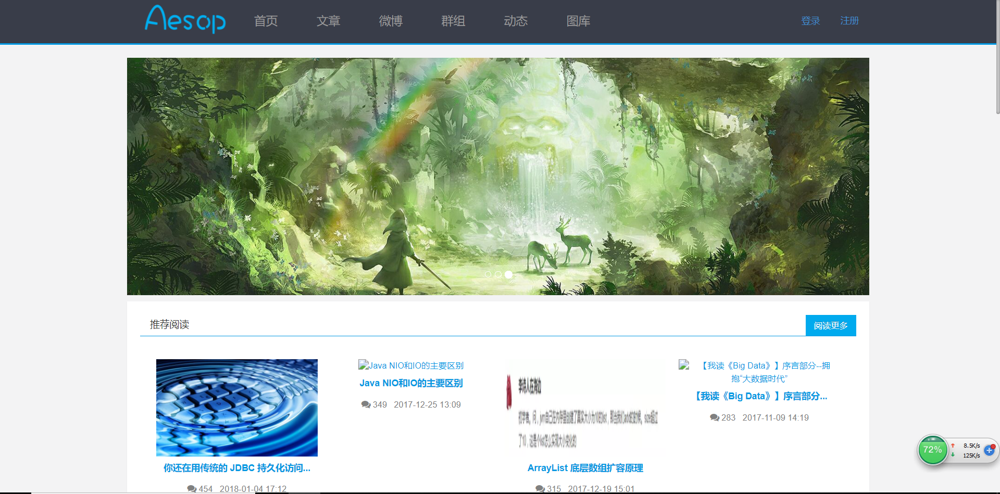
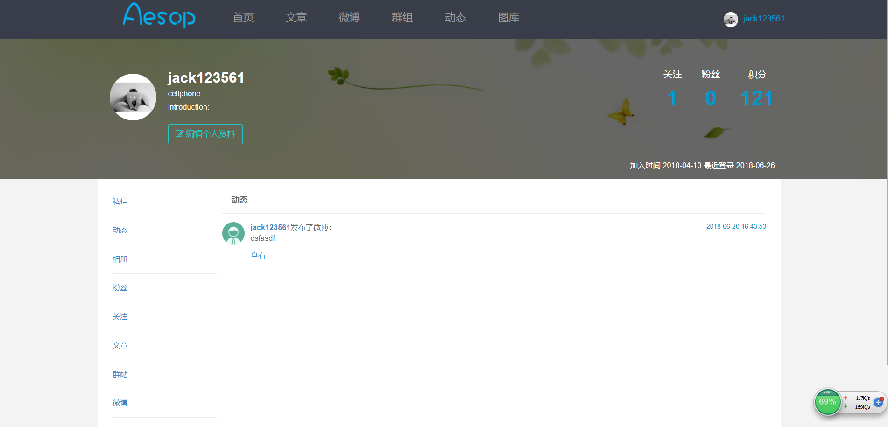
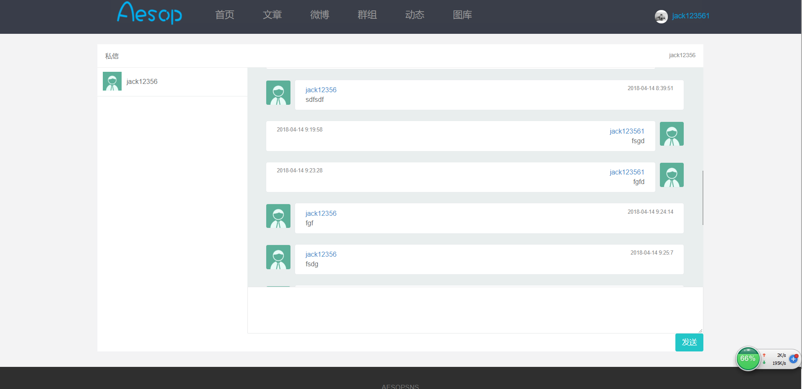
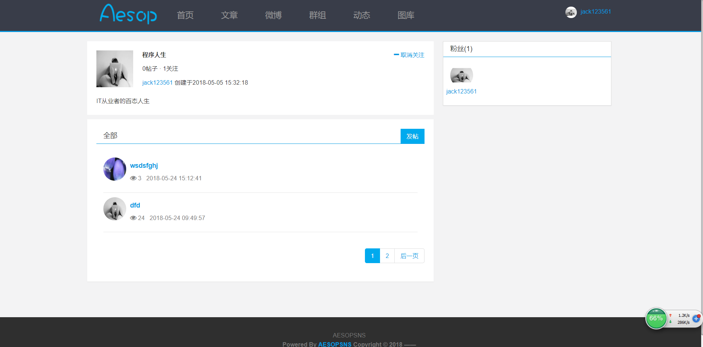
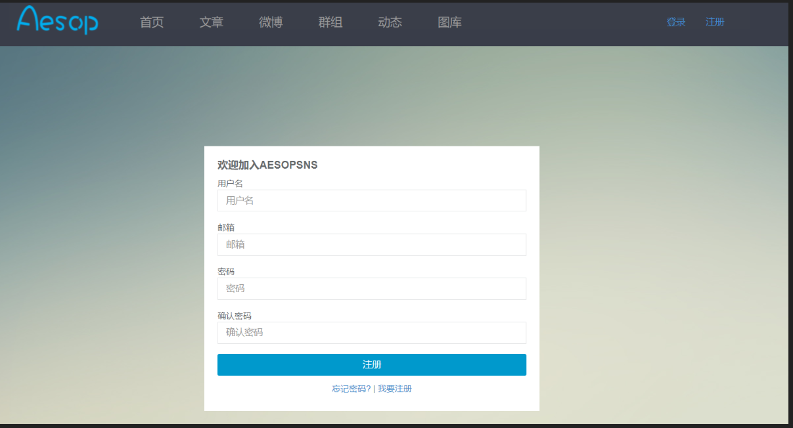
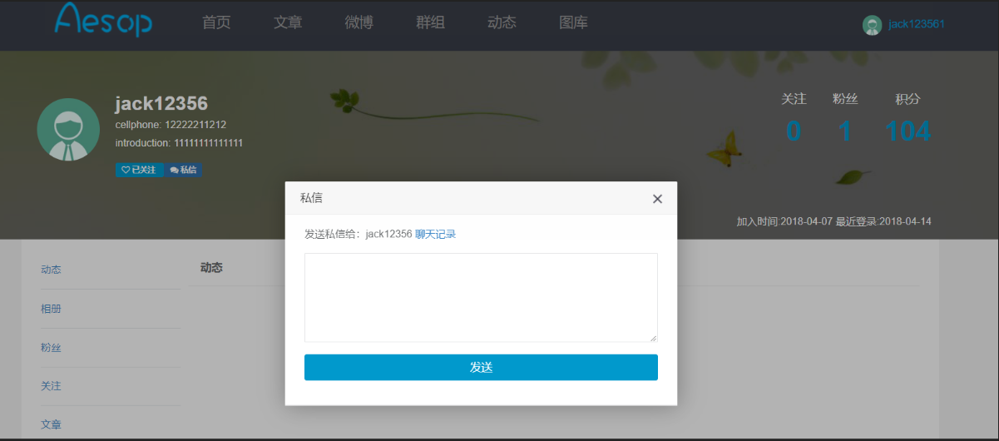

# 2015级项目实训成果展示 

## 《Aesopsns》 - Java与大数据分析

### 项目简介

SNS是一个平台，建立人与人之间的社交网络或社交关系的连接。例如，利益共享、活动、背景或现实生活中的连接。一个社交网络服务，包括表示每个用户（通常是一个配置文件）的社交联系和各种附加服务。大多数社交网络服务是基于网络的在线社区服务，并提供用户在互联网互动的手段，如电子邮件和即时消息。有时被认为是一个社交网络服务，但在更广泛的意义上说，社交网络服务通常是指以个人为中心的服务，并以网上社区服务组为中心。社交网站允许用户在他们的网络共享他们的想法、图片、文章、活动、事件。

### 小组成员

* 杨健 (项目经理，产品，UI设计，客户端代码开发) 
	* Email: <291906254@qq.com>
	* Github : [https://github.com/jacket12356](https://github.com/jacket12356)
* 郭旗龙 (服务器代码开发，产品) 
	* Email: <960007435@qq.com>
	* Github : [https://github.com/guoqilong](https://github.com/guoqilong)
* 王凯旋 (客户端代码开发，测试)
	* Email: <593160444@qq.com>
	* Github : [https://github.com/kaixuan96](https://github.com/kaixuan96)
* 陈亮 (客户端代码开发，测试)
	* Email: <441007713@qq.com>
	* Github : [https://github.com/chenliang6](https://github.com/chenliang6)
* 米仕奇 (客户端代码开发，测试)
	* Email: <787325997@qq.com>
	* Github : [https://github.com/Mrmishiqi](https://github.com/Mrmishiqi)

### 运行效果

