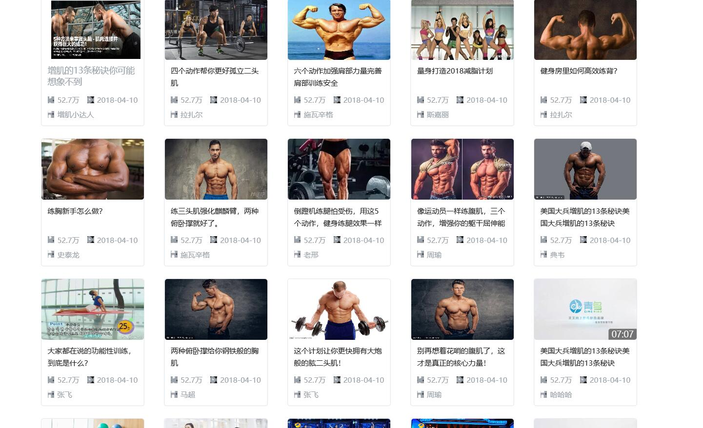
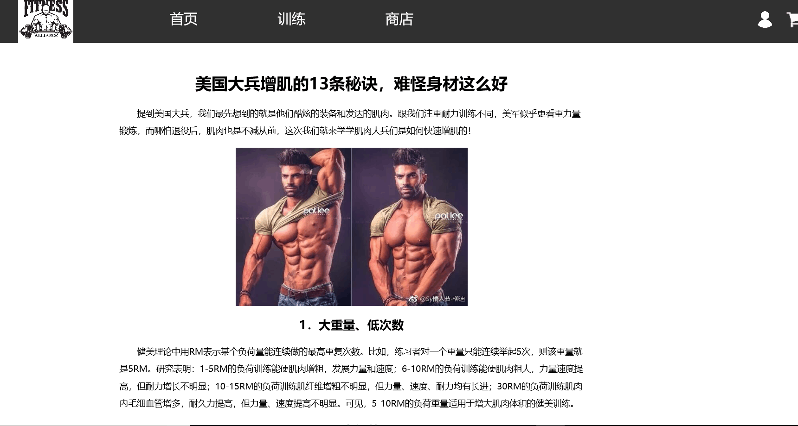

# 2015级项目实训成果展示 

## 《健身联盟网》 - Java与大数据分析

### 项目地址

* Github：[https://github.com/OstensibleBrother/JavaRepository](https://github.com/OstensibleBrother/JavaRepository)

### 项目简介

健身联盟网将是一个集合健身知识发布与查询、健身相关产品买卖、私人培训课程订购等功能于一体的综合性门户网站。健身联盟网会将线上活动与线下健身组织结合一体，为网上用户提供更优质的服务，为广大健身组织提供更大的宣传平台。健身联盟网将以发展体育运动、弘扬健身文化为己任，大力促进健身事业的发展，倡导全民健身。

### 项目成员

* 刘通（项目经理、产品经理）
	* Email：1363225370@qq.com
	* Github：https://github.com/LiuTongDaDa
* 赵峻仟（UI设计、网页前端代码编写）
	* Email：1084314065@qq.com
	* Github：https://github.com/Mr-zhaojunqian
* 张紫航（网页后台代码编写、测试）
	* Email：1104522240@qq.com
	* Github：https://github.com/zhangzihg
* 杨子轩（数据库搭建、测试）
	* Email：877258184@qq.com
	* Github：https://github.com/yangzixuanzi

### 运行效果

