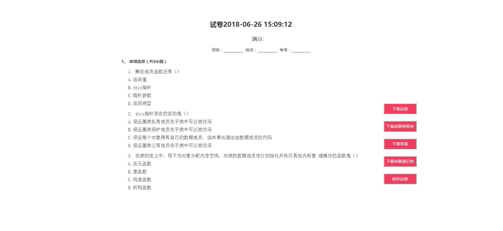
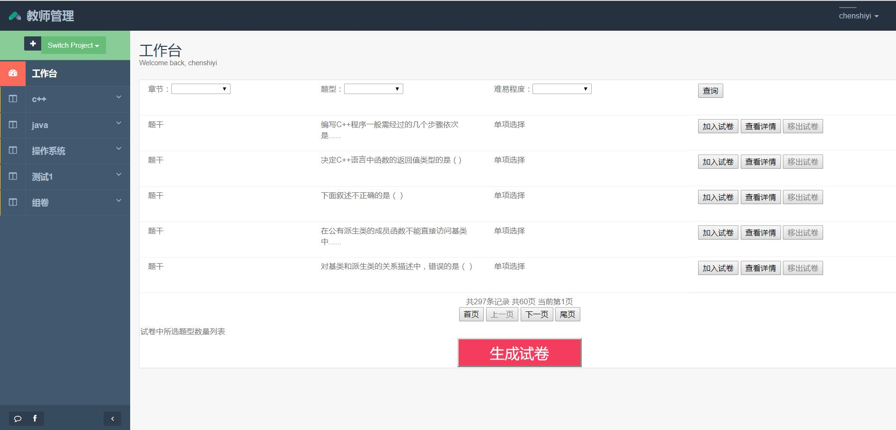
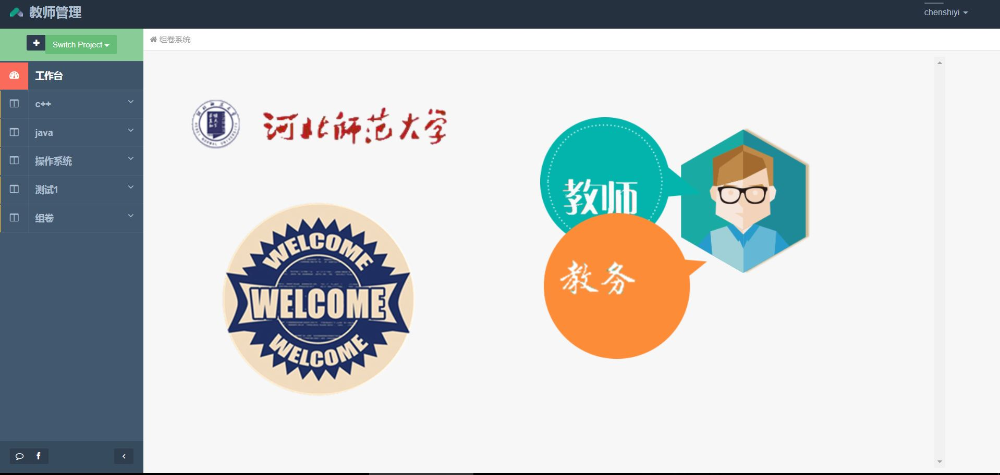
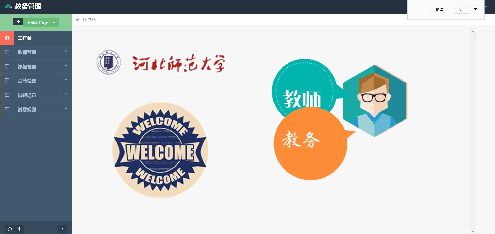
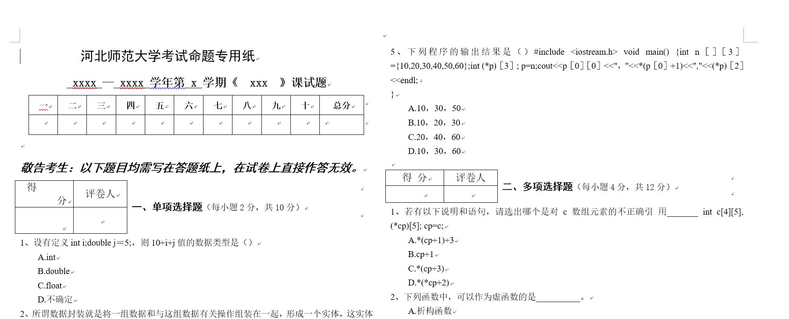



# 2015级项目实训成果展示 

## 《superSchool 智能组卷系统》 - Java与大数据分析

### 项目地址
- GitHub：[https://github.com/wuyunkunkun/superSchool  ](https://github.com/wuyunkunkun/superSchool  )

### 项目简介

我们组基于老师出题时候有明显困难。在每年的出题的时候都需要耗费大量的人力、物力、精力。因此通过我们组的讨论和研究决定我们准备做一个智能组卷系统。智能组卷是面向老师的，智能组卷系统是用来给老师们提供组卷的便利。老师们可以通过平时的录入和平时题型的积累可以轻易出好题。

本项目需求说明书是为了说明项目superSchool的需求分析和对功能确定。  

一、愿景  

经过项目组的多次讨论，我们的愿景是：为减轻教师出题的难度和为教师提供大量的题目  

二、项目的功能  
我们将项目分为两部分来设计：  

- 第一板块为教务板块：  
用于实时的修改课程，并且通过教务可以为老师分配权限，添加和删除教师，修改老师的本学期讲授的课程。  
  
- 第二个板块是教师板块：  
用于实时的添加和删除题目，教师有权限设置题目的难度等级，有权限查看学生的与该教师教授的课程相关的，章节知识点的错误率 ，并且有权限删除题目。

出卷是分为自动组卷和手动组卷，自动是通过合理的算法来挑选题目，而手动则需要我们为老师提供一些题目来然他们选择。  

 三、数据的获取  

通过从学校教务系统导入历年考试的学生题目错误率 。
通过学校的教务中导出教师信息  。

### 项目成员
- 武云坤 (MANAGER)
	- GitHub：https://github.com/wuyunkunkun  
	- E-mail：931858513@qq.com  

- 陈世艺 (CTO) 
	- GitHub：https://github.com/chenshiy1  
	- E-mail：3355366175@qq.com
  
- 黄浦 (DBA-GAD)
	- GitHub：https://github.com/zzzhp  
	- E-mail：hp957660233@foxmail.com  

-	王朝辉 (CCO)
	- GitHub：https://github.com/2015015188wzh 
	- E-mail：2247392595@qq.com 
  
- 唐喆  (SCD)
	- Github：https://github.com/2015015173  
	- E-mail：15732115132@163.com
  
  

  
项目运行图片

