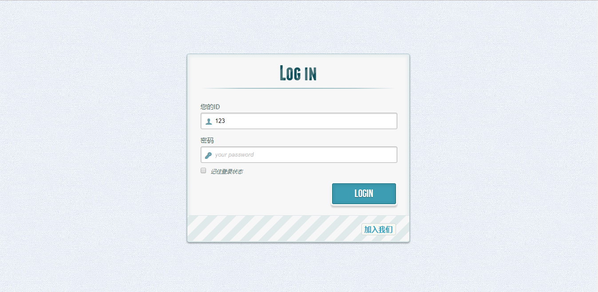
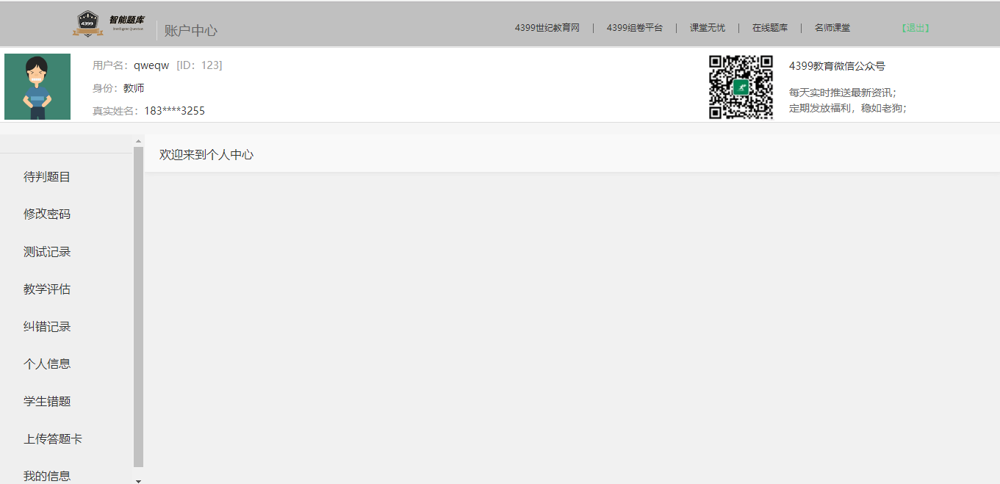
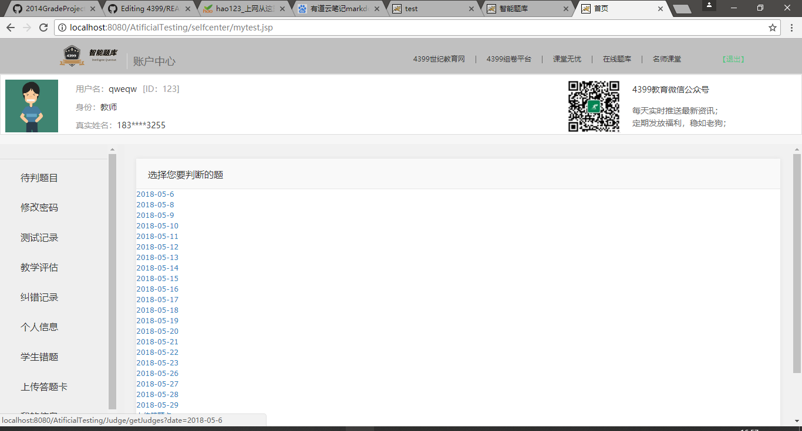
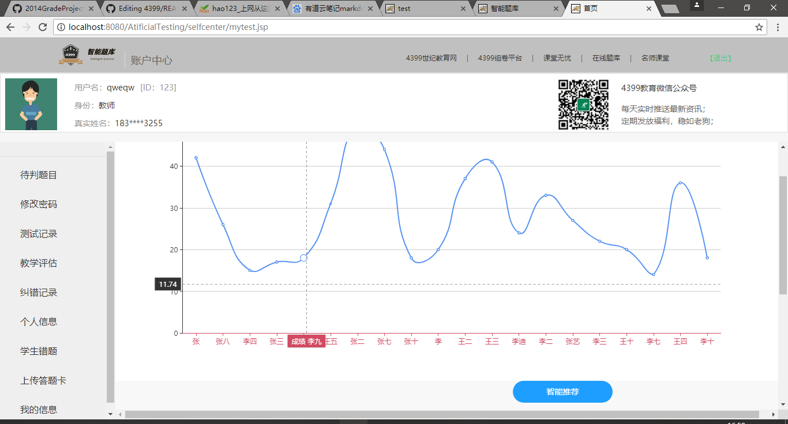
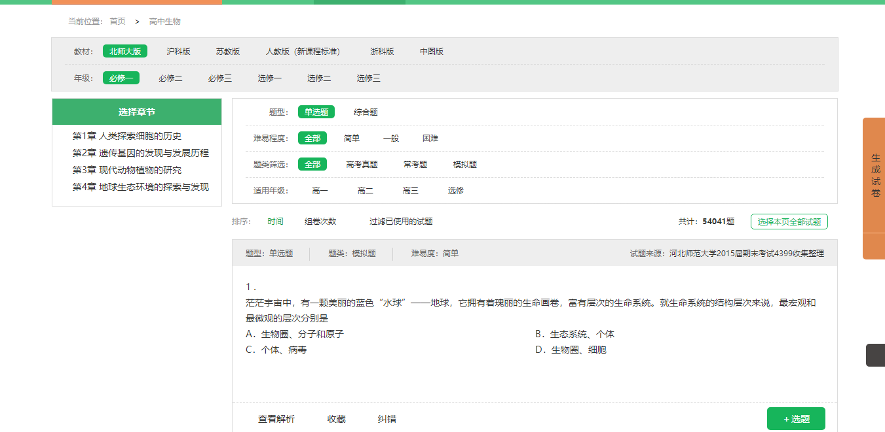
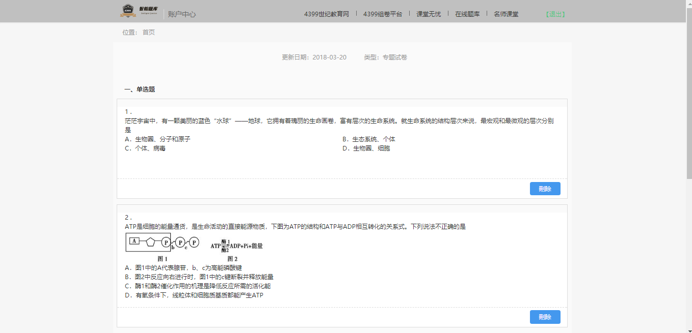



# 2015级项目实训成果展示 

## 《智能题库》 - Java与大数据分析

### 项目简介 

智能题库专门设计题库系统，为老师提供大量试题。在题库中，老师可以方便搜寻试题，并且可以将试题组成卷子或者测试习题，极大地提高老师出题效率，且提供了在线判题功能，该系统可以统计学生做题信息，并进行分析，就可以让老师更好掌握本班学生学习情况。

### 功能介绍

- 登录，注册功能
- 在线搜寻试题，并组卷功能
- 将在线试题，生成word文档功能（包括答题卡及答案）
- 答题卡录入，答题卡图片识别，切块功能
- 老师判题功能
- 成绩最终展示功能
- 根据错题，智能推荐功能

* 孟喆（项目经理）
  	* 邮箱：[296875574@qq.com](296875574@qq.com)
  	* GitHub：[https://github.com/9512mzr](https://github.com/9512mzr)
* 肖舒翔
  	* 邮箱：[1037426886@qq.com](1037426886@qq.com)
  	* GitHub：[https://github.com/xiao970205](https://github.com/xiao970205)
* 宋泽坤（前端设计师）:
  	* 邮箱：[1964015583@qq.com](1964015583@qq.com)
  	* GitHub：[https://github.com/songzkuser](https://github.com/songzkuser)
* 陈冲（后端开发）：
  	* 邮箱：[349130579@qq.com](349130579@qq.com)
  	* GitHub：[https://github.com/cchenchong](https://github.com/cchenchong)
* 李坤（后端开发）：
  	* 邮箱：[137500632@qq.com](137500632@qq.com)
  	* GitHub：[https://github.com/hisuperdou ](https://github.com/hisuperdou )
* 田瑞康（测试）：
  	* 邮箱：[951750361@qq.com](951750361@qq.com)
  	* GitHub：[https://github.com/666Kang](https://github.com/666Kang)
* 田赛（数据库设计）：
	* 邮箱：[425503141@qq.com](425503141@qq.com)
	* GitHub：[https://github.com/425503141](https://github.com/425503141 )

运行效果
---------------------------

## 登录界面

## 主界面

## 个人中心界面

## 待判题界面

## 数据展示界面

## 题库界面

## 生成试卷界面

