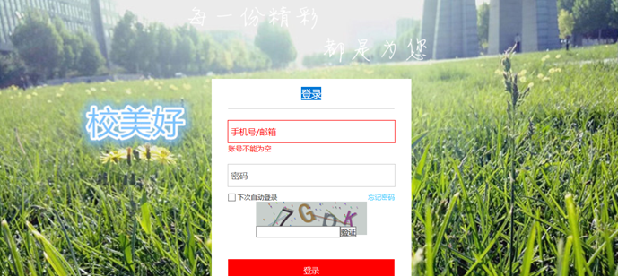
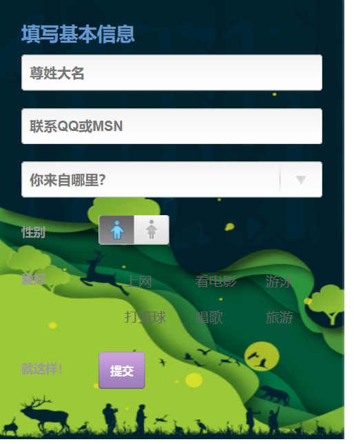
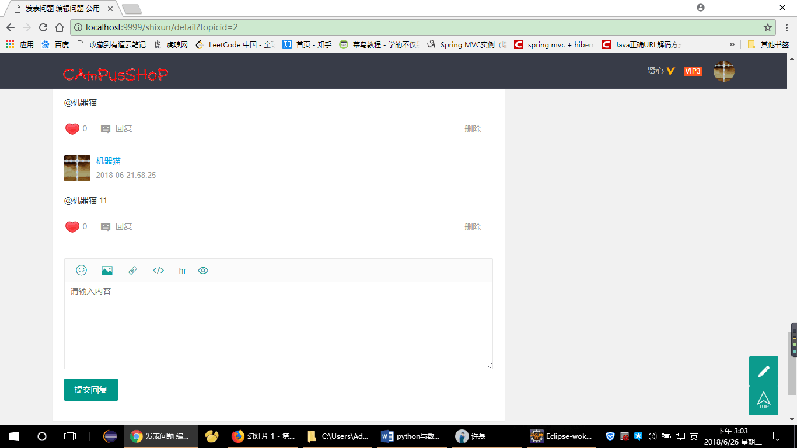
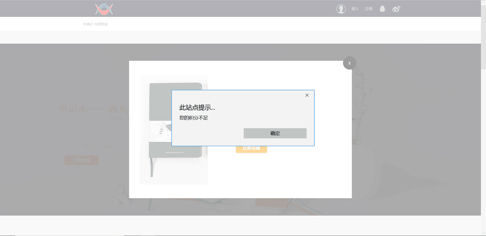
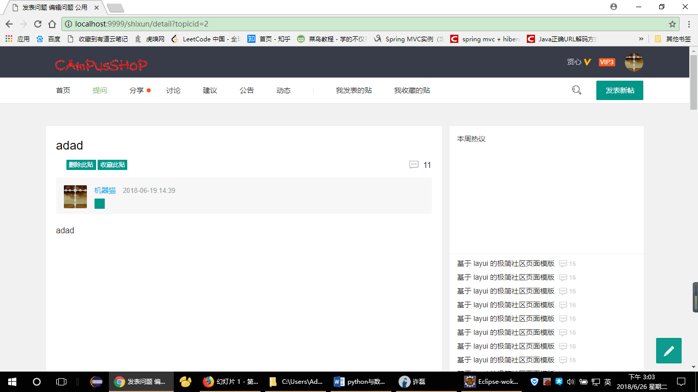
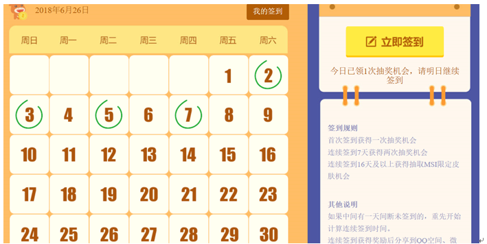
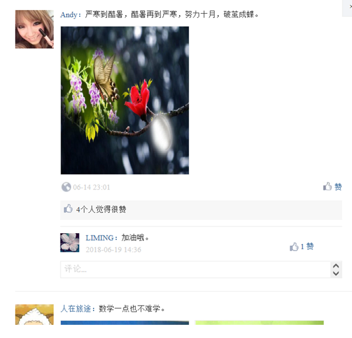

# 2015级项目实训成果展示 

## 《校美好校园活动平台》 - Java与大数据分析

### 项目简介

该项目是一共为大学提供服务的一个基于B/S架构的项目，该项目分为三个模块来构成。分别是：失物招领、交易市场、热点话题。三个项目都是只针对本校（河北师范大学）学生开放的服务项目，其意义在于改变传统的繁琐的事情来简化一系列服务的步骤为大学生提供一个更简单高效的服务平台。这款平台是一个免费的而且具有极高的服务效率，立足于为大学生的服务的优质校园平台。

项目的创建初衷是为了更好的服务大学在学校中的生活，方便于发展在校大学生对自主创业和生活学习的热爱。

### 项目模块：
1. 校园商城
签到赢取积分，可以兑换一些必要的学习和生活用品。也可以自己在上面自己卖一些自己不需要的东西做到交易安全。

2. 话题讨论
讨论一些自己感兴趣的话题，来让自己的生活变得更加有趣，这里可以开启匿名功能可以让自己更自由一些。

3. 失物招领
当我们丢失东西的时候万分焦急，自己只能苦苦等待，这里可以让你有机会快速找到自己丢失的东西，不让你如此的焦虑等待。

4. 为考研加油
从严寒到酷暑，再从酷暑到严寒，经历了多少风风雨雨，几月之功尽在一日，为那些考研的学子们加油。

5. 每日签到
每日签到可以领取现金红包，领取积分，用积分可以兑换许多自己需要的东西和商品。现金红包可以直接提现。心动不如行动赶紧来吧。

### 成员介绍
- 许磊（组长，导航模块设计 文档编写审查  ppt制作 ）
	- 邮箱：799873165@qq.com 
 	- GitHub：https://github.com/xulei1 
- 杨晨星（副组长 项目设计 失物招领模块总制作）
	- 邮箱：1318375942@qq.com 
	- GitHub：https://github.com/yangchenxing 
- 樊卫宽（话题讨论代码编写）
	- 邮箱：2530442804@qq.com 
	- GitHub：https://github.com/fanweikan 
- 张大鹏（话题讨论前端网页制作）
 	- 邮箱：794241087@qq.com 
	- GitHub：https://github.com/zhangdapeng 
- 郭佳兴（宿舍商城项目前端设计 项目实训日记编写  ）
	- 邮箱：913550462@qq.com 
	- GitHub：https://github.com/guojiaxing 
- 方昱程（宿舍商城代码编写）
	- 邮箱：1290121967@qq.com 
	- GitHub：https://github.com/fangyucheng
- 补双彦（为考研加油 每日签到模块制作）
	- 邮箱：1097236153@qq.com 
	- GitHub：https://github.com/bushuagyan

### 项目截图

