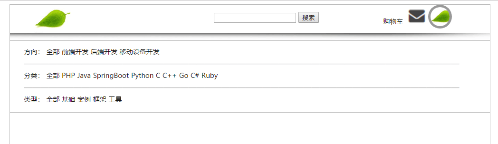
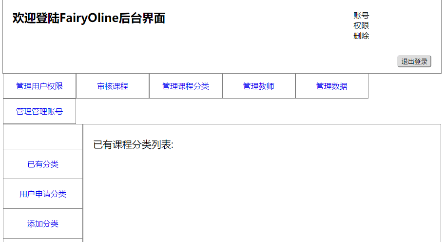



# 2015级项目实训成果展示 

## 《精灵在线课堂》 - Java与大数据分析

### 项目地址

* Github：[https://github.com/wudaosuisui/FairyOnline](https://github.com/wudaosuisui/FairyOnline) 

### 项目简介

**FairyOnline**是一个可以个性化的推荐给用户他们所需要的软件课程的视频教学网站。学森迷绕，精灵小叶指引你在二进制的森林里前行。

计算机类知识的学习没有唯一确定的途径，更加没有捷径可寻。初次接触的小白们难免会不知所措，略有了解的小同学们也难免会有所迷茫。这个时候就可以通过询问小叶来解决困惑了。小叶可以根据提出的问题智能的给予答案，并推荐给访客所需的课程。FairyOnline本身也会记录访客的各种行为（学习了哪些课程，检索了哪些课程等）进行记录，并以此为依据，适时的进行推荐。

### 项目成员

* 陈锐 (项目经理，产品，UI设计，后台代码开发) 
 	* Email: <17360701785@163.com>
   	* Github : [https://github.com/wudaosuisui](https://github.com/wudaosuisui)

* 苏悦 (前端、后台开发) 
	* Email: <1656726620@qq.com>
	* Github : [https://github.com/suyue2015015158](https://github.com/suyue2015015158)

* 何磊 (前端、后台开发) 
	* Email: <794279698@qq.com>
	* Github : [https://github.com/HeLei0822](https://github.com/HeLei0822)

* 贾漠菲 (前端、后台开发) 
	* Email: <woshijiakechong@2008.sina.com(1878151709)>
	* Github : [https://github.com/jiamofei](https://github.com/jiamofei)

* 赵洋洋 (前端、后台开发) 
	* Email: <18332163883@163.com>
	* Github : [https://github.com/zhaoyyyyyy](https://github.com/zhaoyyyyyy)

* 郑智奎 (文档书写) 
	* Email: <1143896344@qq.com>
	* Github : [https://github.com/zhengzhikui ](https://github.com/zhengzhikui)

* 董玥 (文档书写) 
	* Email: <2470295936@qq.com>
	* Github : [https://github.com/dongyue0530](https://github.com/dongyue0530)

* 张晗 (测试) 
	* Email: <1013272209@qq.com>
	* Github : [https://github.com/zhhanhan](https://github.com/zhhanhan)

* 邵晓阡 (测试辅助) 
	* Email: <491366914@qq.com>
	* Github : [https://github.com/shaoxiaoqian](https://github.com/shaoxiaoqian)    

**运行截图**

1. 用户登录界面

   

2. 后台管理员登录界面

   

3. 小叶运行界面

   

4. 前台首页

   

5. 后台管理界面

   