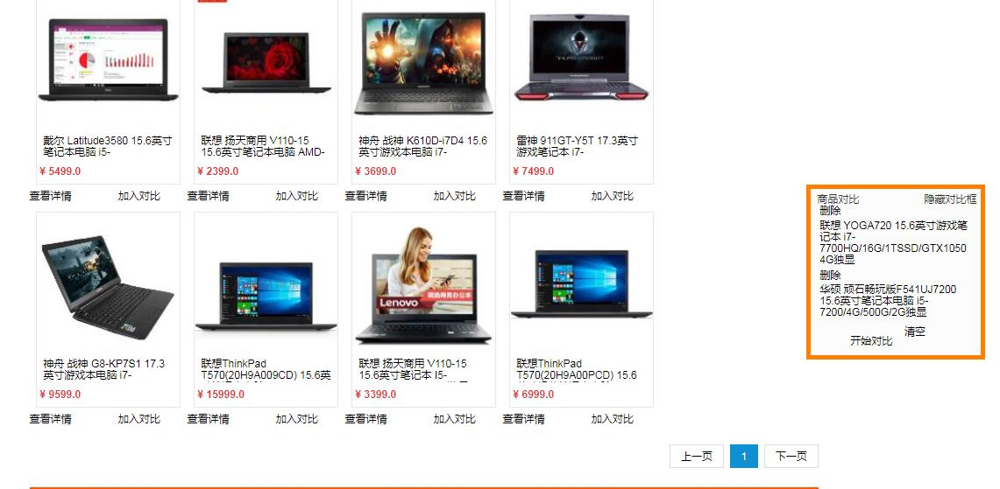
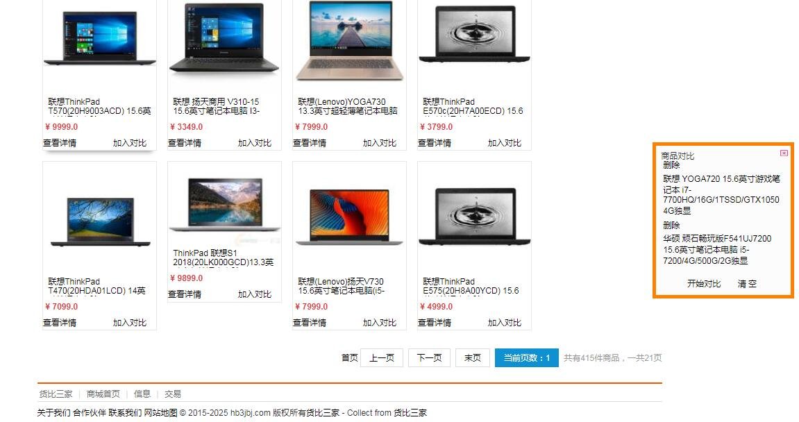
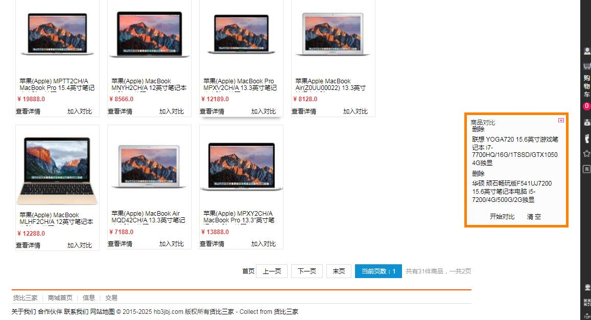
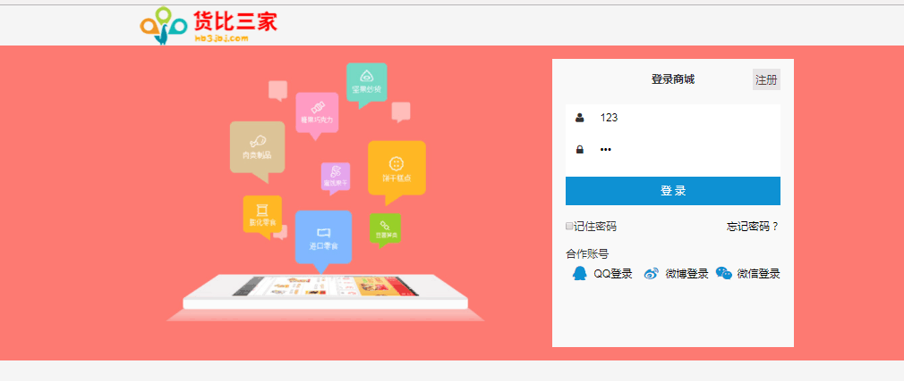
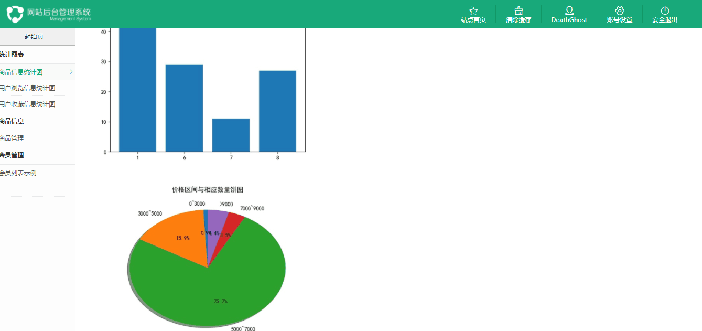
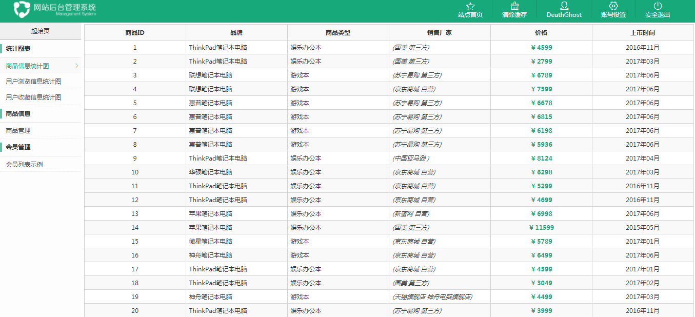
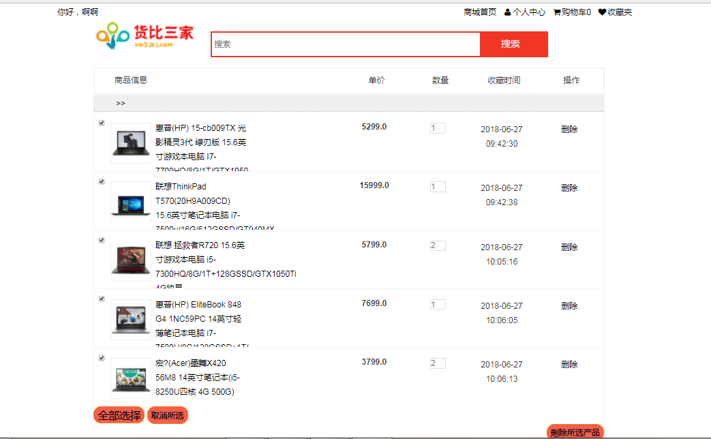
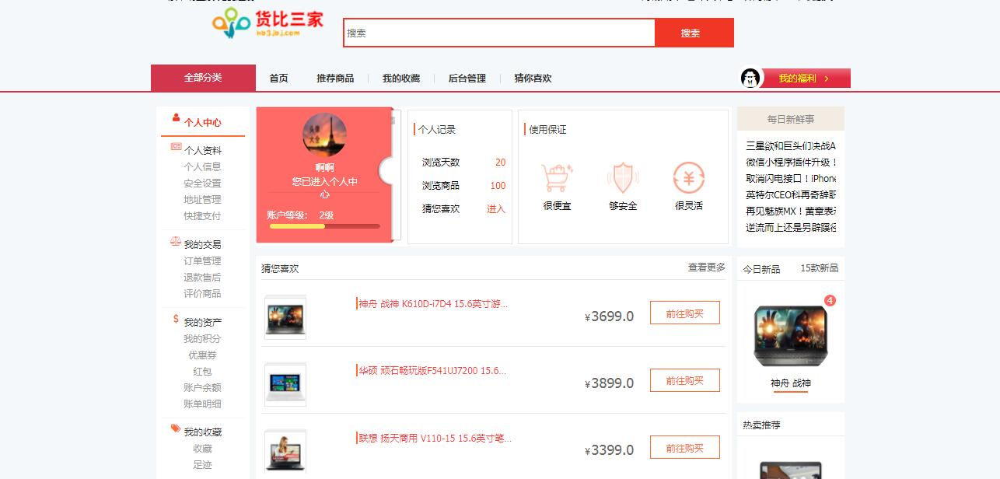
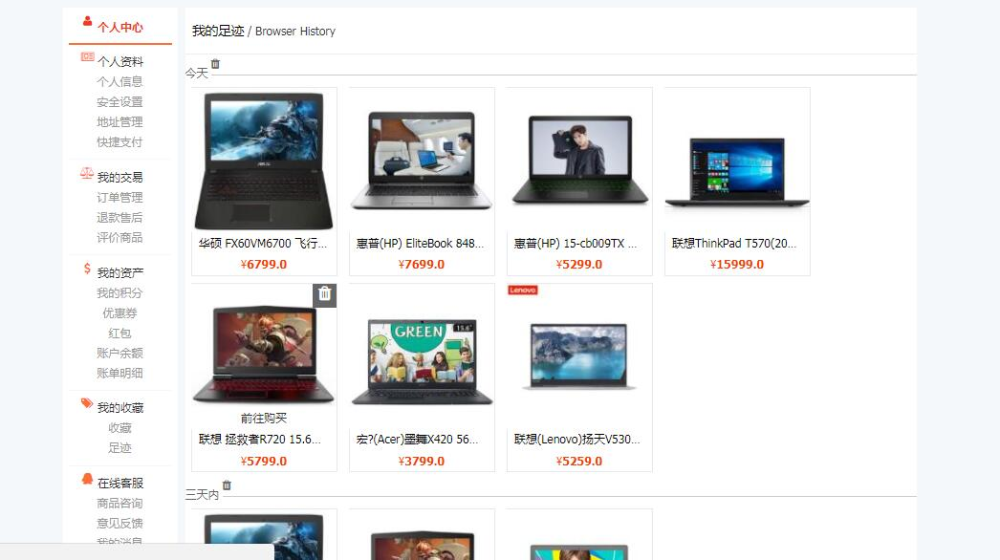



# 2015级项目实训成果展示 

## 《货比三家》 - Java与大数据分析

### 项目简介

**货比三家**是一家集网购折扣推荐、全网搜索比价和历史价格查询为一体的购物导购网站。货比三家的核心是一个购物比价搜索引擎，优势是原创神价商品推荐，帮助用户实现一站式比价选购，买到高性价比的商品！货比三家倡导理性消费，我们相信“慢一点，省一点”！

货比三家目前合作的网上商城都是国内知名的B2C网站，已有多年积累，以保证消费者买到价格实惠的优质产品。

货比三家爱欢迎用户分享原创、心得，评价商品的优劣，并期望更多的用户参与爆料，与大家分享优惠的商品信息，和大家共享购物的乐趣。

### 项目地址

- GitHub：[https://github.com/liuxw888/huoBiSanJiaShow](https://github.com/liuxw888/huoBiSanJiaShow)

### 项目成员

* 邢永润 (项目经理，产品，UI设计，客户端代码开发) 
	* Email: <935443480@qq.com>
	* Github : [https://github.com/orgs/huobisanjia/people/xingyongrun](https://github.com/orgs/huobisanjia/people/xingyongrun)

* 李睿达 (服务器代码开发，产品) 
	* email:3516859407@qq.com
	* Githup:https://github.com/liruida

* 薛昊 (客户端代码开发，测试)
	* Email: <xh843948199@qq.com>
	* Github : [https://github.com/xuehaoritian](https://github.com/xuehaoritian)

* 刘向伟 (客户端代码开发，测试)
	* Email: <1433484140@qq.com>
	* Github : [https://github.com/liuxw888](https://github.com/liuxw888)

* 王子豪 (客户端代码开发，测试)
	* Email: <727720811@qq.com>
	* Github : [https://github.com/big-umbrella](https://github.com/big-umbrella)

* 李鑫 (服务器代码开发，测试)
	* Email: <920599701@qq.com>
	* Github : [https://github.com/leesen-lixin](https://github.com/leesen-lixin)

* 李鑫 (服务器代码开发，测试)
	* Email: <820054960@qq.com>
	* Github : [https://github.com/engesi](https://github.com/engesi)
    

### 运行效果

