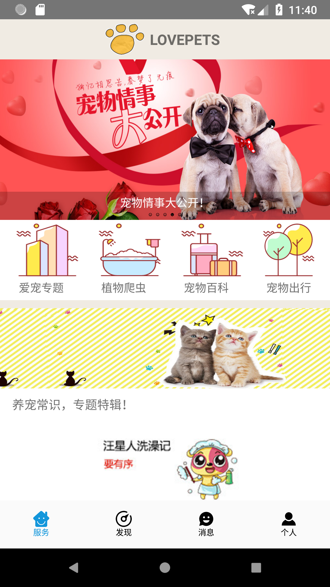
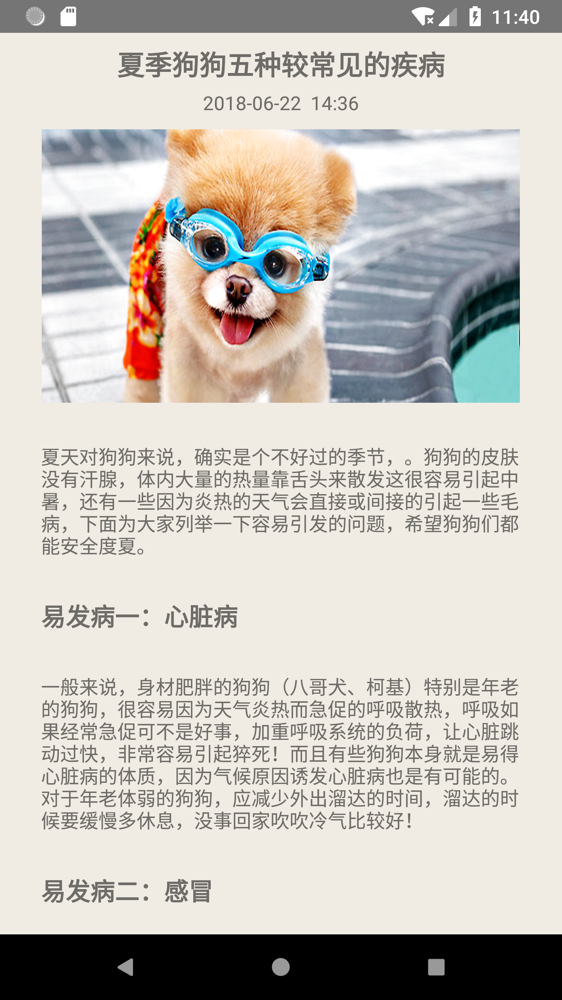
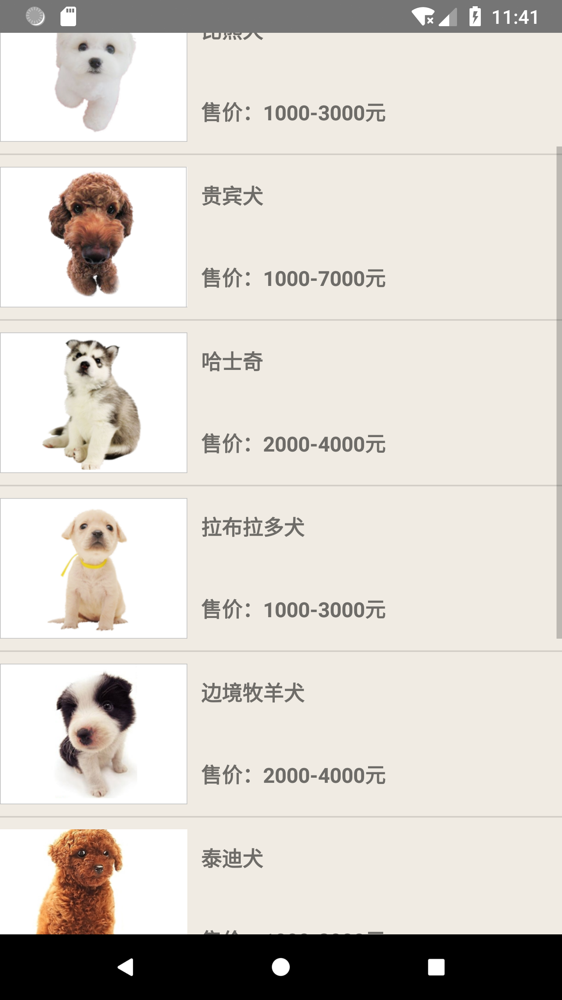
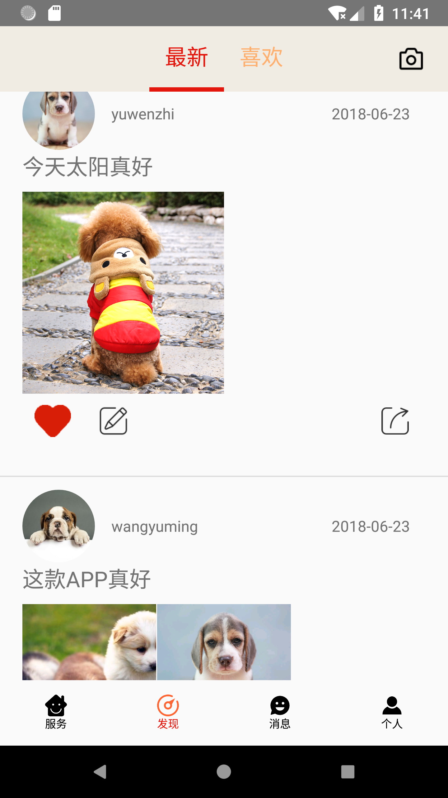
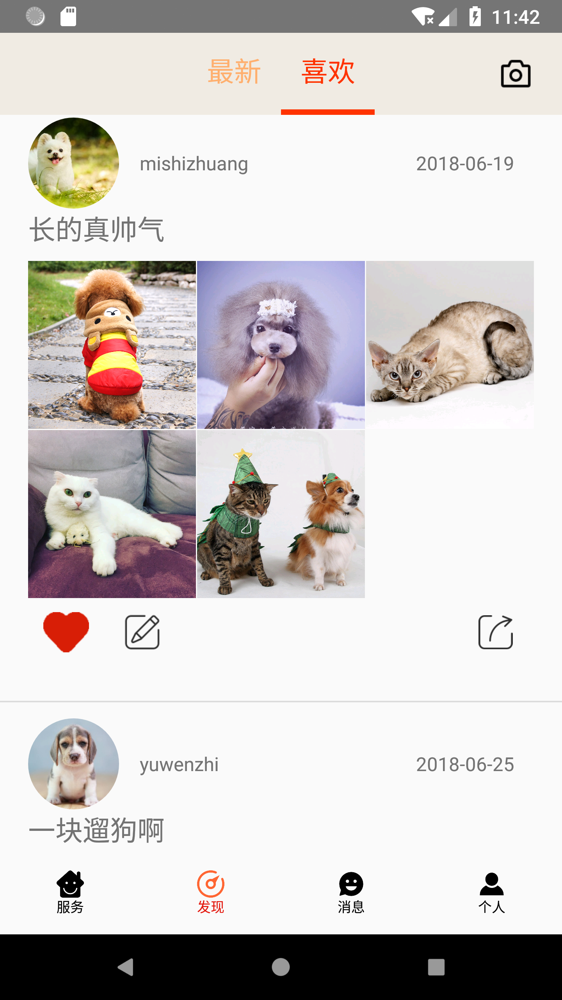
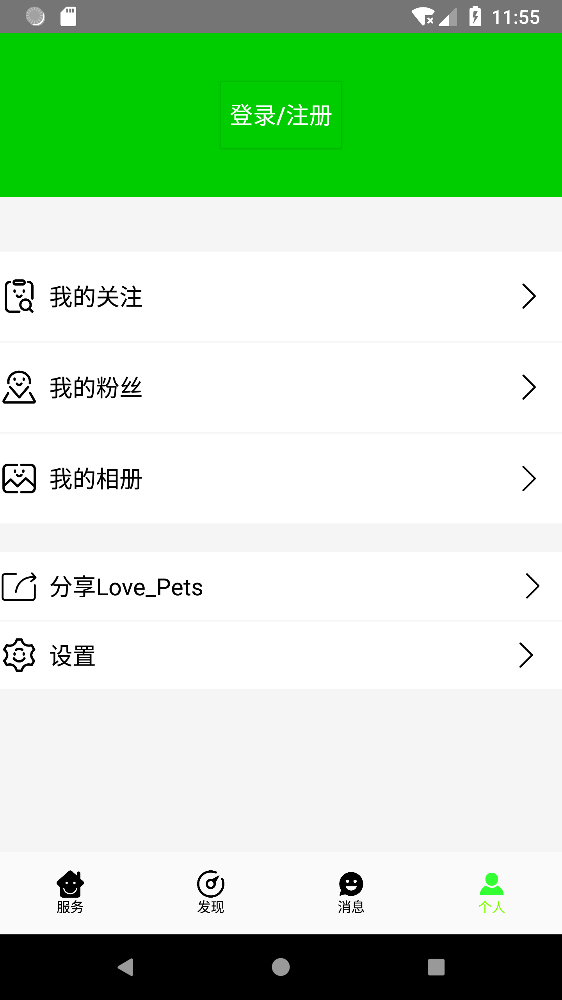
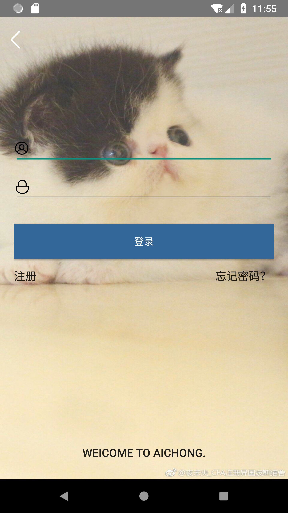
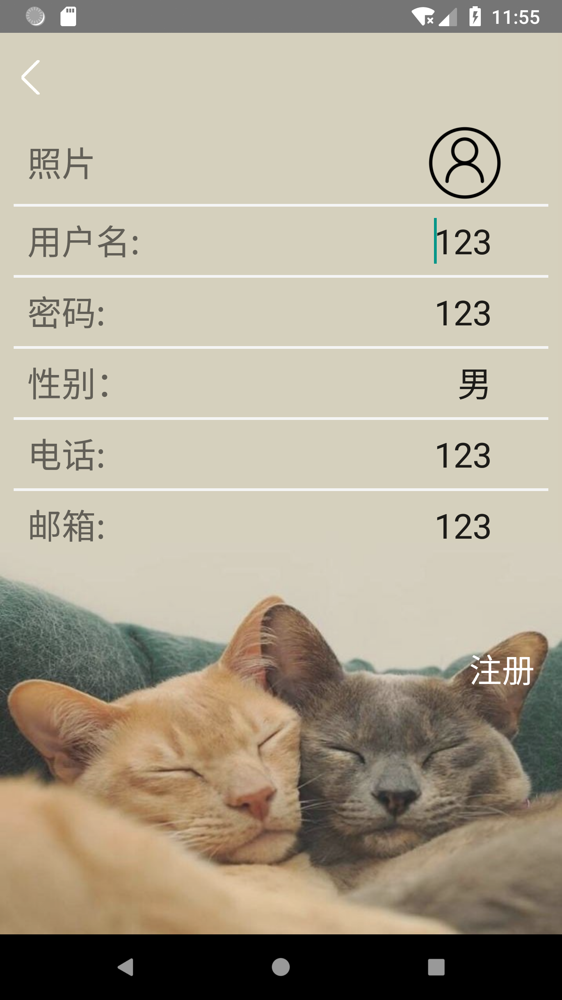
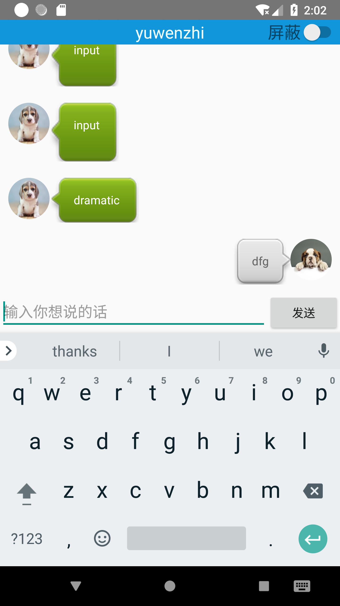
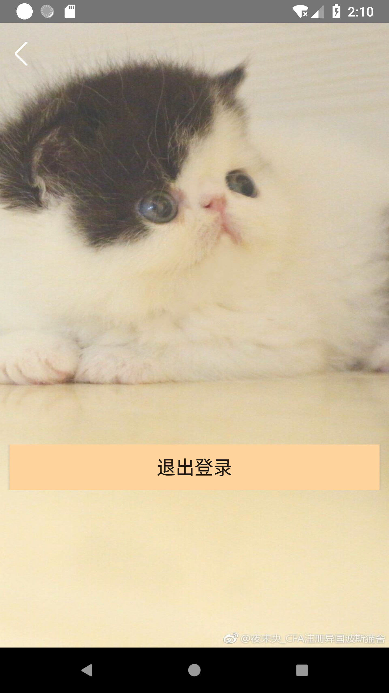

# 2015级项目实训成果展示 

## 《LOVE PETS》 - Java与移动智能设备开发

### 项目简介

LOVE PETS是一款针对养宠物的用户推出的宠物类APP。在这里你可以了解关于宠物最新最火热的资讯、可以在广场上分享你和爱宠的点滴、可以查阅各类宠物的养护方法、与众多爱宠人士进行在线交流沟通。

### 项目成员

- 李朝亮（项目经理、产品、服务器代码开发）
	- Email：[931402469@qq.com](mailto:931402469@qq.com) 
	- Github：[https://github.com/Lichaoliang](https://github.com/Lichaoliang)
- 米仕壮（服务器代码开发、产品、测试）
	- Email：[1913905311@qq.com](mailto:1913905311@qq.com)
	- Github：[https://github.com/mishizhuang](https://github.com/mishizhuang)
- 王余柠（服务器代码开发、测试）
	- Email：[247197442@qq.com](mailto:247197442@qq.com)
	- Github：[https://github.com/WANGYUNING88](https://github.com/WANGYUNING88)
- 于文治（UI设计、客户端代码开发、测试）
	- Email：[252964789@qq.com](mailto:252964789@qq.com)
	- Github：[https://github.com/15631788828](https://github.com/15631788828)
- 庞旭东（客户端代码开发、测试）
	- Email：[2901293213@qq.com](mailto:2901293213@qq.com)
	- Github：[https://github.com/pangxudong11](https://github.com/pangxudong11)
- 方浩（客户端代码开发、测试）
	- Email：[378474058@qq.com](mailto:378474058@qq.com)
	- Github：[https://github.com/fanghao182](https://github.com/fanghao182)

### 项目截图

