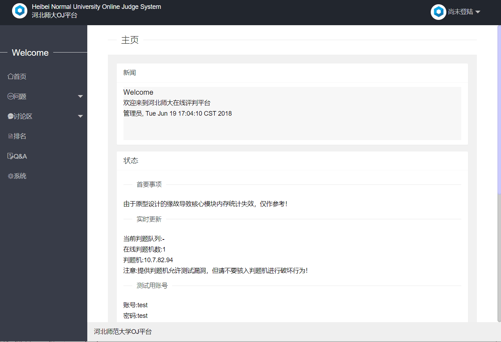
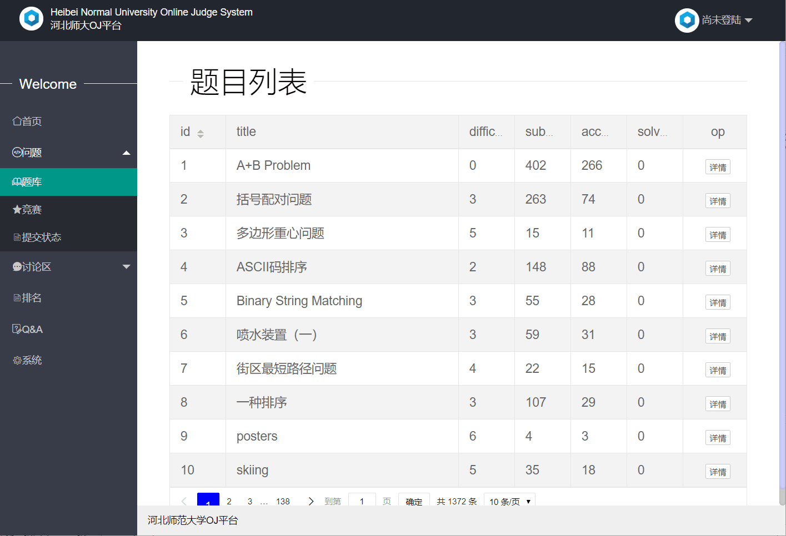

# 2015级项目实训成果展示 

## 《OJSystem》 - Java与移动智能设备开发

### 项目简介

河北师大OJ平台旨在为河北师范大学软件学院和数信学院提供更方便和具有针对性的算法学校平台，营造专业的竞赛气氛，并且为大家提供各大竞赛的参加捷径。

你可以使用OJ平台来学习算法知识，解决算法题目；参加或举办算法竞赛，一般校内代表队会由参加竞赛的优秀队伍中选出；使用讨论版和博客，记录或查看其他同学的学习经验；在资源模块下载软件、电子书或其他所需资料。

### 项目地址
- Github：[https://github.com/JAVA-ORG](https://github.com/JAVA-ORG)

### 项目成员

- 毛凌霄
	- Email：[138841996@qq.com](mailto:138841996@qq.com) 
	- Github：[https://github.com/MaoLingxiao](https://github.com/MaoLingxiao)
- 杨佳亮
	- Email：[814947885@qq.com](mailto:814947885@qq.com)
	- Github：[https://github.com/YangJiaLiang123](https://github.com/YangJiaLiang123)
- 王玉达
	- Email：[710435028@qq.com](mailto:710435028@qq.com)
	- Github：[https://github.com/wyd710435028](https://github.com/wyd710435028)
- 王港
	- Email：[624609720@qq.com](mailto:624609720@qq.com)
	- Github：[https://github.com/Wgangg](https://github.com/Wgangg)
- 娄东杰
	- Email：[1245643506@qq.com](mailto:1245643506@qq.com)
	- Github：[https://github.com/loudongjie](https://github.com/loudongjie)
- 曹慧慧
	- Email：[18332162562@163.com](mailto:18332162562@163.com)
	- Github：[https://github.com/caohuihui1](https://github.com/caohuihui1)

### 项目截图

