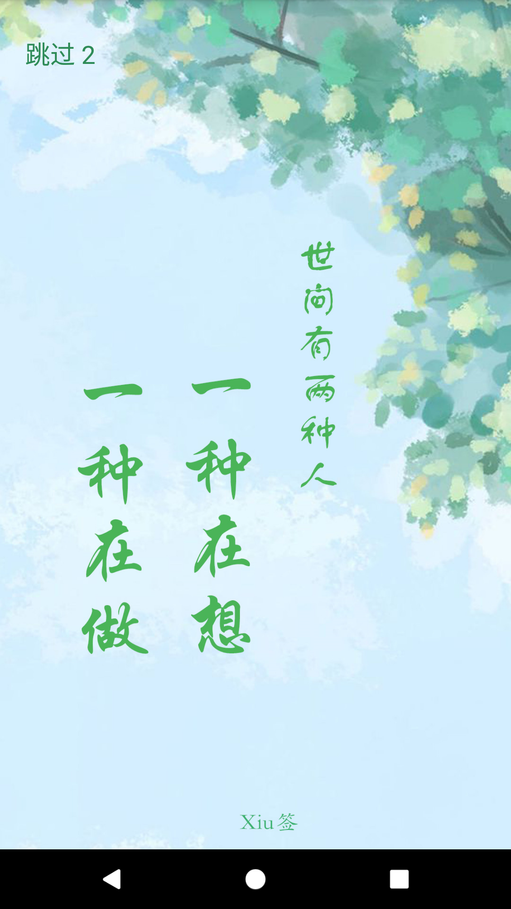
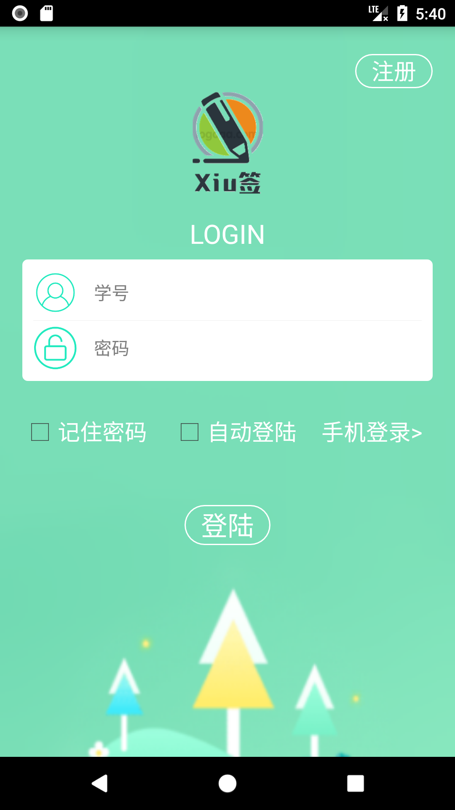
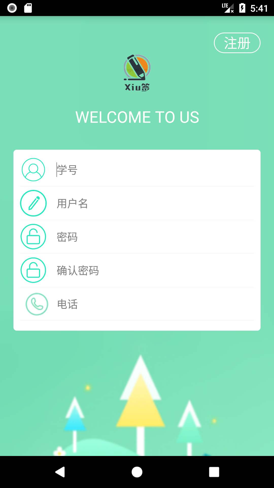
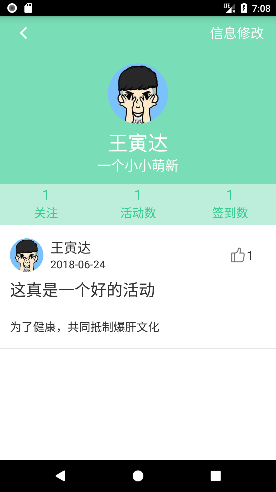
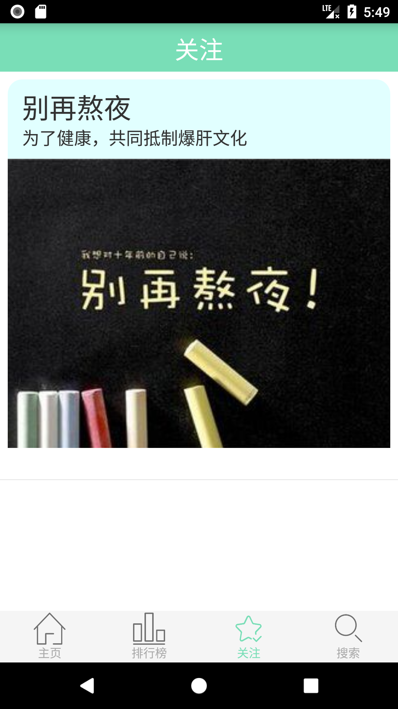
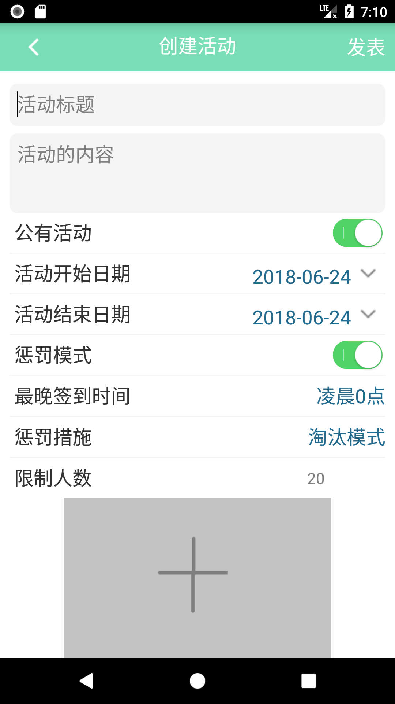
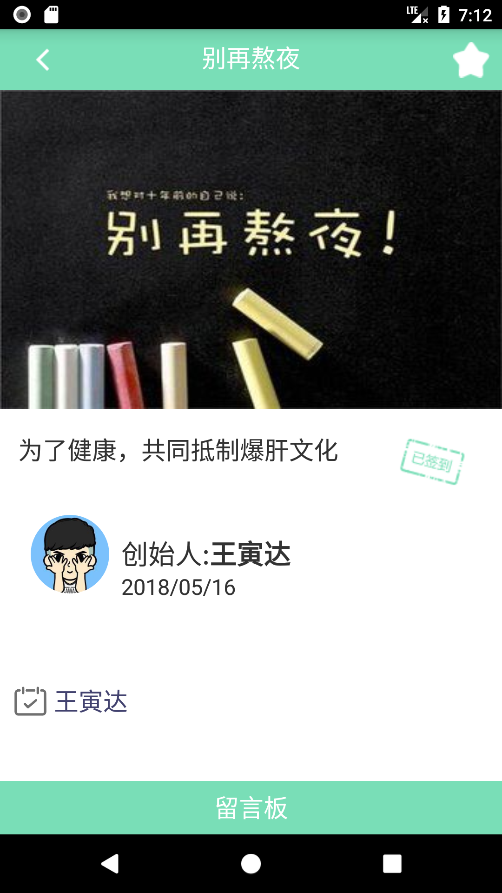
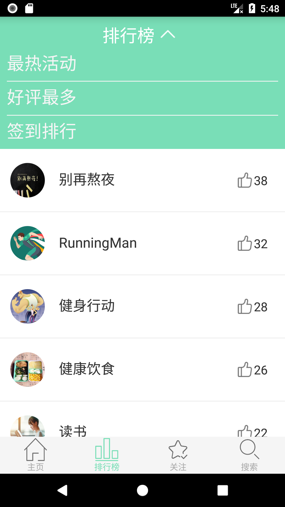
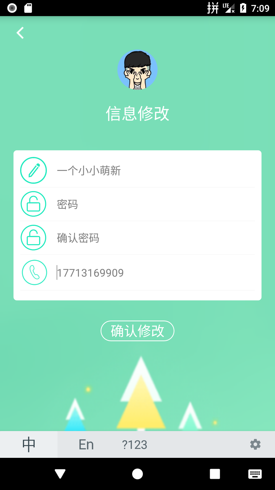
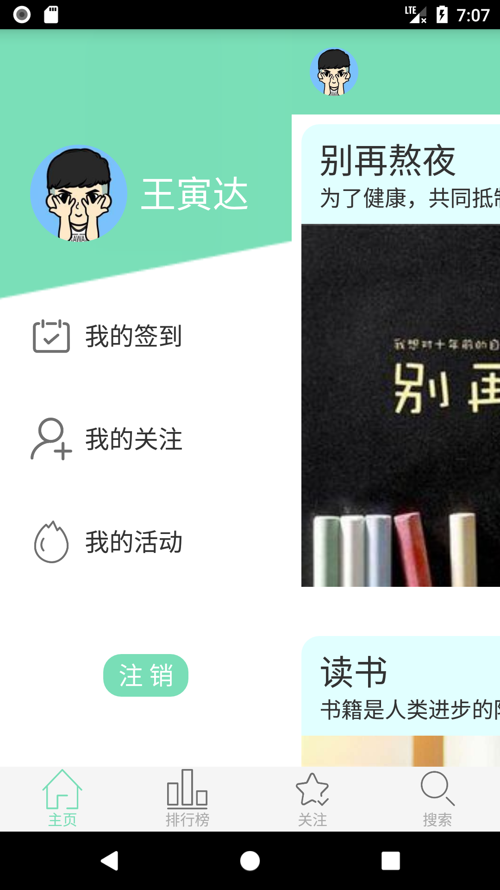

# 2015级项目实训成果展示 
## Xiu签 - Java与移动智能设备开发

- [Github](https://github.com/MISSZQ/XiuQianProject)

### 项目简介

Xiu签是一款以签到为主题的手机APP，它利用一些特色的活动吸引在校学生参加，帮助学生培养良好的生活学习习惯，同时也可以丰富学生的课余生活并且帮助他们结实一些志同道合的朋友。该APP的主要特色是用户可以自己发布一些活动，同时设置活动的相关属性，同时可以在活动中可以发表自己的签到感想，其它用户可以对其进行评论和点赞。

### 项目成员

- 王寅达（项目经理、开发工程师）
	- Email：[1733220383@qq.com](mailto:1733220383@qq.com) 
	- Github：[https://github.com/WindSul](https://github.com/WindSul)
- 高思雨（数据库工程师、开发工程师）
	- Email：[1060970075@qq.com](mailto:1060970075@qq.com)
	- Github：[https://github.com/siyu-gao](https://github.com/siyu-gao)
- 丁雪怡（UI设计师、开发工程师）
	- Email：[dingxueyidxy@foxmail.com](mailto:dingxueyidxy@foxmail.com)
	- Github：[https://github.com/dingxueyi](https://github.com/dingxueyi)
- 杨永昊（研发人员、开发工程师）
	- Email：[15531809228@sina.cn](mailto:15531809228@sina.cn)
	- Github：[https://github.com/xiaoHaoZ1](https://github.com/xiaoHaoZ1)
- 王静楠（测试工程师）
	- Email：[18713923868@163.com](mailto:18713923868@163.com)
	- Github：[https://github.com/wangjingnana](https://github.com/wangjingnana)
- 赵蕾（UI设计师、开发工程师）
	- Email：[455872507@qq.com](mailto:455872507@qq.com)
	- Github：[https://github.com/zhaoleiZ](https://github.com/zhaoleiZ)
- 孙南（产品经理、开发工程师）
	- Email：[njsunnan@outlook.com](mailto:njsunnan@outlook.com)
	- Github：[https://github.com/MISSZQ](https://github.com/MISSZQ)

### 项目截图

