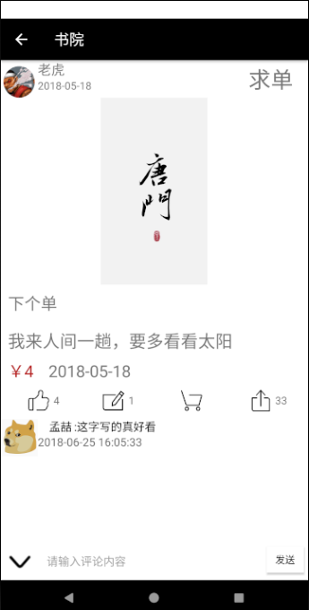
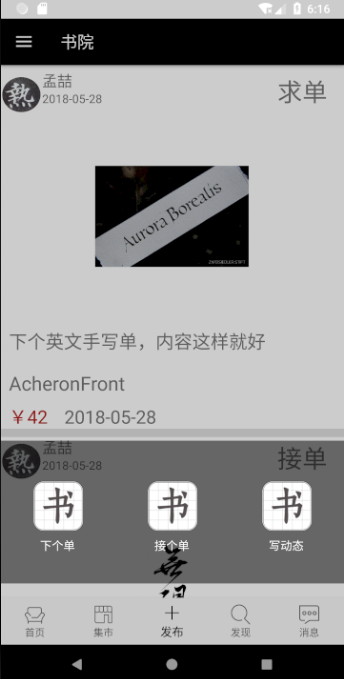
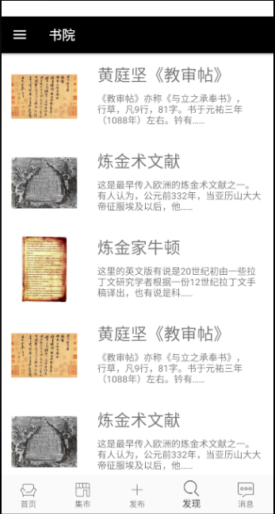
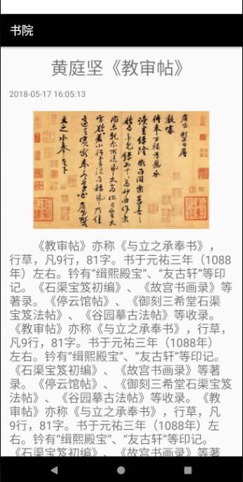
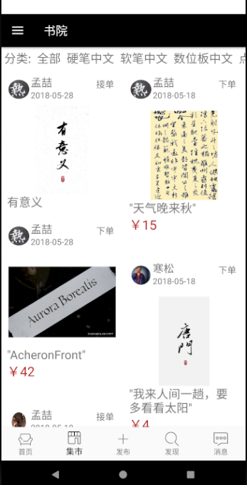
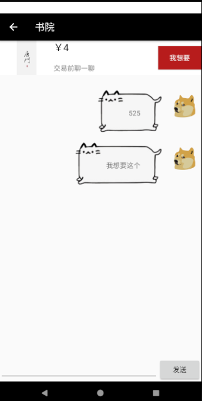
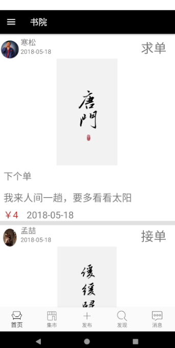
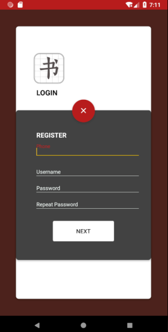

# 2015级项目实训成果展示 

## 《书院》 - Java与移动智能设备开发

### 项目简介

“书院”旨在为书法爱好者提供一个交流和交易的平台。

唐伯虎有言志诗云：

>> “不炼金丹不坐禅，不为商贾不耕田。”
“闲来写就青山卖，不使人间造孽钱。”

在外呆的累了，不妨来书院坐坐。

在书院里，谈书论道，烹茶访友，兴致来了，挥毫一幅赚几钱银子打酒来喝，
不亦乐乎。

我们做了一个这样的小院子，可以随意聊天，

结交志同道合的朋友，

向先闻道者学习；

想要“写就青山卖”了，

我们也为你准备了一个简单却安全的小“摊位”，

保证每一次交易的顺利进行。

### 项目成员

- 陈鸿宇（项目经理、产品、UI设计、前端开发工程师）
	- Email：[chenhy4918@gmail.com](mailto:chenhy4918@gmail.com) 
	- Github：[https://github.com/chenvinc](https://github.com/chenvinc)
- 李响（产品、开发工程师）
	- Email：[1763724062@qq.com](mailto:1763724062@qq.com)
	- Github：[https://github.com/StitchLee](https://github.com/StitchLee)
- 张友朋（服务端开发工程师）
	- Email：[306020703@qq.com](mailto:306020703@qq.com)
	- Github：[https://github.com/HappyYp](https://github.com/HappyYp)
- 张寒崧（UI设计）
	- Email：[eyearcn@gmail.com](mailto:eyearcn@gmail.com)
	- Github：[https://github.com/eyears](https://github.com/eyears)
- 王钊（前端开发工程师）
	- Email：[1983228380@qq.com](mailto:1983228380@qq.com)
	- Github：[https://github.com/wangzhao211](https://github.com/wangzhao211)
- 宋予轩（测试）
	- Email：[18233110662@qq.com](mailto:18233110662@qq.com)

### 项目截图

