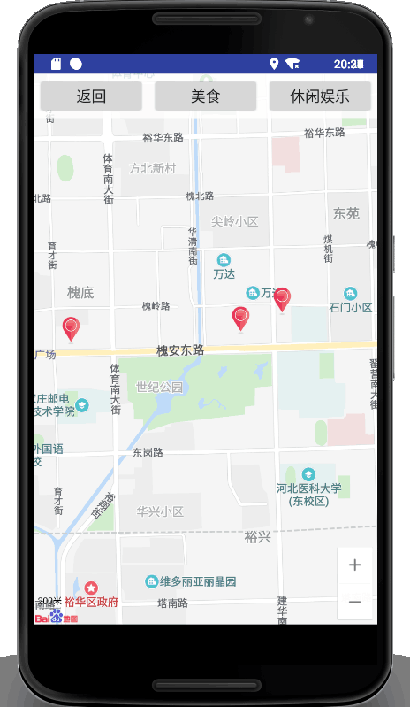
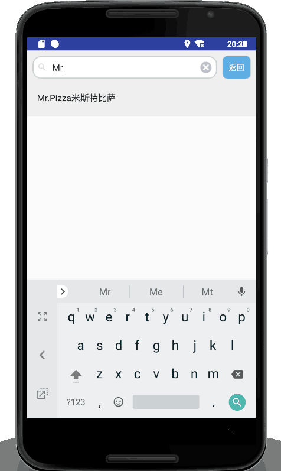

# 2015级项目实训成果展示 

## 《吃享》 - Java与移动智能设备开发

### 项目简介

"吃享app"除传统美食娱乐App所具有的功能外，还添加了地图模式以及排队等待模块等内容。与传统的列表展示相比而言，地图模式更加直观，让人视野明朗，用户可以在生动明朗的地图模式下挑选出自己感兴趣的商家。除此之外，我们还会继续添加了提供各个平台如美团等的对商家评论的功能，可以看到所有平台的评论。我们致力于打造出一个“1.在自己喜欢的模式下寻找出感兴趣商家2.如果去此就餐是否需要等待3.如果需要等待自己前方会还有"xx桌"，大概需要等待多长时间4.是否需要提前取号排队”的四步走方式最大程度去解决用户的实际需求。

### 项目地址
- Github：[https://github.com/MealAndEnjoy/MealAndEnjoy](https://github.com/MealAndEnjoy/MealAndEnjoy)

### 项目成员

- 杨依涵（项目组长、客户端和服务器端代码开发、UI界面设计）
	- Email：[846719309@qq.com](mailto:846719309@qq.com) 
	- Github：[https://github.com/yangyihan](https://github.com/yangyihan)
- 司谨铫（客户端和服务器端代码开发、UI界面设计、数据库关系搭建）
	- Email：[623821382@qq.com](mailto:623821382@qq.com)
	- Github：[https://github.com/sijinyao](https://github.com/sijinyao)
- 蔡鹏志（客户端和服务器端代码开发、UI界面设计、测试项目）
	- Email：[609923365@qq.com](mailto:609923365@qq.com)
	- Github：[https://github.com/caipengzhi](https://github.com/caipengzhi)
- 张刘洋（数据库设计）
	- Email：[1668522243@qq.com](mailto:1668522243@qq.com)
	- Github：[https://github.com/ZhangLiuYang2015](https://github.com/ZhangLiuYang2015)
- 钱晋（测试、简单代码编写）
	- Email：[979082404@qq.com](mailto:979082404@qq.com)
	- Github：[http://github.com/qianjin517](http://github.com/qianjin517)
- 赵江文（测试、找素材）
	- Email：[2381592001@qq.com](mailto:2381592001@qq.com)
	- Github：[https://github.com/zhaojiangwen](https://github.com/zhaojiangwen)

### 项目截图

