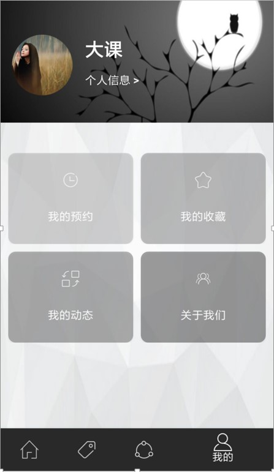
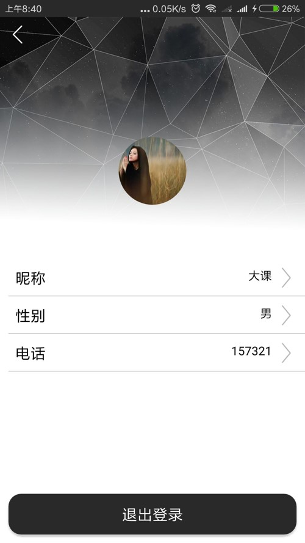
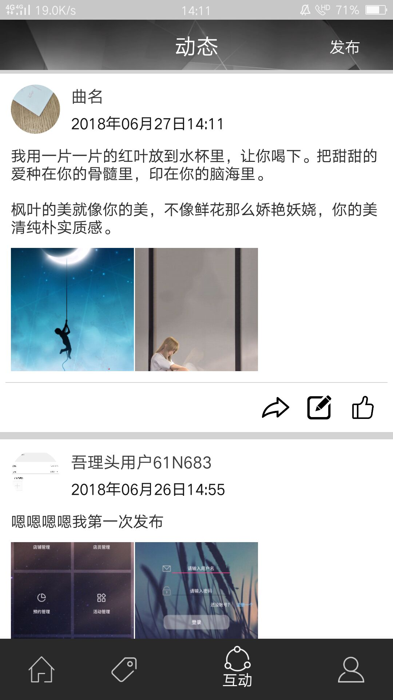
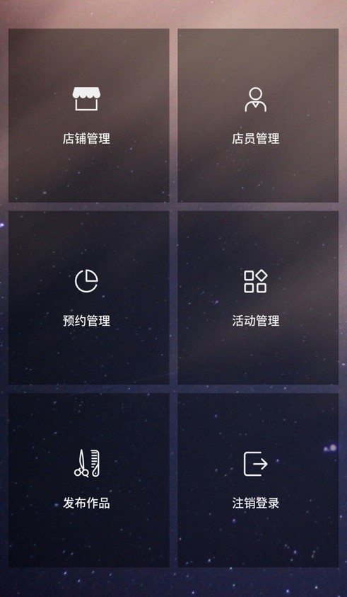

# 2015级项目实训成果展示 

## 《吾理头》 - Java与移动智能设备开发
> ——为你提供更多的理发选择

### 项目简介

本项目着力于解决当前多数人对理发不可预期，无法详细了解和比较各个理发店铺实际情况的问题，致力于为用户提供一个更加公开、方便的信息获取平台以及为理发店提供自我展示平台，来方便生活。同时为店铺管理提供更加灵活、简单、可视化的方案，实现更加便捷的店铺经营。

### 项目地址
- Github：[https://github.com/IcePods](https://github.com/IcePods)

### 项目成员

- 李垚（项目经理、开发工程师）
	- Email：[1074735496@qq.com](mailto:1074735496@qq.com)
	- Github：[https://github.com/SCP-KAKA](https://github.com/SCP-KAKA)
- 陆昊阳（开发工程师）
	- Email：[1023973648@qq.com](mailto:1023973648@qq.com)
	- Github：[https://github.com/luhaoyang1](https://github.com/luhaoyang1)
- 谷超男（开发工程师）
	- Email：[1046850931@qq.com](mailto:1046850931@qq.com)
	- Github：[https://github.com/guchaonan](https://github.com/guchaonan)
- 李亚欣（开发工程师）
	- Email：[563294284@qq.com](mailto:563294284@qq.com)
	- Github：[https://github.com/liliyaxin](https://github.com/liliyaxin)
- 韩聪聪（开发工程师）
	- Email：[2393551398@qq.com](mailto:2393551398@qq.com)
	- Github：[https://github.com/HanCongCong](https://github.com/HanCongCong)
- 何宗亮（开发工程师）
	- Email：[810218104@qq.com](mailto:810218104@qq.com)
	- Github：[https://github.com/Hezongliang](https://github.com/Hezongliang)
- 张天龙（开发工程师）
	- Email：[1036862114@qq.com](mailto:1036862114@qq.com)
	- Github：[https://github.com/1036862114](https://github.com/1036862114)

### 项目截图

