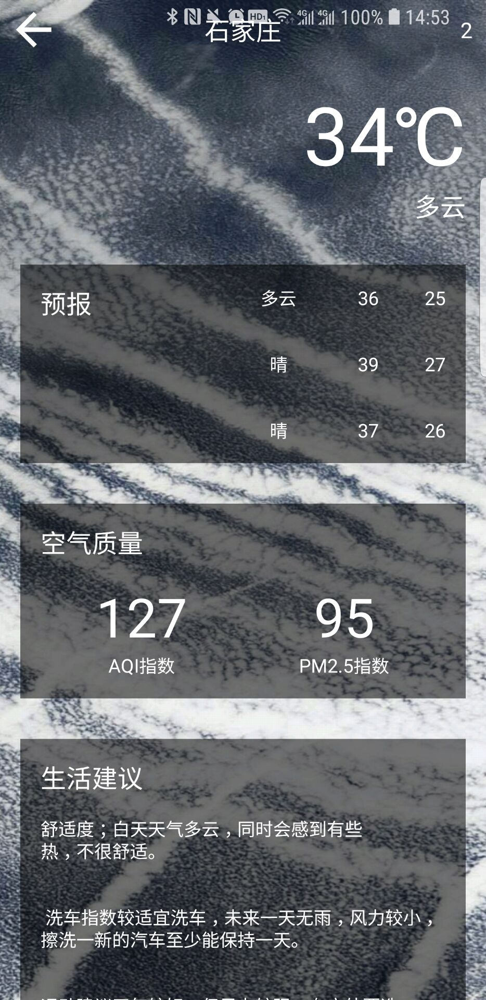
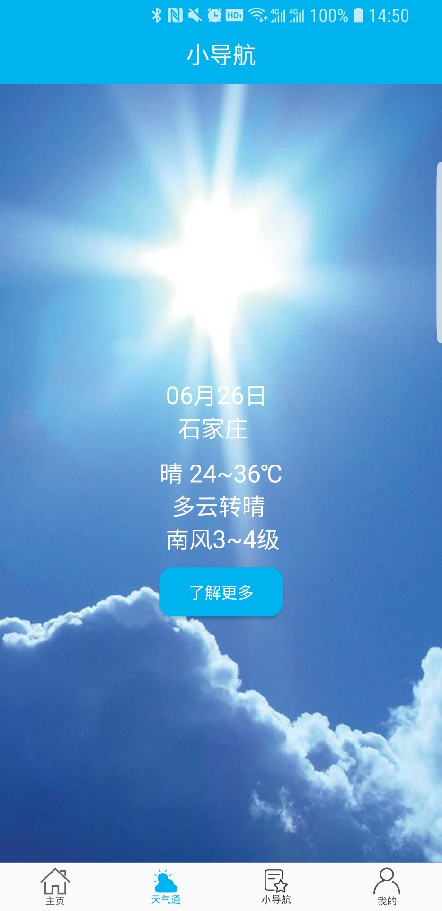
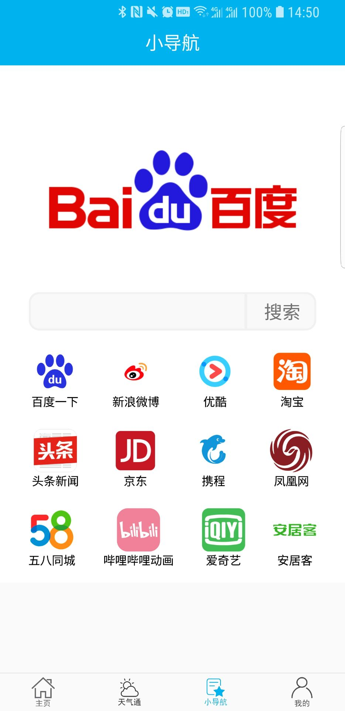

# 2015级项目实训成果展示 

## 《小导航》 - Java与移动智能设备开发

### 项目简介

小导航——轻量工具性实用APP

小导航APP并不是真正的导航工具，而是一款具备新闻，天气，网站导航等功能的一款轻量型工具APP，在智能设备普及的今天，孕育而生的是更加丰富种类繁多的APP，在APP竞争激烈的环境下，功能齐全甚至于冗杂，这样的APP已经多到数不胜数了，其实大部分的用户并没有用到其全部功能的一半甚至于更少，所以我们推出一款界面简洁，用户操作方便的APP，简单的功能，可以满足用户一定的需求。

### 项目地址
- Github（服务端）：[https://github.com/xiaowangziLMZ/Training_Android_LittleGuide_Service](https://github.com/xiaowangziLMZ/Training_Android_LittleGuide_Service)
- Github（客户端）[https://github.com/xiaowangziLMZ/Training_Android_LittleGuide_Client](https://github.com/xiaowangziLMZ/Training_Android_LittleGuide_Client)

### 项目成员

- 李明泽（项目经理、UI设计师、开发工程师	）
	- Email：[1049485739@qq.com](mailto:1049485739@qq.com) 
	- Github：[https://github.com/xiaowangziLMZ](https://github.com/xiaowangziLMZ)
- 张旭（测试工程师、开发工程师）
	- Email：[274344964@qq.com](mailto:274344964@qq.com)
	- Github：[https://github.com/zhangxu0](https://github.com/zhangxu0)
- 秦翱奥（UI设计师、开发工程师）
	- Email：[378580708@qq.com](mailto:378580708@qq.com)
	- Github：[https://github.com/qinaoao](https://github.com/qinaoao)
- 樊迎港（产品经理、UI设计师、开发工程师）
	- Email：[1443365096@qq.com](mailto:1443365096@qq.com)
	- Github：[https://github.com/fanyinggang](https://github.com/fanyinggang)
- 彭子奇（UI设计师、测试工程师、开发工程师）
	- Email：[1176091002@qq.comm](mailto:1176091002@qq.com)
	- Github：[https://github.com/Tsoiay](https://github.com/Tsoiay)

### 项目截图

