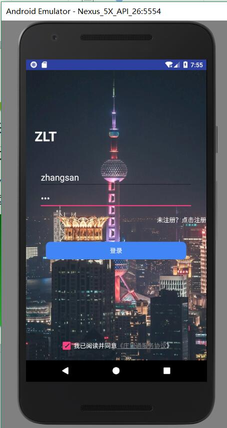
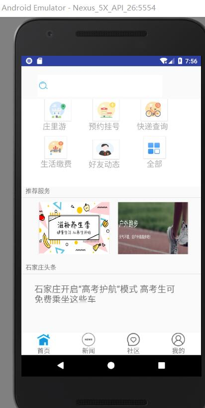
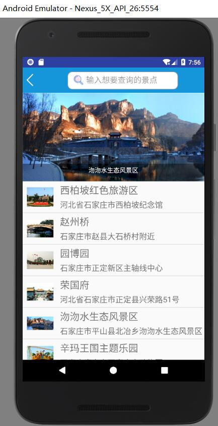
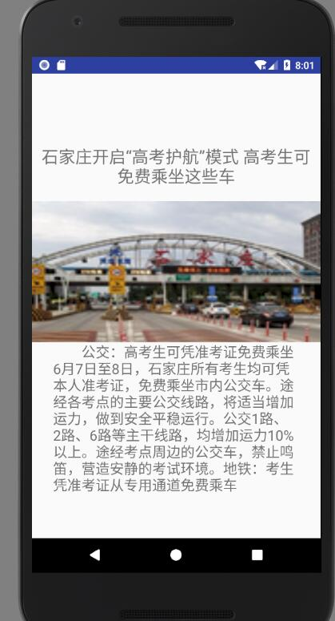
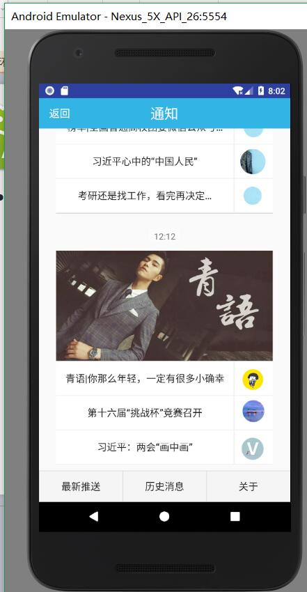
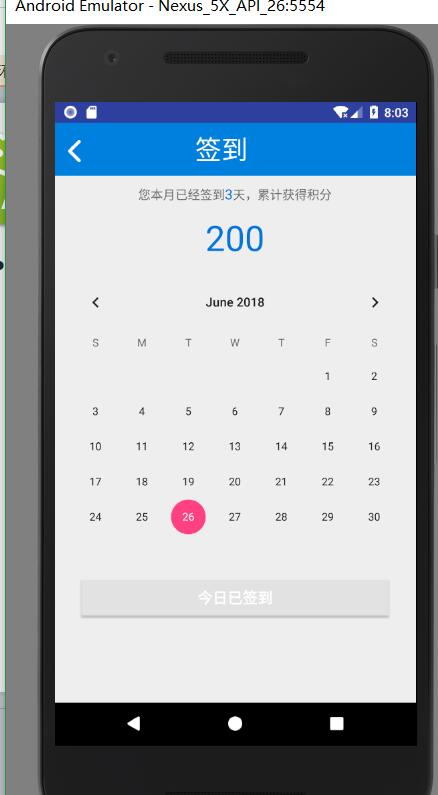
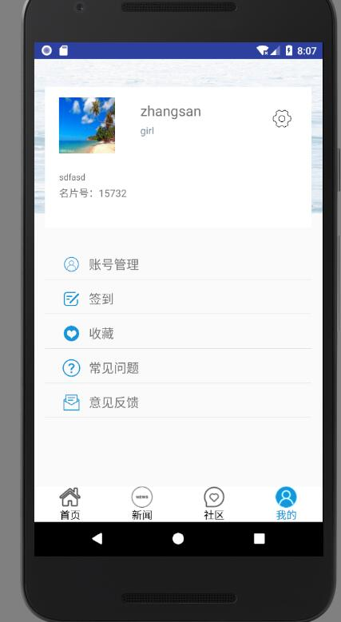

# 2015级项目实训成果展示 

## 《庄里通》 - Java与移动智能设备开发

### 项目简介

此项目包含新闻类模块、出行旅游类模块、生活服务类模块、政民互动类模块、社区类模块，主要提供给石家庄城市居民更好的生活体验。项目可以满足用户的基本需求，从出行到休闲各个方面。随着互联网快速发展，人们对依托于平台之上的服务有着更多需求，未来的商业模式将不会是工具的贩卖。项目在手机上属于底层应用中的一种，可以具备强大有力的实用性功能，更加方便了城市居民的生活，在商业化方面有着不容忽视的商业价值。

### 项目成员

- 刘雨晴（产品经理、软件开发工程师）
	- Email：[1170507707@qq.com](mailto:1170507707@qq.com)
	- Github：[https://github.com/LiuyuQingg](https://github.com/LiuyuQingg)
- 王颖（软件架构师、软件开发工程师）
	- Email：[wying1997@foxmail.com](mailto:wying1997@foxmail.com)
	- Github：[https://github.com/wangyinga](https://github.com/wangyinga)
- 王玉波（软件架构师、软件开发工程师）
	- Email：[459282174@qq.com ](mailto:459282174@qq.com)
	- Github：[https://github.com/wangyubo880](https://github.com/wangyubo880)
- 李静敏（项目经理、软件开发工程师）
	- Email：[1394013446@qq.com](mailto:1394013446@qq.com)
	- Github：[https://github.com/lijingmin-2](https://github.com/lijingmin-2)
- 汪小钦（需求专家、软件开发工程师）
	- Email：[1157154477@qq.com](mailto:1157154477@qq.com)
	- Github：[https://github.com/hellowangxiaoqin](https://github.com/hellowangxiaoqin)
- 杨文邈（需求专家、软件开发工程师）
	- Email：[1902674108@qq.com](mailto:1902674108@qq.com)
	- Github：[https://github.com/yangwenmiao](https://github.com/yangwenmiao)
- 李易娟（软件测试专家）
	- Email：[15095271330@163.com](mailto:15095271330@163.com)
	- Github：[http://github.com/leeyijvan](http://github.com/leeyijvan)

### 项目截图

