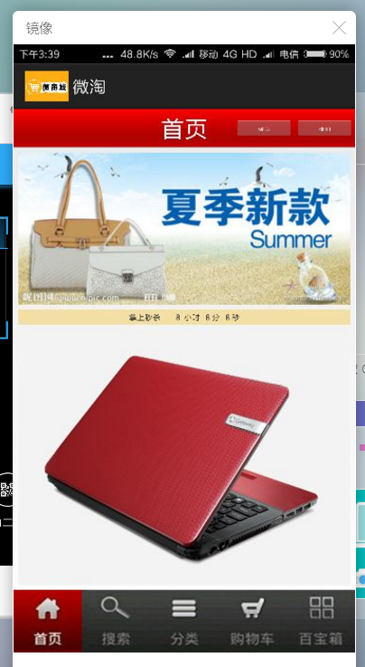
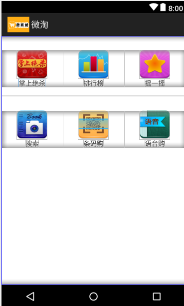
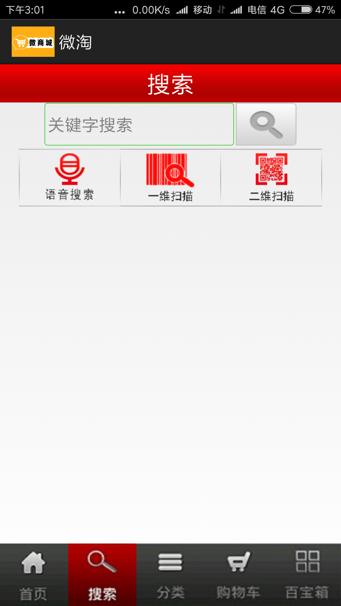
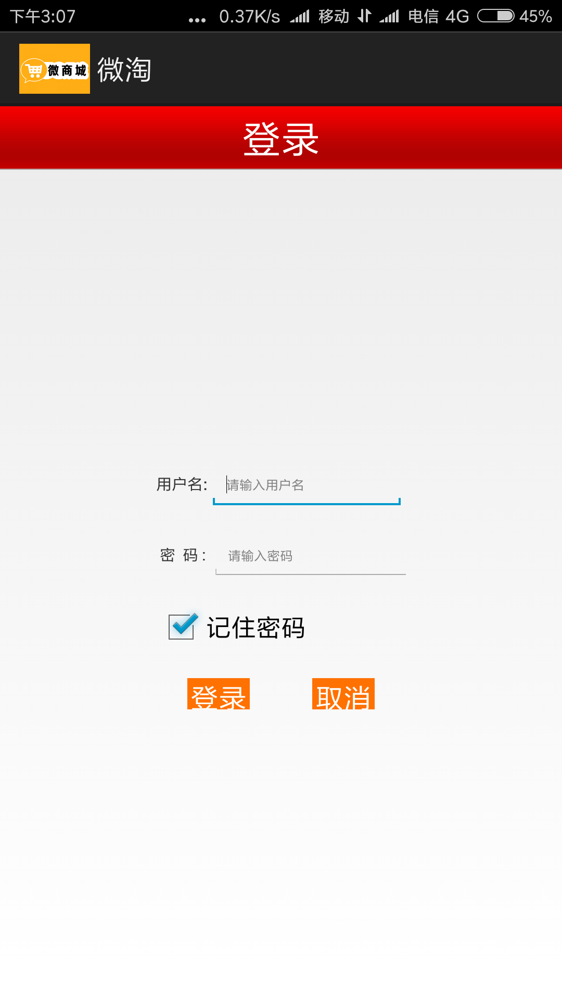
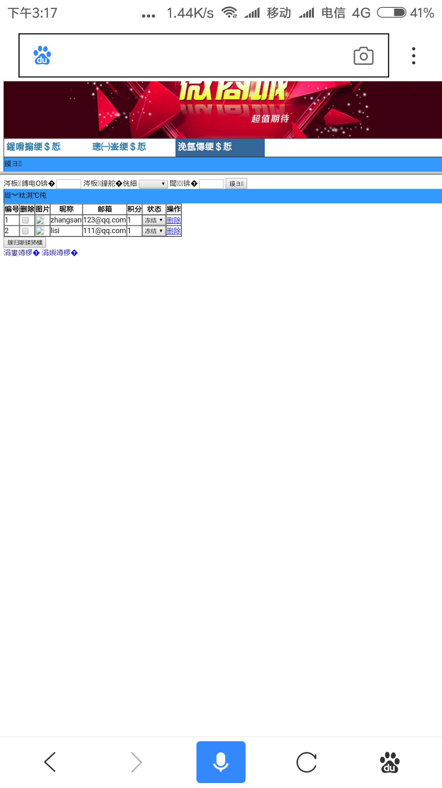

# 2015级项目实训成果展示 

## 《微淘》 - Java与移动智能设备开发

### 项目简介

一款以方便网民购物的,满足人们的购物需求，同时兼具有后台管理功能的手机APP。

### 项目成员

- 章亨（开发、策划、测试）
	- Email：[1519561050@qq.com](mailto:1519561050@qq.com) 
	- Github：[https://github.com/zhangheng1519561050](https://github.com/zhangheng1519561050)
- 高亮（开发、策划）
	- Email：[384677072@qq.com](mailto:384677072@qq.com)
	- Github：[https://github.com/BESTCLEARFUTURE](https://github.com/BESTCLEARFUTURE)
- 陆宇轩（开发、调查）
	- Email：[2996545126@qq.com](mailto:2996545126@qq.com)
	- Github：[https://github.com/luyuxuan](https://github.com/luyuxuan)
-白裕鑫（项目经理、开发、调查）
	- Email：[759224046@qq.com](mailto:759224046@qq.com)
	- Github：[https://github.com/2015015453](https://github.com/2015015453)

### 项目截图

