# 2015级项目实训成果展示 

## 《掌上图书馆》 - Java与移动智能设备开发

### 项目简介

一款为在校学生和教师提供所在学校图书馆的馆藏信息，和个人的图书借阅情况的APP。旨在为各大高校学生开创图书馆书籍借阅平台，以实现节约时间以及高效阅览书籍，提升大学生文化素养。

### 项目地址
- Github (客户端)：[https://github.com/wanghui321/PalmarLibrary](https://github.com/wanghui321/PalmarLibrary)
- Github (服务端)：[https://github.com/wanghui321/PalmarLibraryService](https://github.com/wanghui321/PalmarLibraryService)

### 项目成员

- 王辉（项目经理，UI设计师，服务器端开发工程师）
	- Email：[1562995735@qq.com](mailto:1562995735@qq.com)
	- Github：[https://github.com/wanghui321](https://github.com/wanghui321)
- 李宇鹏（UI设计师，客户端开发工程师）
	- Email：[529436712@qq.com](mailto:529436712@qq.com)
	- Github：[https://github.com/cometo6](https://github.com/cometo6)
- 王睿（UI设计师，客户端开发工程师）
	- Email：[1026053419@qq.com](mailto:1026053419@qq.com)
	- Github：[https://github.com/wangrui2](https://github.com/wangrui2)
- 郭彭（UI设计师，服务器端开发工程师）
	- Email：[627829348@qq.com](mailto:627829348@qq.com)
	- Github：[https://github.com/gp15340](https://github.com/gp15340)
- 刘振宙（UI设计师，服务器端开发工程师）
	- Email：[1150542206@qq.com](mailto:1150542206@qq.com)
	- Github：[https://github.com/wudilong3](https://github.com/wudilong3)
- 田云鹏（UI设计师，服务器端开发工程师）
	- Email：[1078518482@qq.com](mailto:1078518482@qq.com)
	- Github：[https://github.com/tianyunpeng](https://github.com/tianyunpeng)

### 项目截图

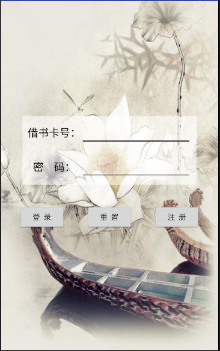

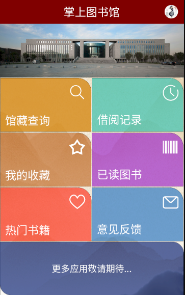

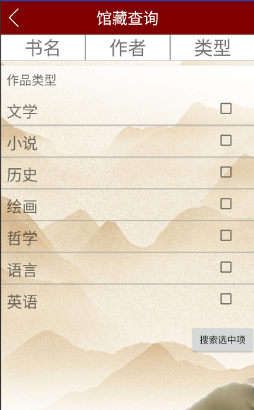

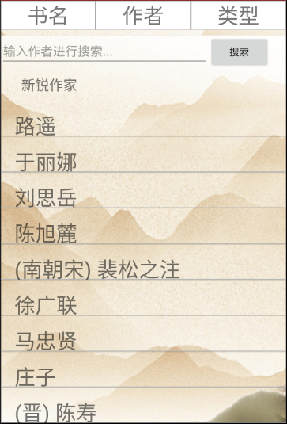

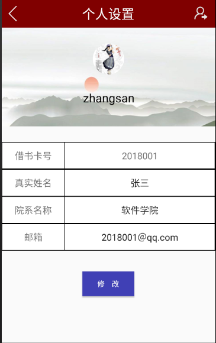
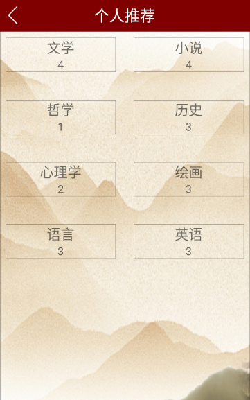
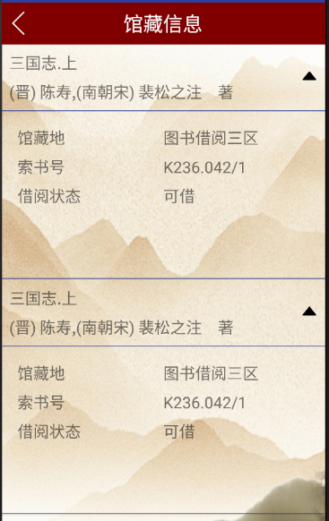

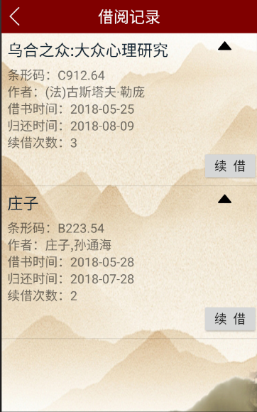
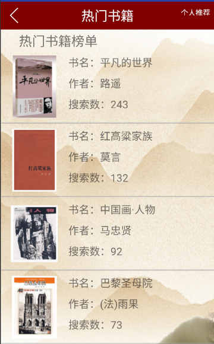
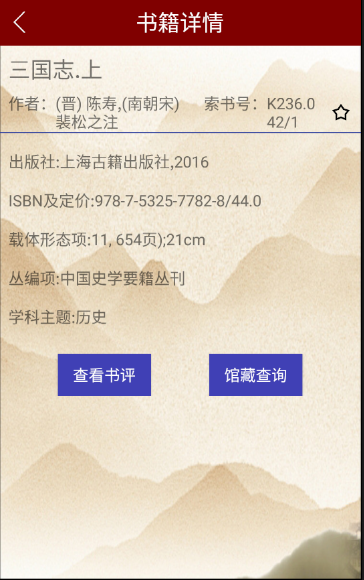

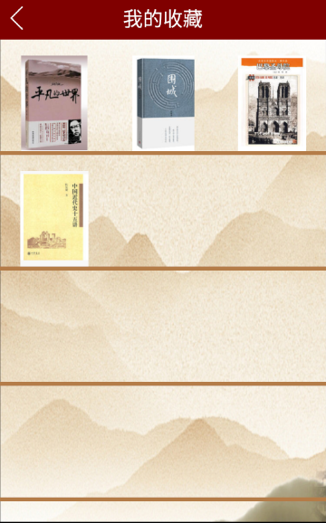

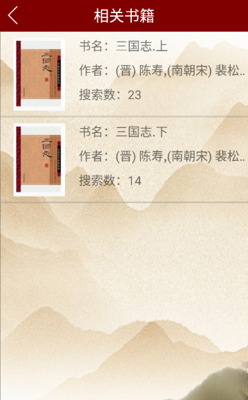

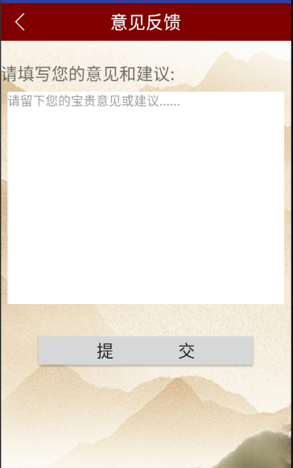

