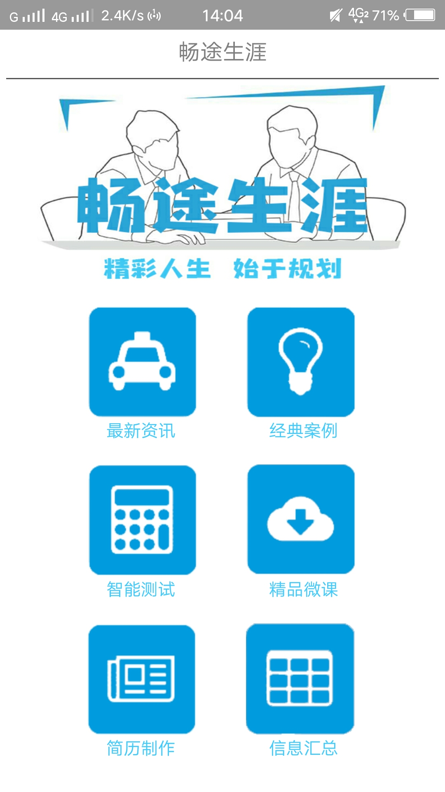
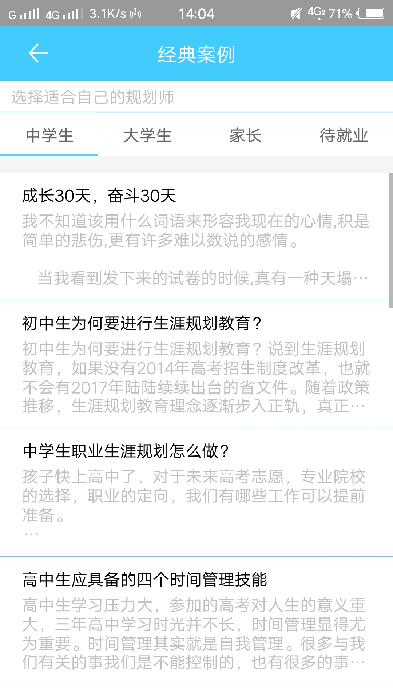
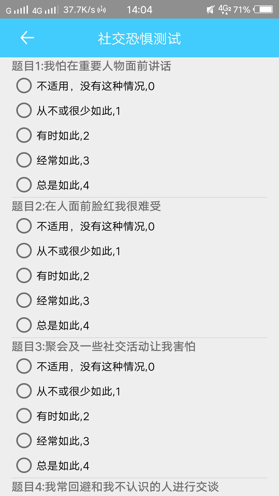
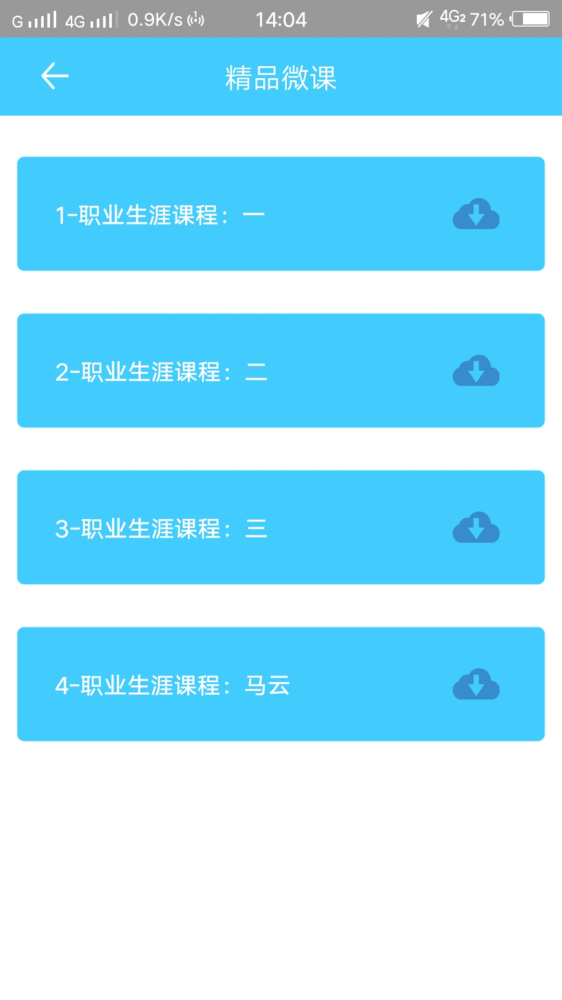
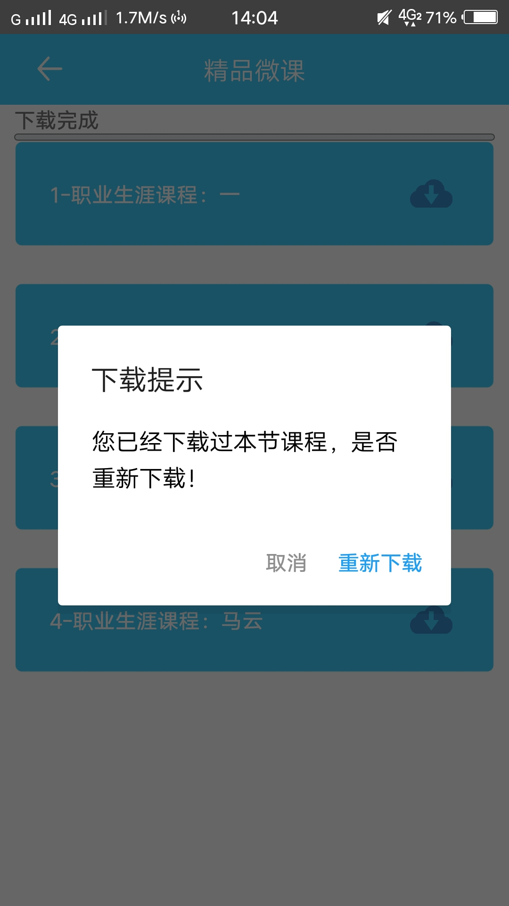
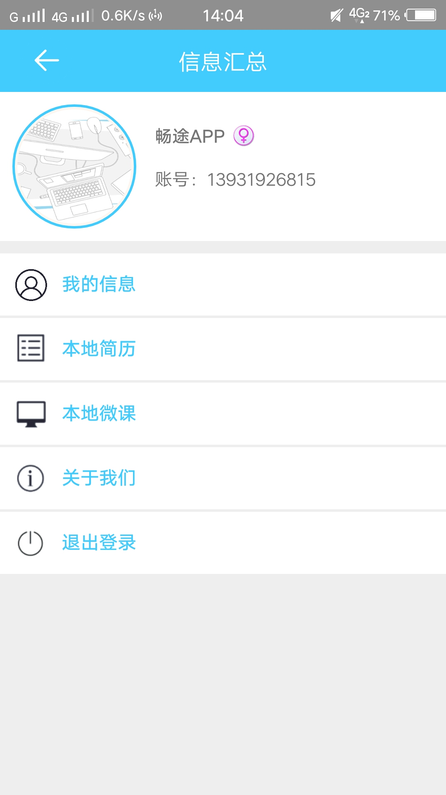

# 2015级项目实训成果展示 

## 《畅途生涯》 - Java与移动智能设备开发

### 项目简介

畅途生涯是面向中学生、大学生等广大用户的生涯规划APP。

### 项目成员

- 张涛 (项目经理、产品、UI设计、服务器、客户端代码开发)
	- Email：[2282660541@qq.com](mailto:2282660541@qq.com) 
	- Github：[https://github.com/winter2282](https://github.com/winter2282)
- 韩宇轩 (服务器代码开发、产品、UI设计)
	- Email：[943635952@qq.com](mailto:943635952@qq.com)
	- Github：[https://github.com/hanyuxuan2015015516](https://github.com/hanyuxuan2015015516)
- 卫晓靖 (客户端代码开发、测试)
	- Email：[570678494@qq.com](mailto:570678494@qq.com)
	- Github：[https://github.com/weixiaojing](https://github.com/weixiaojing)
- 岳瑞波 (客户端代码开发、测试)
	- Email：[1213996437@qq.com](mailto:1213996437@qq.com)
	- Github：[https://github.com/yueruibo](https://github.com/yueruibo)
- 陈港 (客户端代码开发、测试)
	- Email：[565584387@qq.com](mailto:565584387@qq.com)
	- Github：[https://github.com/Cgg565584387](https://github.com/Cgg565584387)

### 项目截图

