# 2015级项目实训成果展示 

## 《篮球吧》 - Java与移动智能设备开发

### 项目简介

篮球吧APP提供线上约球、线下打球、实时篮球咨询、NBA赛事直播、CBA赛事直播、著名球星动态、交流社区、篮球设备零售等功能，并依据APP的特点与线下高校合作。用户可在APP开辟自己的空间，通过个人主页分享自己的赛事直播赚取观看用户的赏金，分享打球心得，结交大量热爱篮球运动的朋友；各大高校也可利用此网站开展基于校园篮球赛事等活动，以达到大学生活跃开展篮球健身的目的。给你一个NBA梦。

### 项目地址
- Github：[https://github.com/AOPG](https://github.com/AOPG)

### 项目成员

- 刘壑川（项目经理，产品，DBA，客户端代码开发，服务器代码开发）
	- Email：[hechuan.hc@foxmail.com](mailto:hechuan.hc@foxmail.com) 
	- Github：[https://github.com/hechuanLiu](https://github.com/hechuanLiu)
- 李华伟（项目经理，产品）
	- Email：[1293747294@qq.com](mailto:1293747294@qq.com)
	- Github：[https://github.com/LiHuaWei00](https://github.com/LiHuaWei00)
- 王伟健（产品，架构师，UI设计，客户端代码开发，服务器代码开发）
	- Email：[1209050051@qq.com](mailto:1209050051@qq.com)
	- Github：[https://github.com/weijianwang](https://github.com/weijianwang)
- 王攀（产品，DBA，客户端代码开发，服务器代码开发）
	- Email：[331944508@qq.com](mailto:331944508@qq.com)
	- Github：[https://github.com/wp1573216](https://github.com/wp1573216)
- 张瑶（UI设计，客户端代码开发）
	- Email：[357782955@qq.com](mailto:357782955@qq.com)
	- Github：[https://github.com/Amberyao](https://github.com/Amberyao)
- 陈燕博（UI设计，客户端代码开发）
	- Email：[117480507@qq.com](mailto:117480507@qq.com)
	- Github：[https://github.com/yanboch](https://github.com/yanboch)
- 刘薇（测试）
	- Email：[1013488645@qq.com](mailto:1013488645@qq.com)
	- Github：[https://github.com/LiuVvv](https://github.com/LiuVvv)

### 项目截图

#### 篮球模块

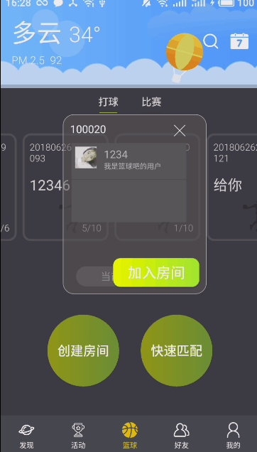
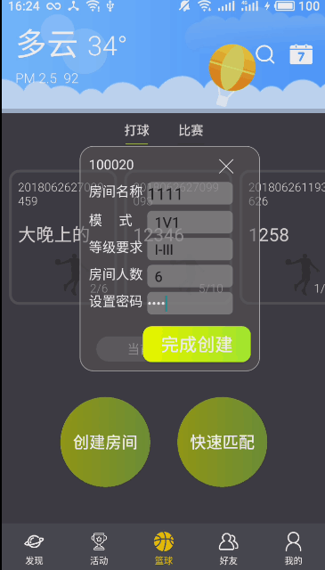
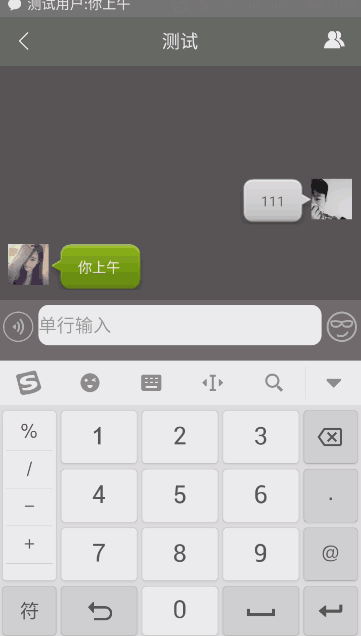

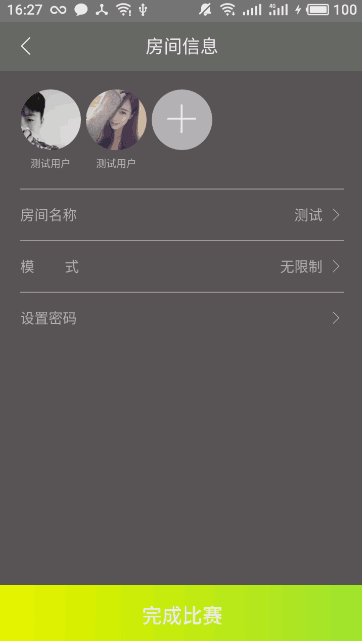
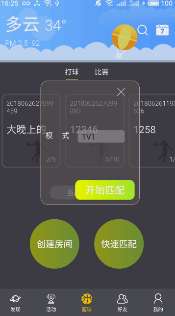
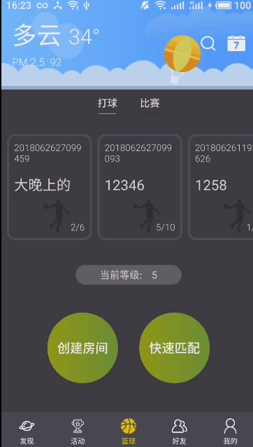

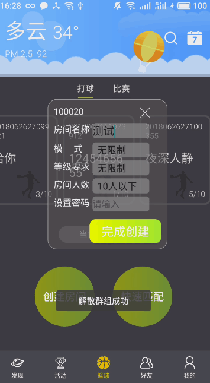
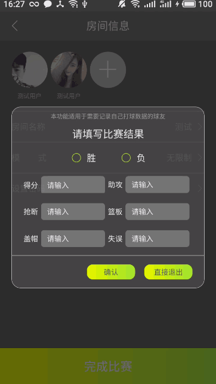
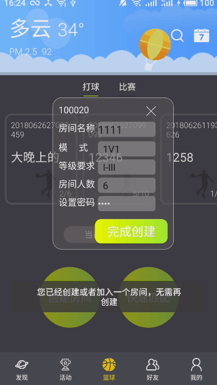

#### 注册登录

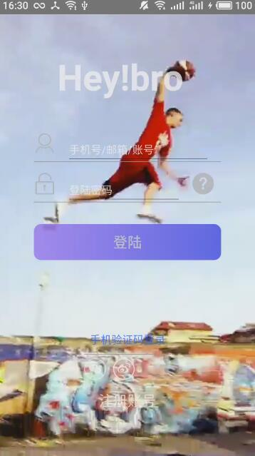
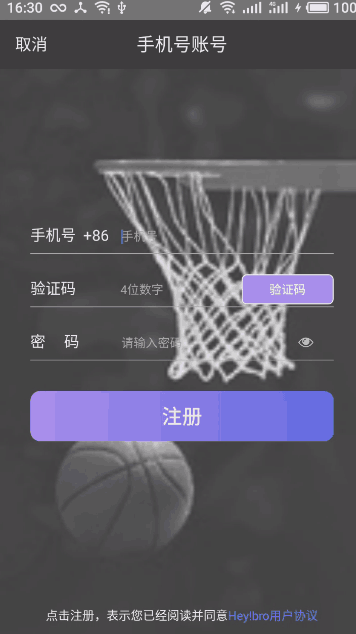

#### 活动模块

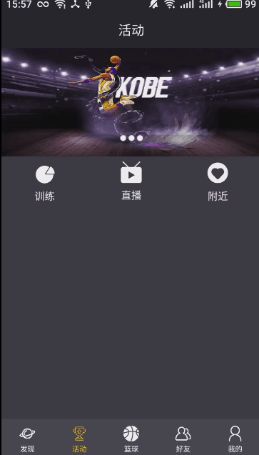
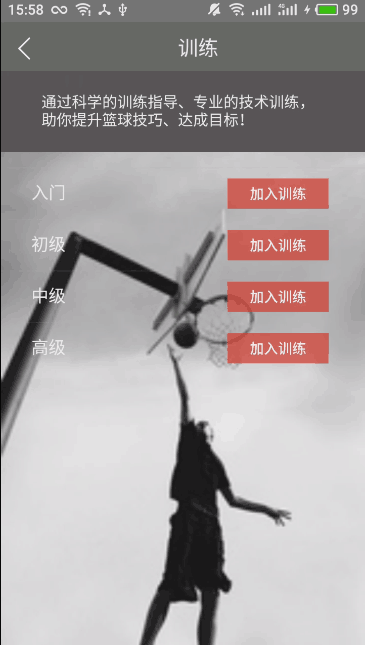
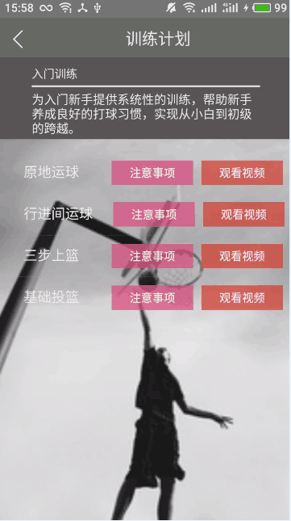

#### 好友模块

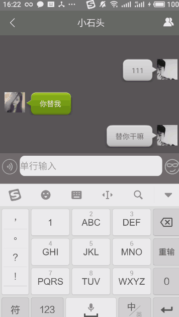
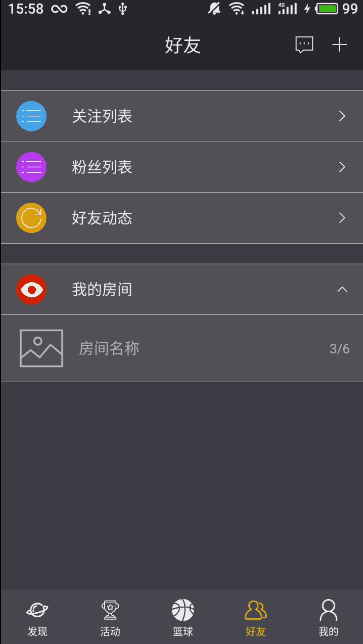

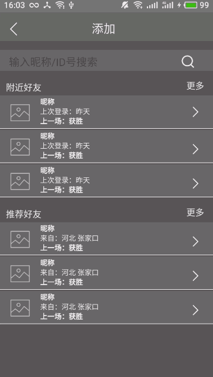

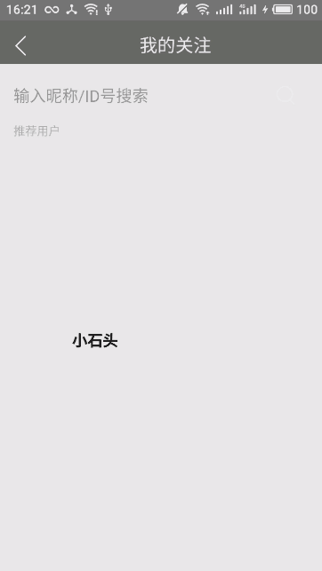

#### 设置

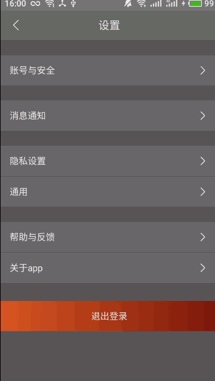
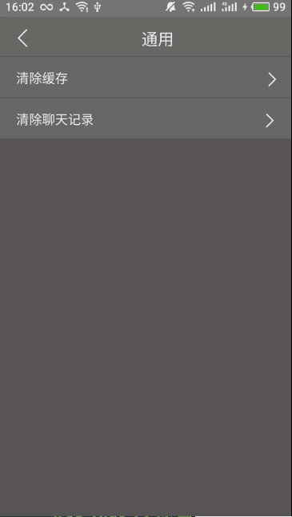

#### 我的

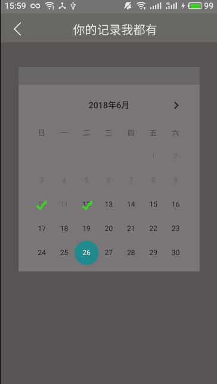
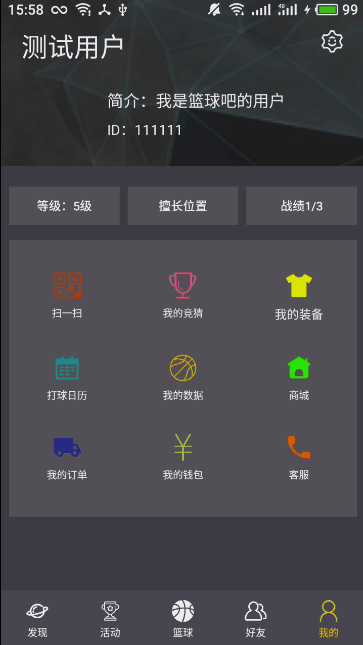
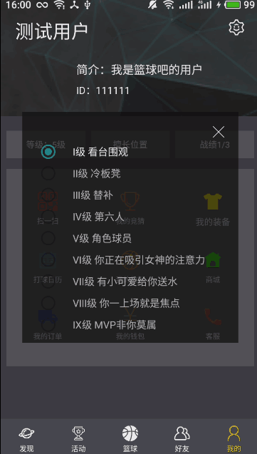

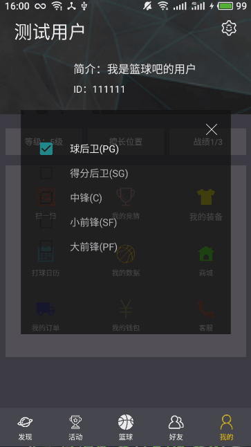
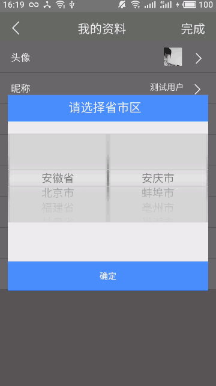
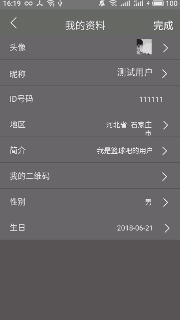

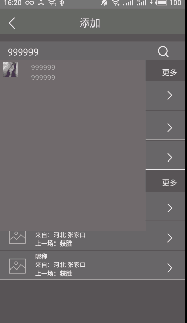
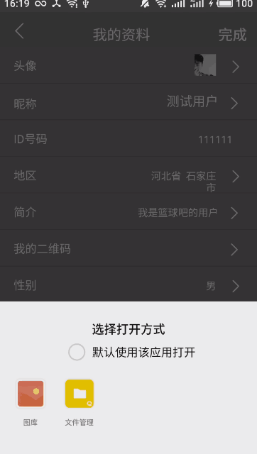
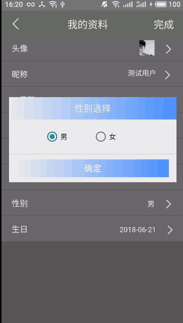

#### 发现

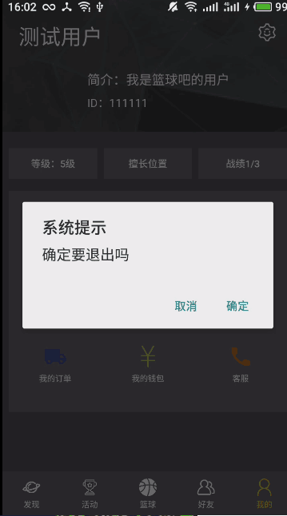

