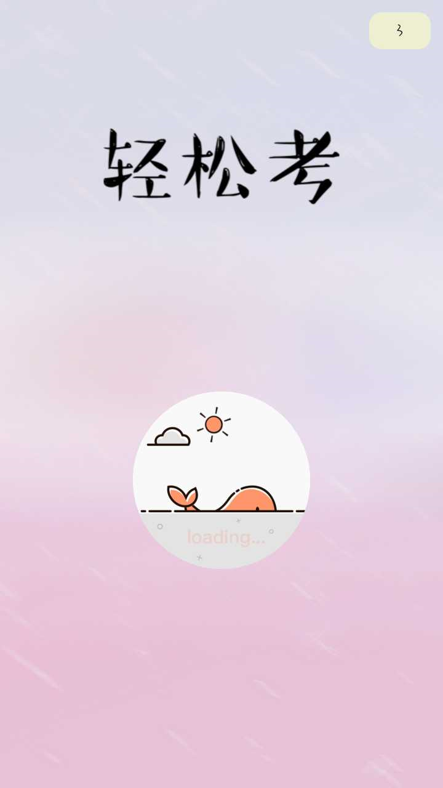
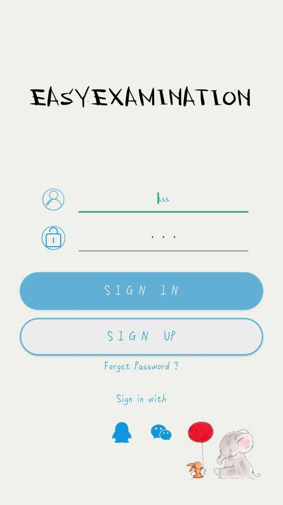
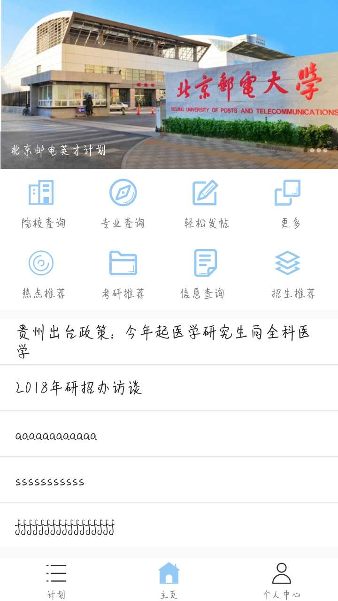
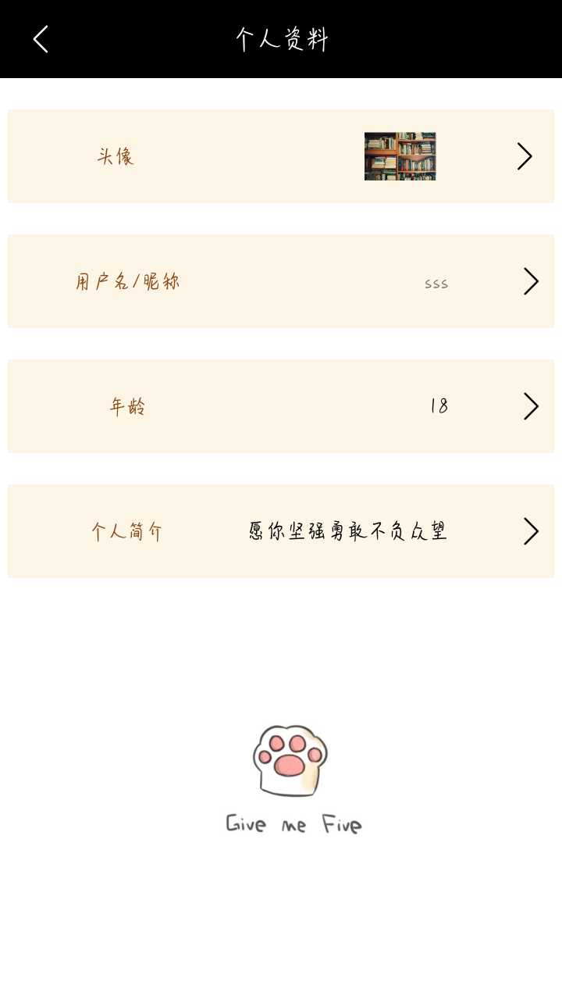
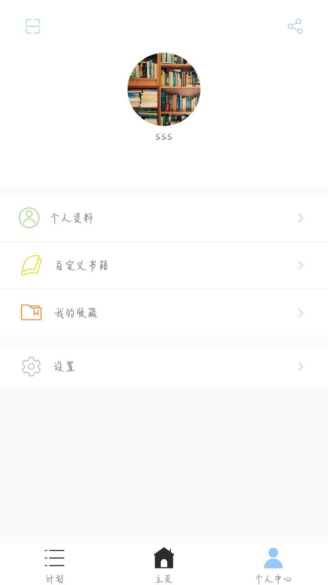
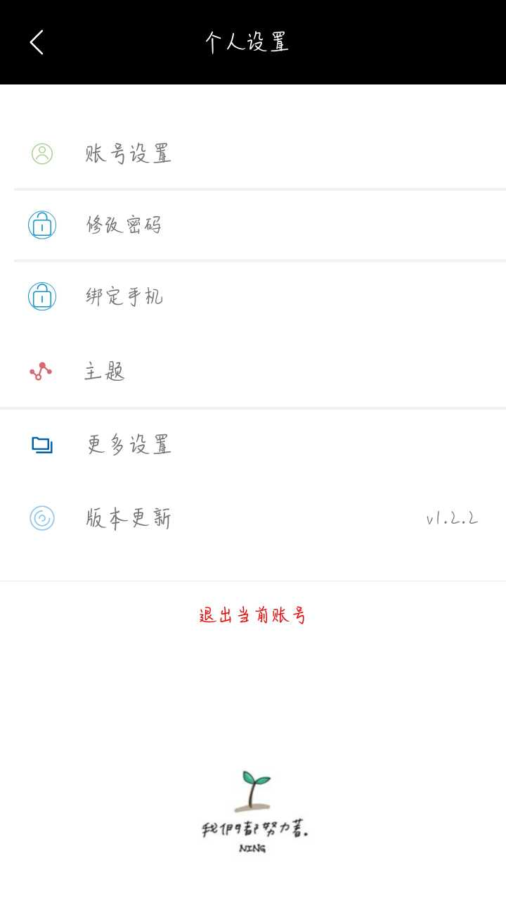
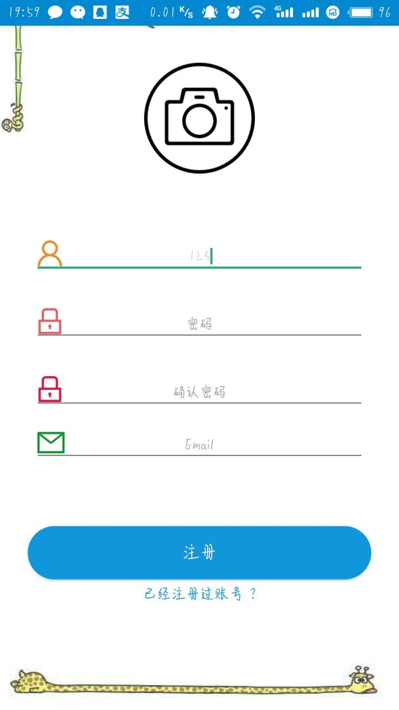
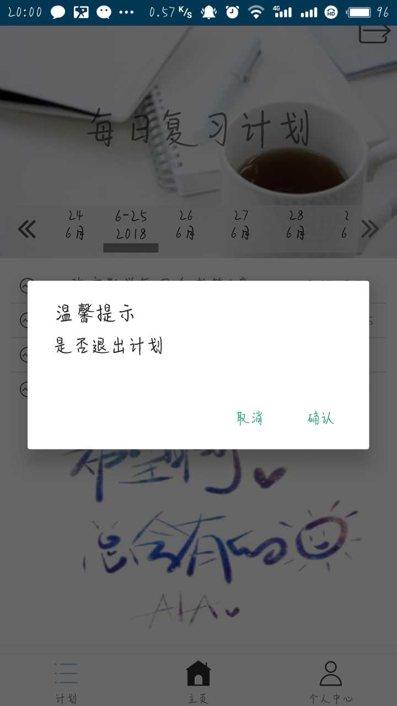
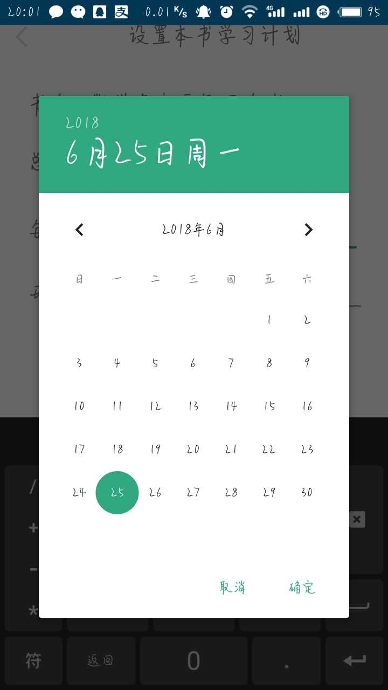

# 2015级项目实训成果展示 

## 《轻松考》 - Java与移动智能设备开发

### 项目简介

轻松考APP 秉承提供优质服务的宗旨，致力于为广大考研学子们提供一个制定专属计划，快速提供信息的广阔平！坚持诚信至上的原则，竭诚帮助广大考研学子。本产品推出了一系列独具特色的服务项目：用户可根据自己实际情况选择或添加书籍，指定个人特色计划，根据专业，地区等来查询院校信息。提供大量考研服务，为考研学子保驾护航。

### 项目地址
- Github：[https://github.com/weilenggmj/EasyExamination](https://github.com/weilenggmj/EasyExamination)

### 项目成员

- 高明健 （项目经理、后台搭建、服务器代码开发）
	- Email：[weilenggmj@outlook.com](mailto:weilenggmj@outlook.com) 
	- Github：[https://github.com/weilenggmj](https://github.com/weilenggmj)
- 马嘉田 （客户端开发、UI设计）
	- Email：[jachinma@qq.com](mailto:jachinma@qq.com)
	- Github：[https://github.com/JachinM](https://github.com/JachinM)
- 赵雅欣 （客户端开发、UI设计、文档）
	- Email：[2289979048@qq.com](mailto:2289979048@qq.com)
	- Github：[https://github.com/zhaoyaxinzyx/](https://github.com/zhaoyaxinzyx/)
- 邢旭东 （客户端开发、UI设计、文档）
	- Email：[290544920@qq.com](mailto:290544920@qq.com)
	- Github：[https://github.com/anzhulabaibi](https://github.com/anzhulabaibi)
- 王珺 （客户端开发、UI设计、文档）
	- Email：[2426488466@qq.com](mailto:2426488466@qq.com)
	- Github：[https://github.com/wangjunWJ](https://github.com/wangjunWJ)
- 汤珺 （客户端开发、UI设计 ）
	- Email：[894749509@qq.com](mailto:894749509@qq.com)

### 项目截图

