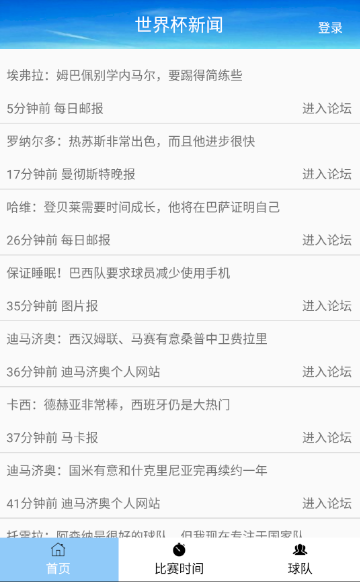
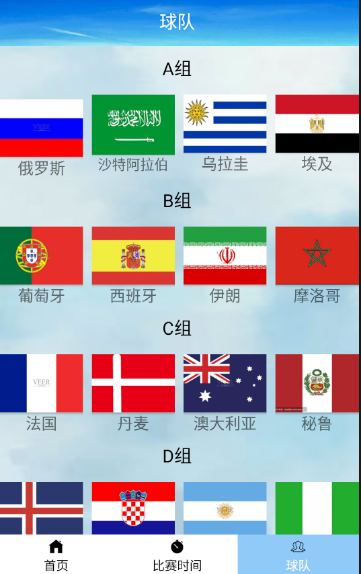
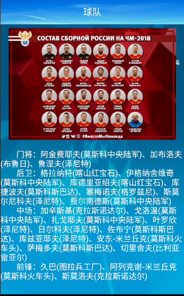
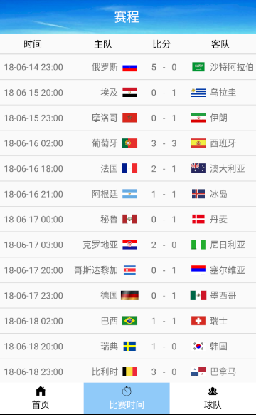

# 2015级项目实训成果展示 

## 《迷上世界杯》 - Java与移动智能设备开发

### 项目简介

《迷上世界杯》是一款面向足球爱好者的足球新闻类APP，为足球爱好者提供一手足球比赛资料，赛场奇闻异事，足球明星的八卦新闻，比赛的最新赛程，比赛结果，各个球队球员信息。

### 项目地址
- Github：[https://github.com/Lhaiyu/worldcupnews](https://github.com/Lhaiyu/worldcupnews)

### 项目成员

- 李海宇（项目经理、客户端开发人员、需求分析人员、服务器开发人员）
	- Email：[1255759571@qq.com](mailto:1255759571@qq.com)
	- Github：[https://github.com/Lhaiyu](https://github.com/Lhaiyu)
- 王宏伟（客户端开发人员、服务器开发人员、需求分析人员）
	- Email：[1172768786@qq.com](mailto:1172768786@qq.com)
	- Github：[https://github.com/wanghognweiqq](https://github.com/wanghognweiqq)
- 赵棋（客户端开发人员、需求分析人员）
	- Email：[446110229@qq.com](mailto:446110229@qq.com)
	- Github：[https://github.com/zhaoqi7](https://github.com/zhaoqi7)
- 何鲁健（UI设计人员、测试人员）
	- Email：[13780405532@163.com](mailto:13780405532@163.com)
	- Github：[https://github.com/helujian](https://github.com/helujian)
- 刘宗尧（UI设计人员）
	- Email：[79845777@qq.com](mailto:79845777@qq.com)
	- Github：[https://github.com/liuzongyao233](https://github.com/liuzongyao233)
- 司习晨（UI设计人员）
	- Email：[772476018@qq.com](mailto:772476018@qq.com)
	- Github：[https://github.com/sixichen](https://github.com/sixichen)

### 项目截图

