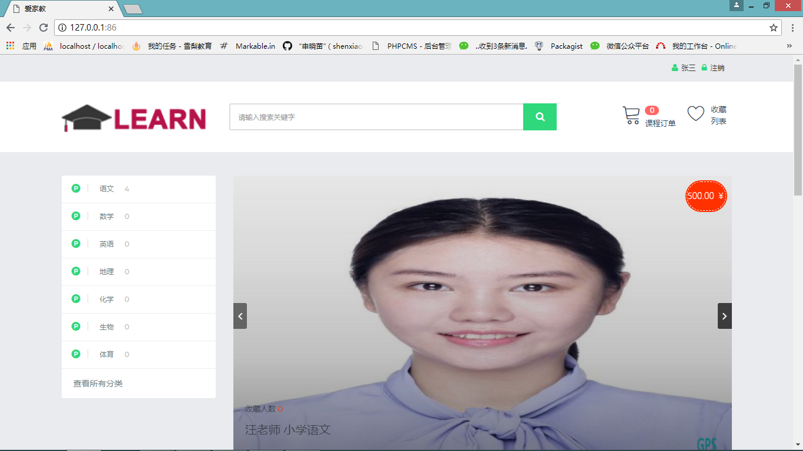
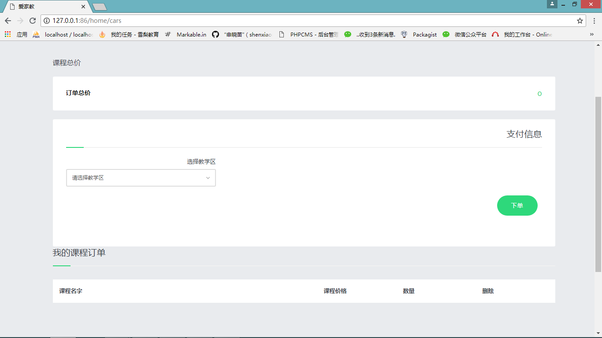
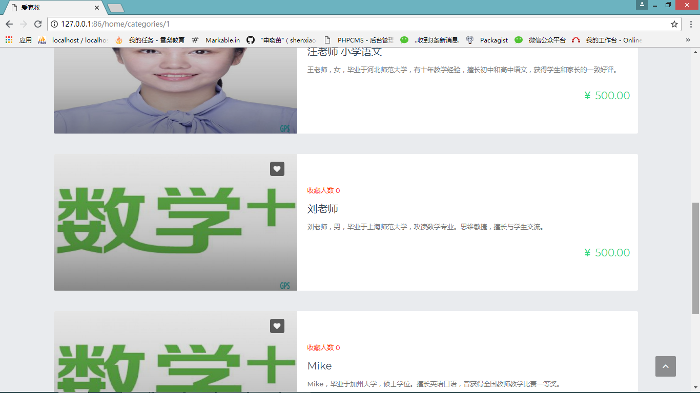
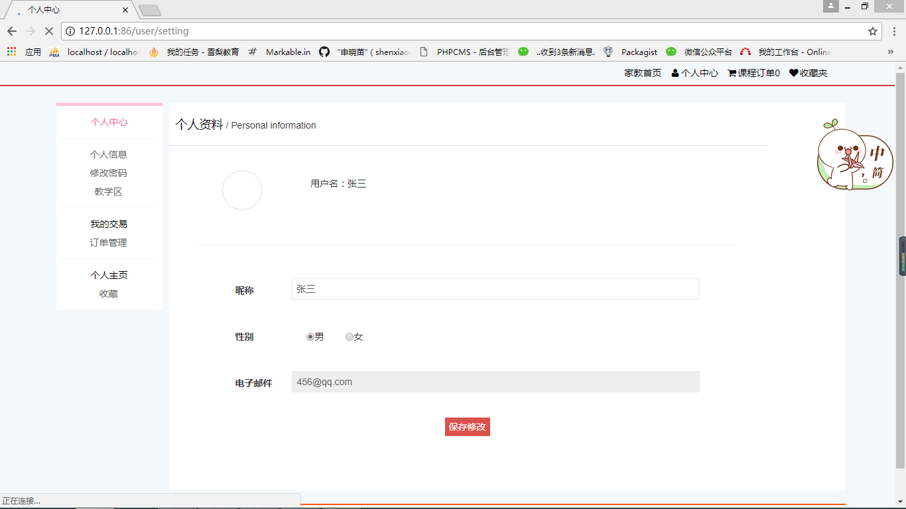
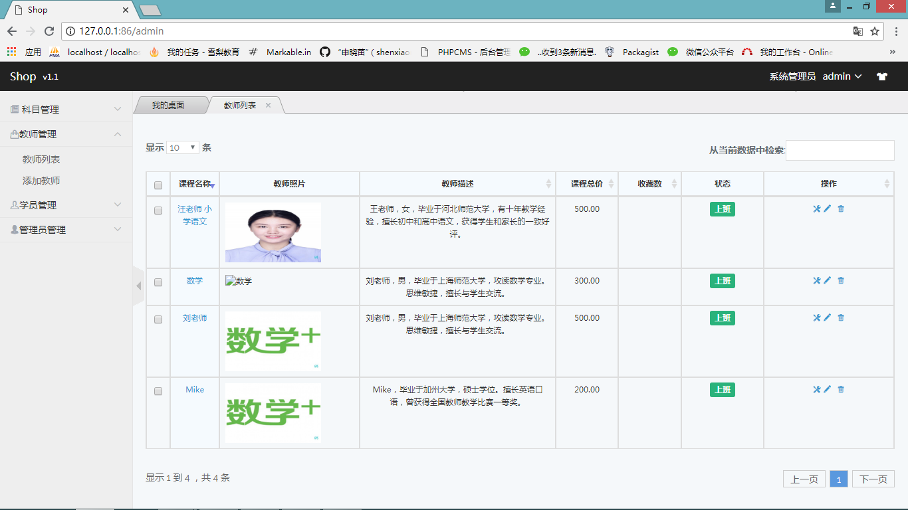
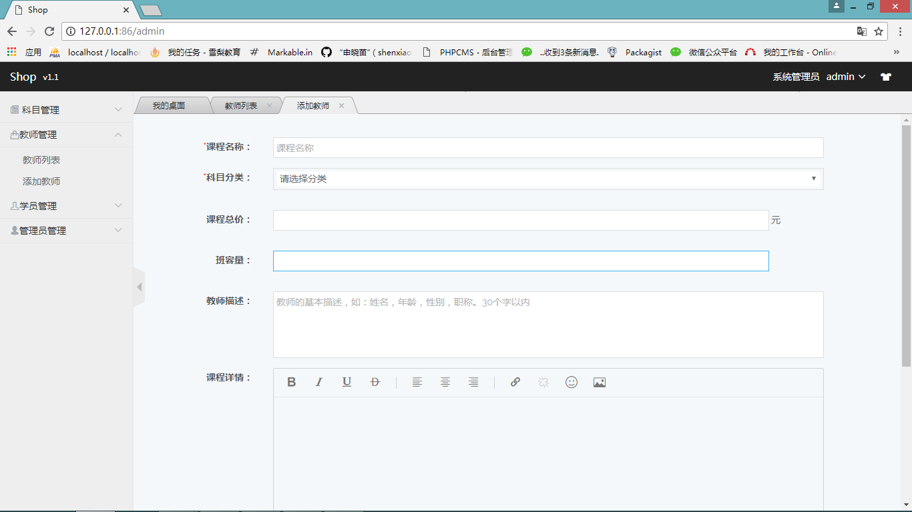

# 2015级项目实训成果展示 

## 《Learn家教系统》 - PHP与云计算技术

### 项目简介

在互联网线上平台运用趋于热门的时代，家教系统在社会规律中运用互联网商业模式，打破传统中介找家教的理念，使交易双方更方便快捷地达成合作，大大减少了额外担心的问题。我们思考如何运用网络资源方便家长为孩子找到合适的家教并减少家长遇到的额外的问题。因此我们推出了家教系统，对于学生家长，可以使用家教自助中心选择一对一辅导或者班级式辅导为找到适合孩子且符合自己满意程度的家教；对于当家教的老师，可以使用家教中心在上面投递个人信息，等待家长的咨询。我们将通过后台家教系统监督并管理学生家长和老师之间的交易，杜绝乱收费的情况，方便双方都找到各自合适的交易对象。 

### 项目地址

- GitHub：[https://github.com/dongjunyan/work12/tree/master/laravel1](https://github.com/dongjunyan/work12/tree/master/laravel1)

### 项目成员

董隽妍、申晓苗、郝蒙蒙、马佩琪、王贯懿 

### 项目分工

前台页面设计及代码编写：马佩琪、王贯懿、郝蒙蒙

数据库搭建：董隽妍、申晓苗、郝蒙蒙

后台管理搭建及完善：申晓苗、董隽妍

**效果截图**

