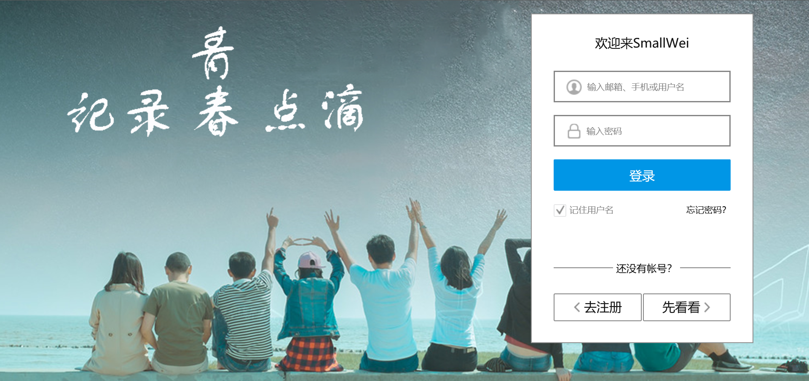
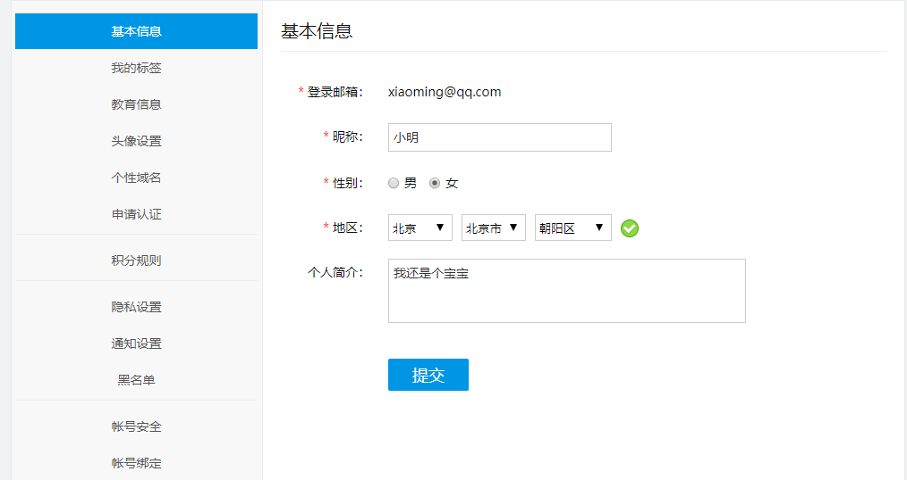
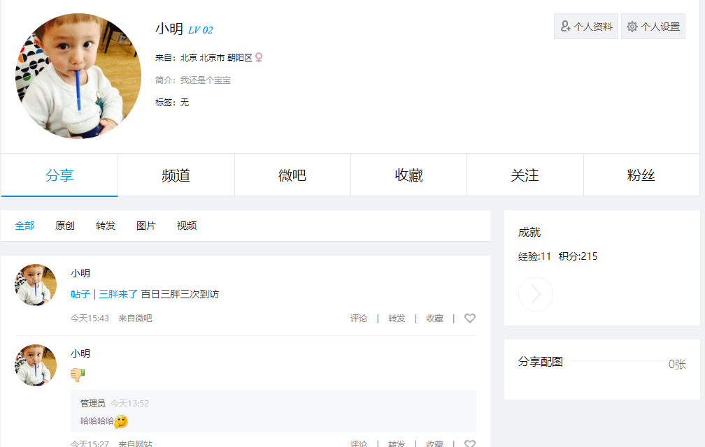
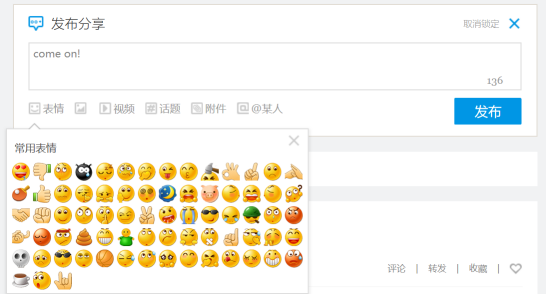
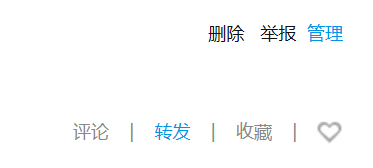
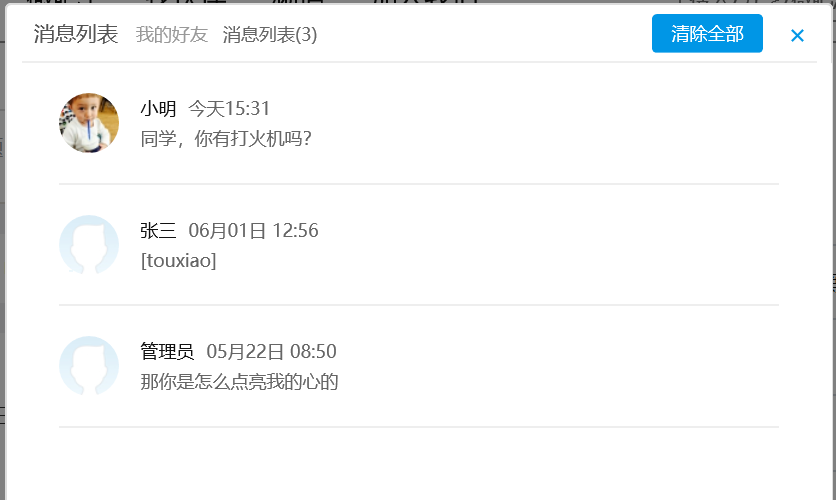
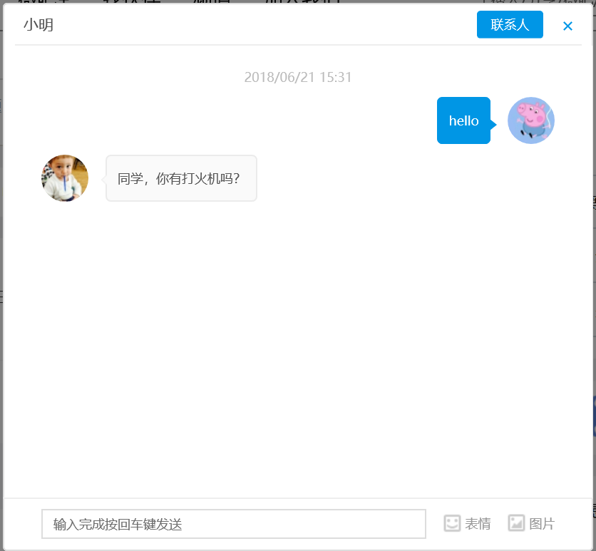

# 2015级项目实训成果展示 

## 《SmallWei网络社交平台》 - PHP与云计算技术

### 项目简介

通用社交框架，提供组织机构的内部使用，用于一些数据比较机密的场景。

### 优势·针对性

- 为适用于区域性用户需求，推出SmallWei综合社交网络平台。供特定组织，特定领域、特定人群的客户使用。
- 用户可以自主掌握所有数据，数据对于一个企业的重要性不言而喻。
- 用户可以实现自主管理，自主运营，不必再像传统社交平台开各种“会员”

### 项目地址

- GitHub：[https://github.com/Kongxiansheng/WeiWeiBo](https://github.com/Kongxiansheng/WeiWeiBo)

### 项目成员

- 孔令剑：负责团队管理&任务分配
- 田松岩：负责系统架构&核心开发
- 荣艳莎：UE、UI设计&前端开发
- 郭龙：系统架构&主要开发
- 张学钊：测试&部署运维

**效果截图**

