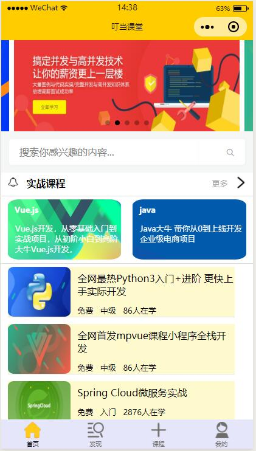
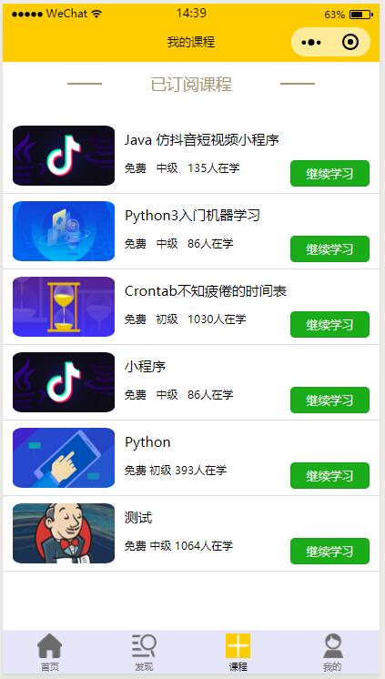
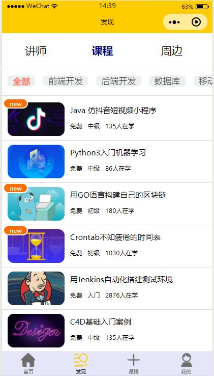
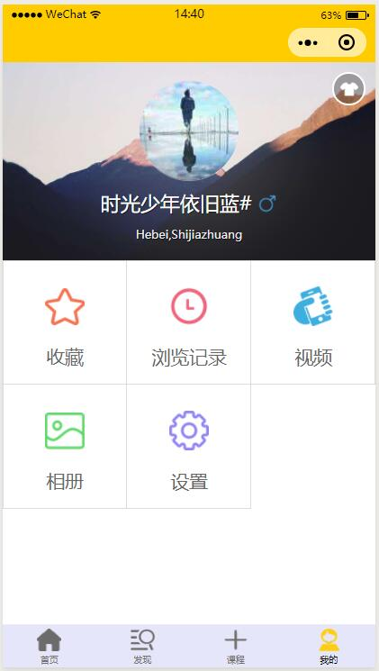

# 2015级项目实训成果展示 

## 《叮当课堂》 - PHP与云计算技术

### 项目简介

随着“互联网+”热潮的来袭，社会在教育方面越来越重视，因此我们开发出一款“互联网+教育”的产品——《叮当课程》，《叮当课堂》是一款教育类小程序，它的主要人群是大学教师和大学生， 它的主要功能是上传、收藏、在线播放学习视频。该小程序里边有着当下比较火爆的网络课程，学生可根据自己的个人兴趣观看，并且也会根据课程的内容进行分类以及检索功能，让用户能够快速地查找到自己心仪的课程。这个小程序最大的亮点是在于不管是老师还是学生，都可以上传自己的视频，所以的用户都可以观看留言，在线交流彼此的心得体会，来获得更加全面的知识。 

### 项目地址

GitHub：[https://github.com/jikangxin/demo.git](https://github.com/jikangxin/demo.git)

### 项目成员

- 组长：冀康鑫
- 成员：杨雨晴、苑旭蒙、石雨辰、李佳晨

### 开发分工

- 冀康鑫：负责编写编写前台代码，维护和整合；
- 杨雨晴：负责编写后台代码，数据库的维护；
- 苑旭蒙：负责编写前台部分代码和维护，开发文档；
- 石雨辰：负责编写后台代码，数据库的维护；
- 李佳晨：负责编写前台部分代码和维护，前台原型界面功能

### 效果截图

