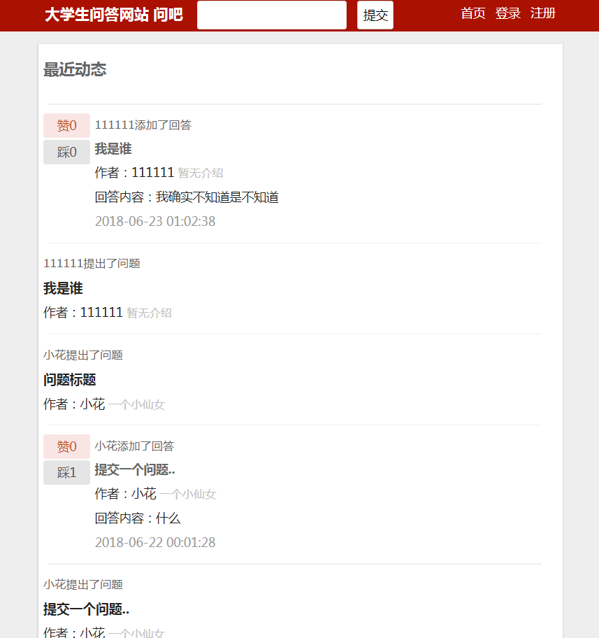
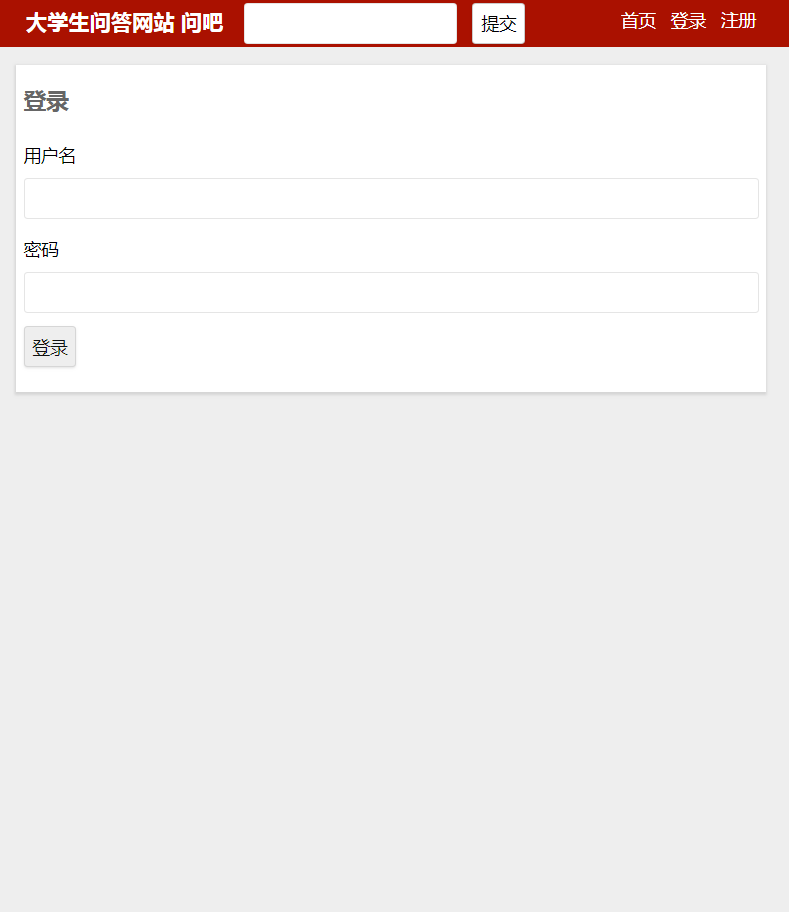
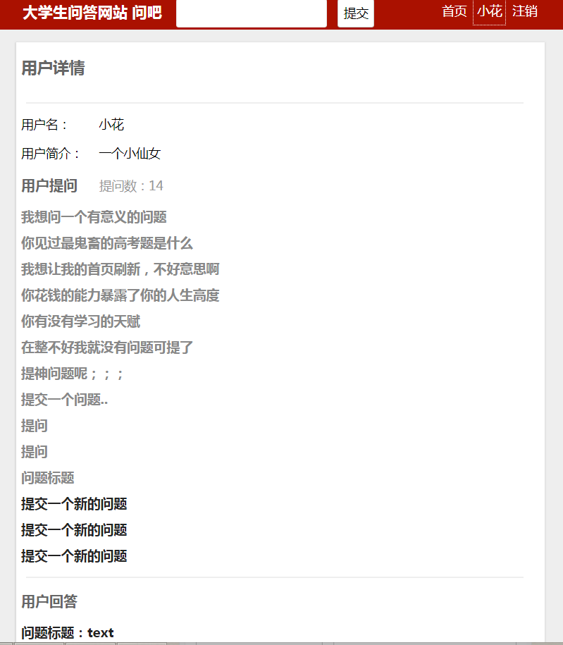
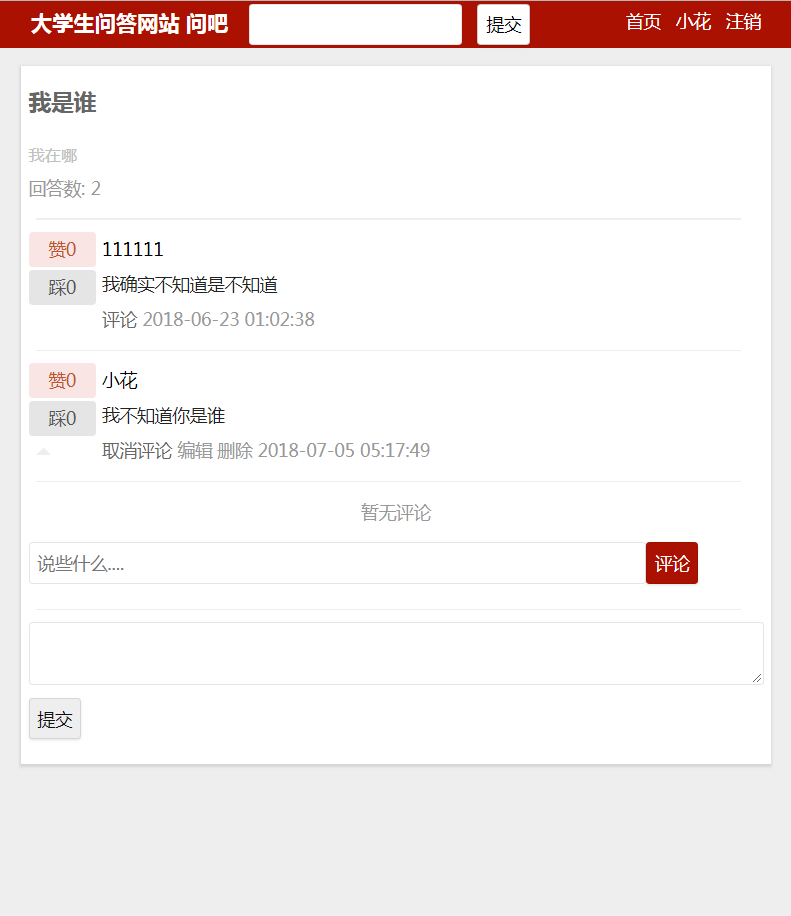
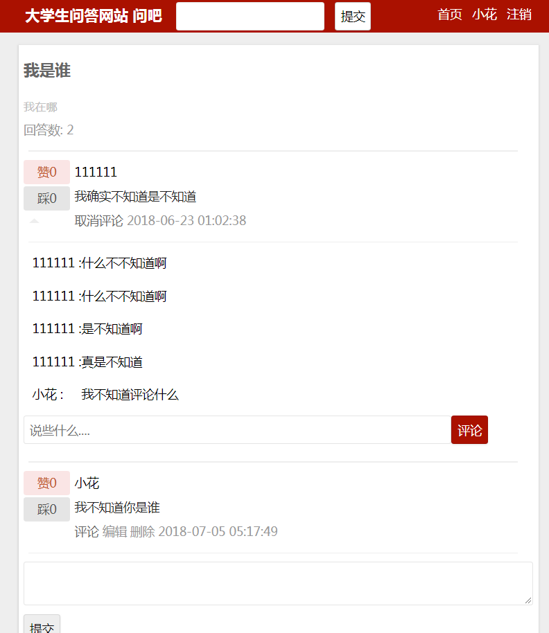
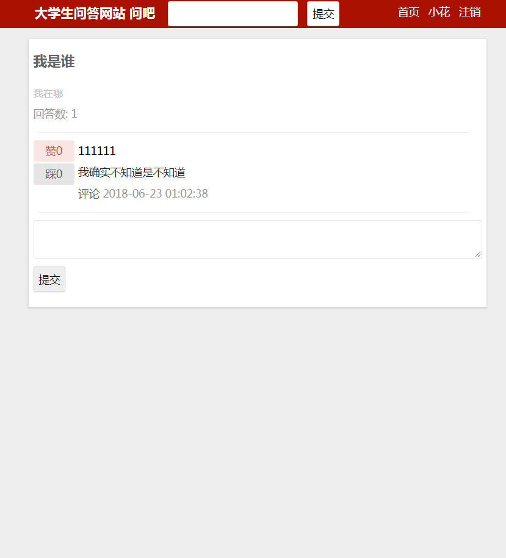

# 2015级项目实训成果展示 

## 《大学生问吧》 - PHP与云计算技术

### 项目简介

主要基于laravel、angular框架的面向大学生的在线问答网站 登录注册、实现了提问问题、回答问题、评论问题、点赞点踩。

### 项目地址

GitHub：[https://github.com/zhanghuizhen/bighomework](https://github.com/zhanghuizhen/bighomework)

### 项目成员和分工

- 张慧珍：登录注册功能、提问问题、修改问题
- 刘鹏：数据库的设计与创建、回答问题、修改回答
- 王源：评论问题
- 董怀京：点赞点踩

### 效果截图

