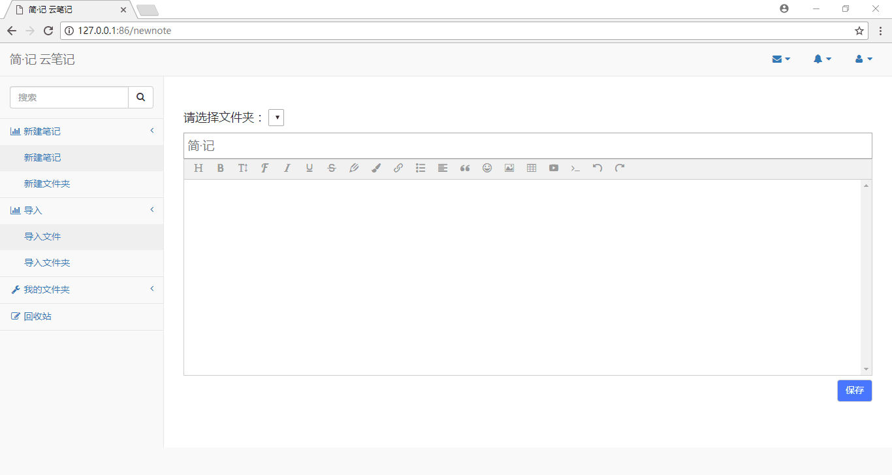
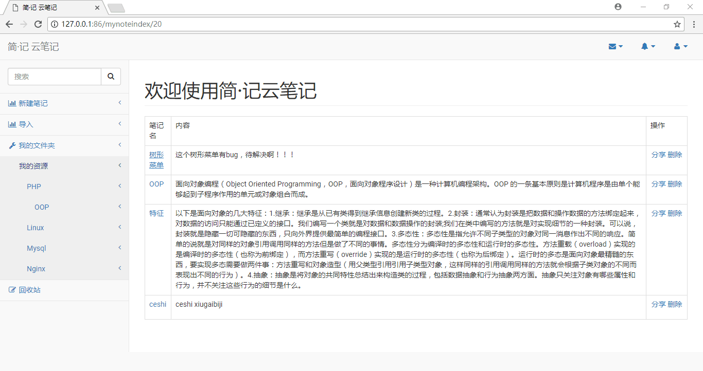
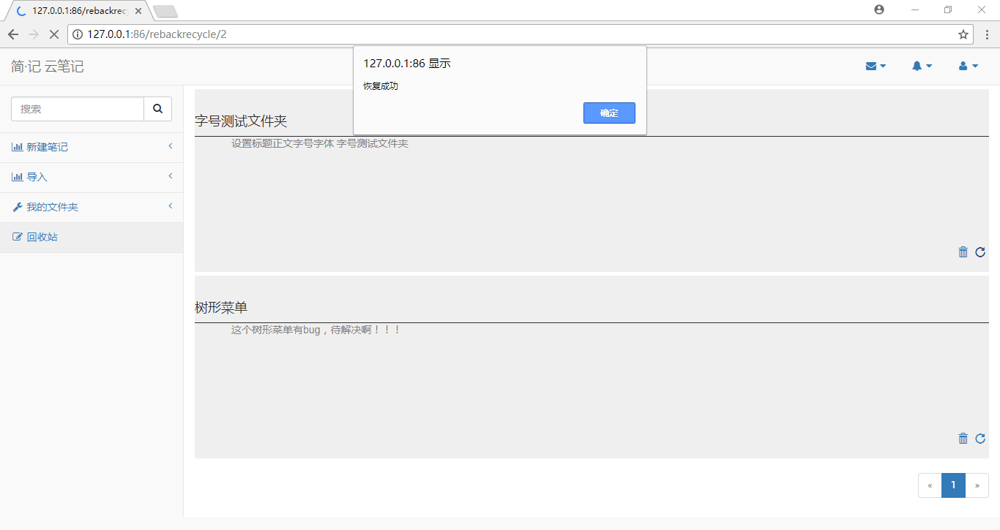

# 2015级项目实训成果展示 

## 《简-记云笔记》 - PHP与云计算技术

### 项目简介

简记云笔记实现 用户模块中的用户登录、注册，笔记模块下的新建笔记、新建文件夹、查看笔记、修改笔记、删除笔记（放入回收站）和永久删除（从回收站中删除）、搜索（存在问题）

### 项目地址

GitHub：[https://github.com/201506dongzehao/easywrite](https://github.com/201506dongzehao/easywrite)

### 项目成员

- 董泽浩：简记用户模块，笔记模块下的新建、查看修改，前台渲染
- 王春江：简记笔记模块的删除，简记后台管理系统
- 王雨鹤：前端页面设计
- 马倩：前端页面设计

### 效果截图

