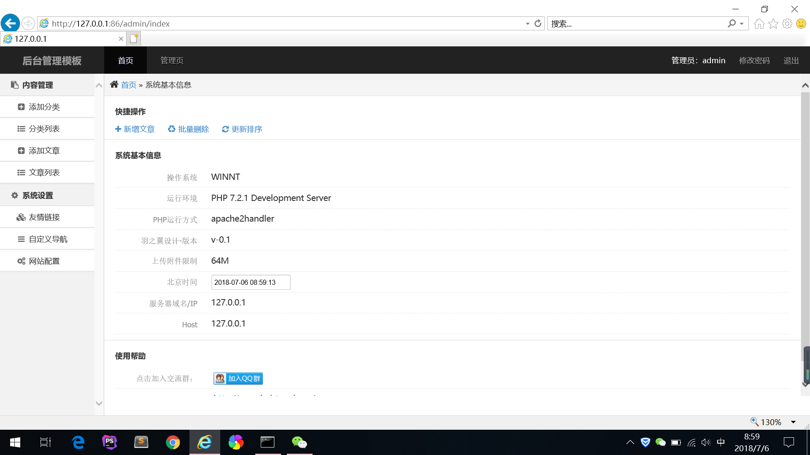
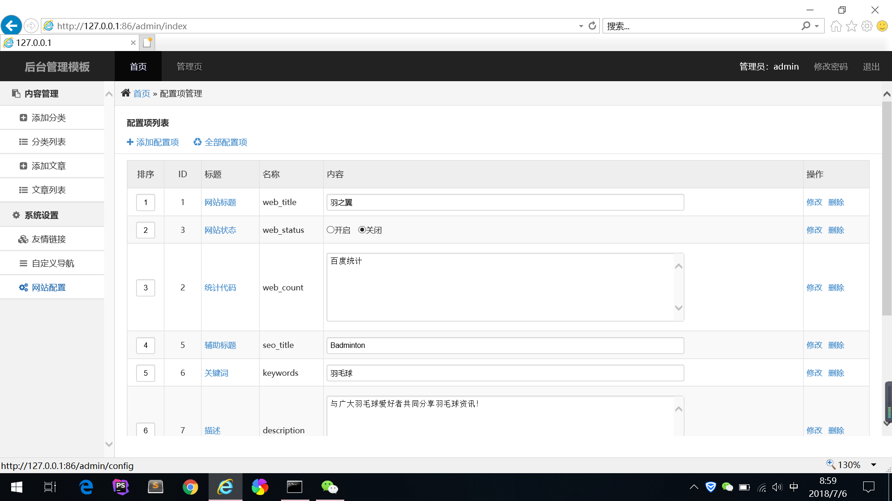
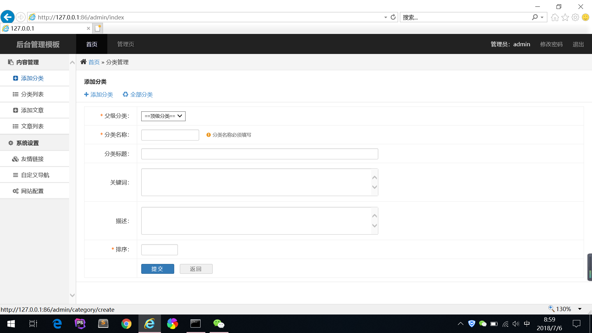
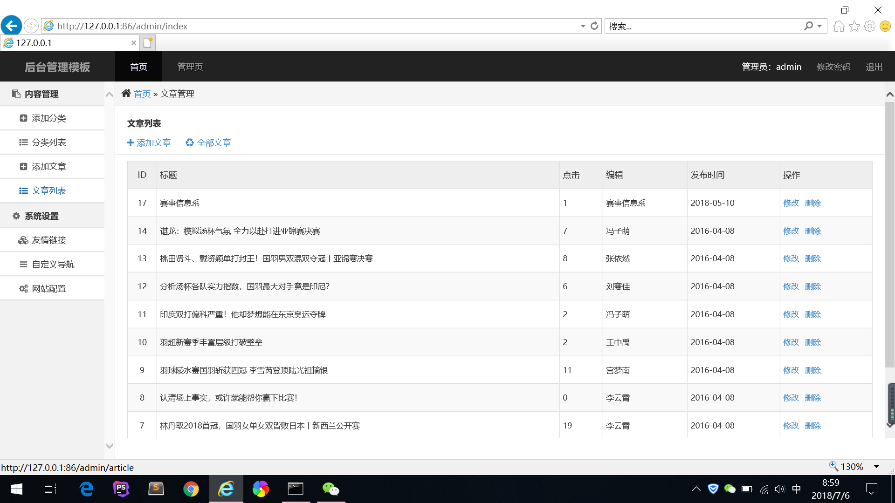
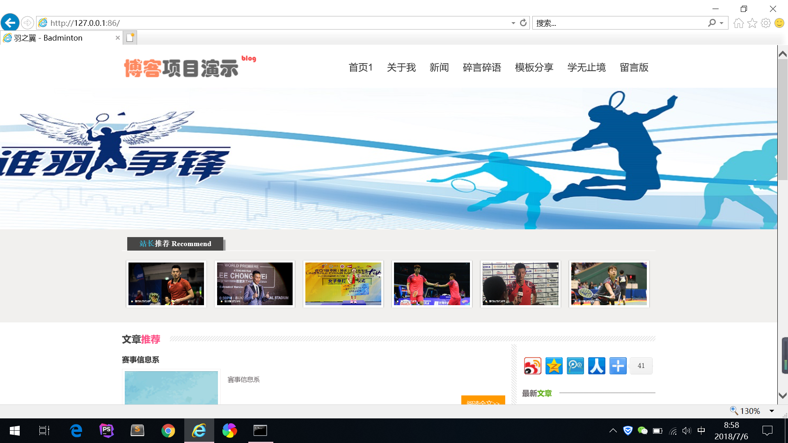

# 2015级项目实训成果展示 

## 《羽之翼》 - PHP与云计算技术

### 项目简介

羽之翼网站是一个以羽毛球为主要载体的网站。该网站提供了各种羽毛球相关信息，为广大羽毛球爱好者提供一个专门的羽毛球信息网站，不再需要从各种网站上搜集板块信息，更加方便。后台提供了管理员登录，管理文章，对其进行添加编辑删除操作。同时网站提供了其他网站的友情链接，还有第三方分享。 

### 项目地址

GitHub：[https://github.com/FengZimeng/blog](https://github.com/FengZimeng/blog)

### 项目成员

宫梦南、李云霄、冯梓萌、刘赛佳、张依然

### 项目分工 

- 刘赛佳，张依然：前端页面，文章模块，配置模块 
- 李云霄：数据库设计维护
- 宫梦南：后台文章管理功能设计
- 冯梓萌：用户管理功能以及后台其他细节设计

### 效果截图

