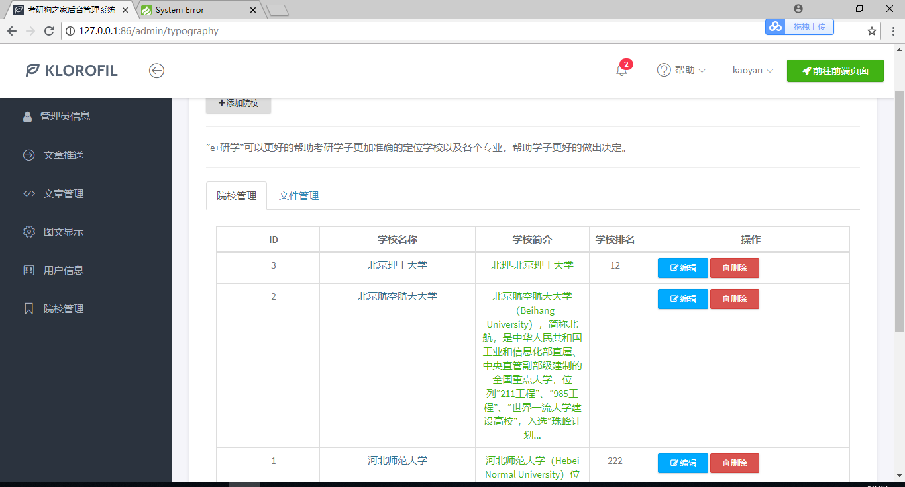
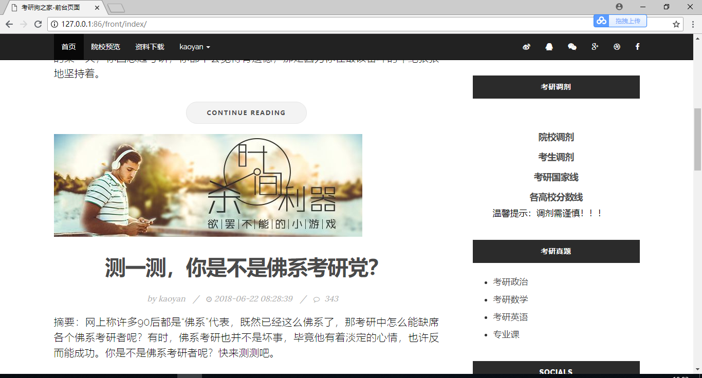
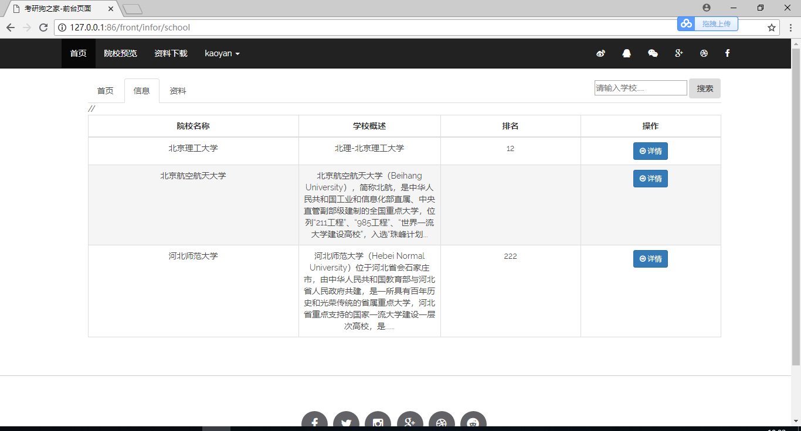
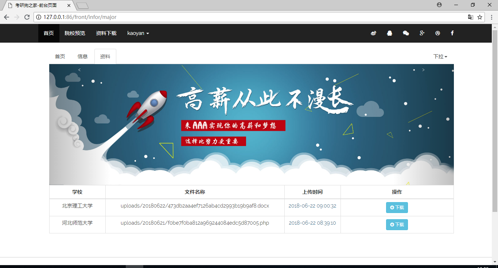
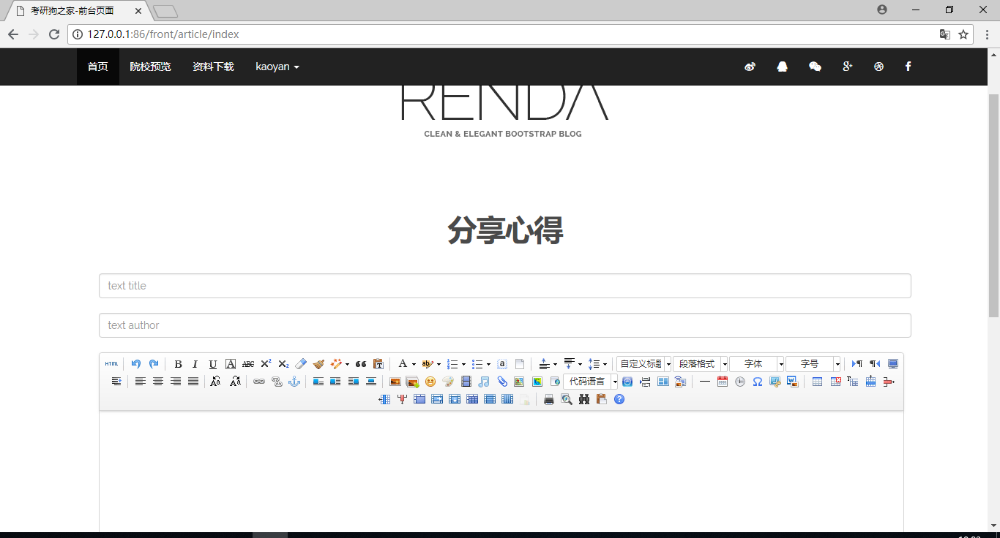
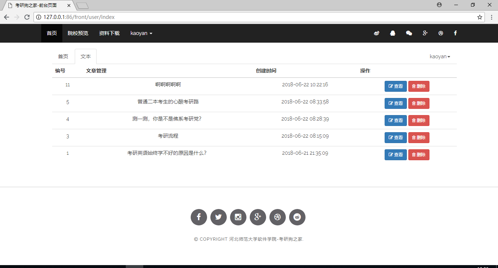
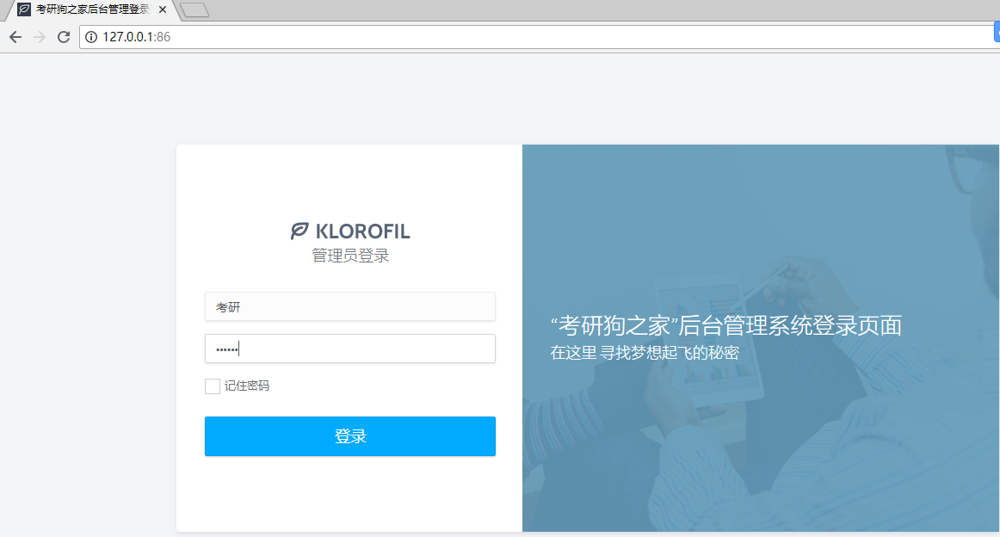
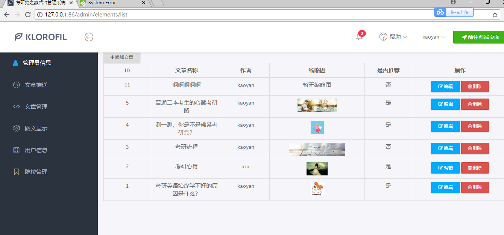
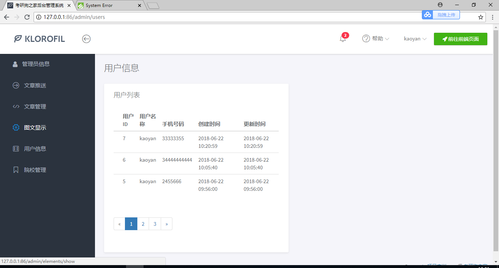

# 2015级项目实训成果展示 

## 《考研狗之家》 - PHP与云计算技术

### 项目简介

针对考研大学生提供的文章，笔记分享，资讯，考研经验分享的网站。 以考研学习的内容为主。设计不追求功能复杂，仅仅是做最核心的功能。

### 项目地址

GitHub：[https://github.com/weijianzidu/kaoyangou](https://github.com/weijianzidu/kaoyangou)

### 项目成员

田媛、许彩霞、田会会、孟冰冰、李金玉

### 项目分工

- 田媛、许彩霞：前端页面设计，AJAX交互设计。
- 李金玉：后台管理员所登录的界面设计
- 田会会、孟冰冰：后台PHP的程序编写，用于提供JSON数据的API。

### 效果截图

