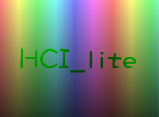
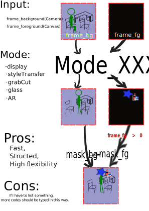
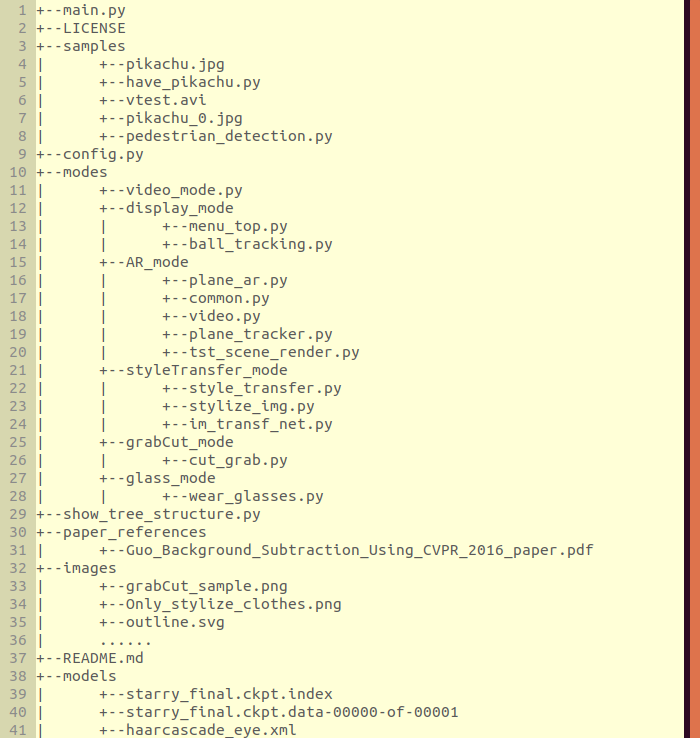

# 2015级项目实训成果展示 

## 《HCI_lite》 - Python与机器学习



__Description__: A lite human computer interaction system, mainly dependent on you 'handler' in your webcam, including 5 modes which are illustrated simplicitly behind.

__Members__:

+ 郑鹏:
  + Role: coder, tester, cleaner, and buger\doge.
  + E-mail: 15732115701@163.com
  + Github site: [https://github.com/ZhengPeng7/HCI_lite](https://github.com/ZhengPeng7)(Don't be mean about your stars, hiahia.)

__Github__: [https://github.com/ZhengPeng7/HCI_lite](https://github.com/ZhengPeng7/HCI_lite)

__Duration__:

> |                           Progress                           | Start Date | Deadline  |
> | :----------------------------------------------------------: | :--------: | :-------: |
> | Building basic video flow frame skeleton, including controller tracking, controller tailing... |  5/9/2018  | 5/9/2018  |
> |                     Appending top menu.                      | 5/10/2018  | 5/10/2018 |
> |        Inserting real time image_style_transfer mode.        | 5/10/2018  | 5/11/2018 |
> |  Implementing clothes region extraction for styleTransfer.   | 5/11/2018  | 5/12/2018 |
> | Implementing formula evaluation: integerate my own dataset for training Lenet to do single character recognition, split the handwritten expression, then evaluate it. | 5/13/2018  | 5/14/2018 |
> |              Finishing sunglasses wearing mode.              | 5/14/2018  | 5/15/2018 |
> |      Refining my documents and improving the stability.      | 5/13/2018  |    ...    |
> |                    __Development SumUp__                     | 5/10/2018  | 5/15/2018 |
> |    Substitude '__grabCut__' for '__formula_evaluation__'     |  6/6/2018  | 6/6/2018  |
> |                           AR mode                            |  6/7/2018  | 6/7/2018  |


### Outline


### Project Structure




### Mode

- #### Guide:

```python3
video mode setting: {
    "display": Random colors, While ink would fade, like tails,
    "styleTransfer": Stylize the whole input from webcam or only your clothes,
    "grabCut": Move you from the whole scene to a new video,
    "glass": Help you wear a pair of glasses,
    "AR": Build a roof on the plane you choose,
}
```

### __Overall__


- ### Display mode:

  __Algorithms__: Nothing is worth mention. I hoped to use hands as the controllers so that I can use the gestures to do many things. However, my little thinkpad with a Geforce 940m GPU doesn't approve of my suggestion..., and I bumped into the final controller idea in [Adrian Rosebrock's blog](https://www.pyimageearch.com/2015/09/14/ball-tracking-with-opencv/).

- ### StyleTransfer mode:

  __Algorithm__: [Clarification by the team of my roommates](https://github.com/yanzhengbin/Neural_Style_Transform)

1. #### Whole input is stylized except my body:

   __Algorithms:__ [HSL Color Space](https://en.wikipedia.org/wiki/HSL_and_HSV#From_HSL), [Basic Morphology operations](https://docs.opencv.org/3.0-beta/doc/py_tutorials/py_imgproc/py_morphological_ops/py_morphological_ops.html), etc.

2. #### Only clothes stylized:

   __Algorithms:__ [Background Substraction (LSBP)](http://opencv-python-tutroals.readthedocs.io/en/latest/py_tutorials/py_video/py_bg_subtraction/py_bg_subtraction.html), [HSL Color Space](https://en.wikipedia.org/wiki/HSL_and_HSV#From_HSL)


- ### ~~Simple Formula Evaluation(Removed):~~

  ​	~~Concerning my laptop thinkpad-t450 with i5-5200U and Geforce 940m... I used Lenet. to recognize each single character(coz this is only a very **simple** formula evaluation, I only took some basic operations into account.)~~

  > ~~The shuffled dataset consists of [MNIST](http://yann.lecun.com/exdb/mnist/) and [handwrittenMathSymbol](https://www.kaggle.com/xainano/handwrittenmathsymbols/). BTW, if you're interested in recognizing a complex mathematic expression, take a look at the MathSymbol dataset, which is from a this kind of competition on Kaggle.~~

  1. ~~The well-trained MobileNetV2:~~
  2. ~~Then I just split the formula horizontally, just like what I did in the [VehicleLicensePlateRecognition](https://github.com/ZhengPeng7/Vehicle_License_Plate_Recognition).~~
  3. ~~Afterwards, recognize each single character.~~
  4. ~~Finally, evaluate the stitched string.~~

- ### Figure Extraction:

  ​	__Algorithm__: [grabCut](http://www.cad.zju.edu.cn/home/gfzhang/course/computational-photography/proj1-grabcut/grabcut.html).

  ​	__Extension__: [Mask-RCNN](https://github.com/matterport/Mask_RCNN)

- ###  Glass mode:

  __Algorithms:__ [Haarcascade](https://docs.opencv.org/trunk/d7/d8b/tutorial_py_face_detection.html).

- ### AR of building roof on a plane

  >  Modified from [plane_ar sample in opencv](https://github.com/opencv/opencv/blob/master/samples/python/plane_ar.py)

  __Algorithms:__ [3d_calibration](https://docs.opencv.org/2.4/modules/calib3d/doc/camera_calibration_and_3d_reconstruction.html#solvepnp).


### TODO:

+ Use [Openpose](https://github.com/CMU-Perceptual-Computing-Lab/openpose) to estimate my poseture, especially the hands.
+ Modify the roof in AR mode into a more general object, such as an image or a video.
+ Yet, __above all__, get a fairly good computer with a camera. 