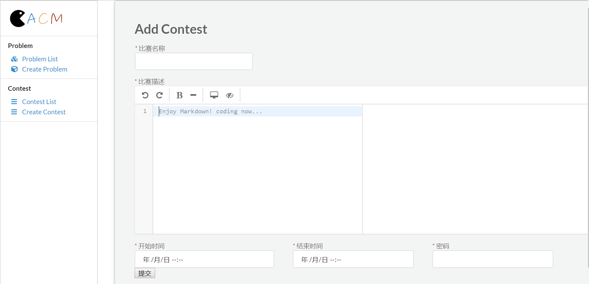
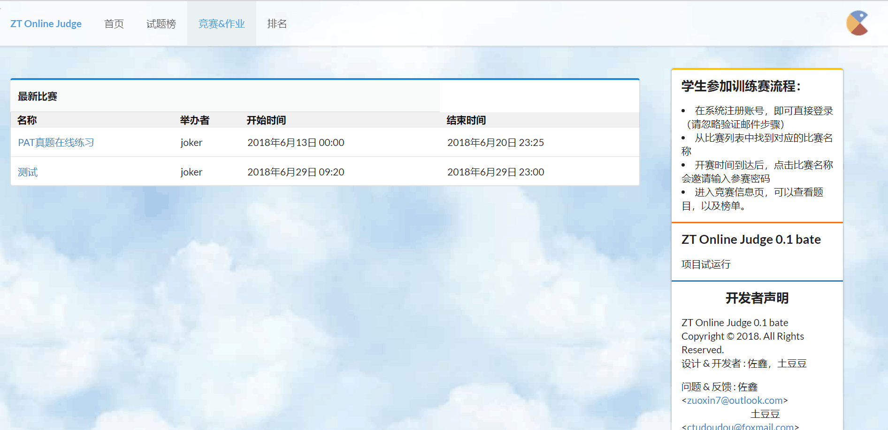
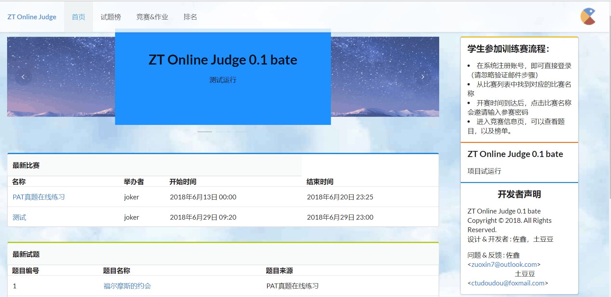
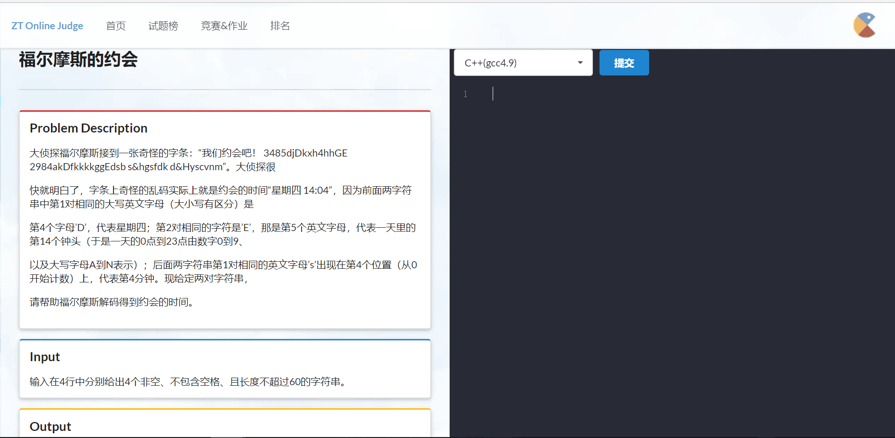

# 2015级项目实训成果展示 

## 《ZT Online Judge 》 - Python与机器学习

github地址：https://github.com/ctudoudou/ZTOJ

### 项目简介

该项目是面向在校大学生和指导老师使用的在线评测网站。应用了基于docker的底层虚拟化技术，和对Redis消息队列系统的应用，并使用了tornado进行中间件的开发,项目的前后台是基于django开发，使用了semantic UI作为前端开发。项目应用于在线编程训练、以小组形式进行考试、比赛。该系统可以编译和执行代码，并使用预先构建的数据对其进行测试。提交的代码可能会受限制运行，包括时间限制，内存限制，安全限制等。代码的输出将被系统捕获，并与标准输出进行比较。系统将返回结果。

### 项目成员

佐鑫  曹国鸿

### 项目截图

