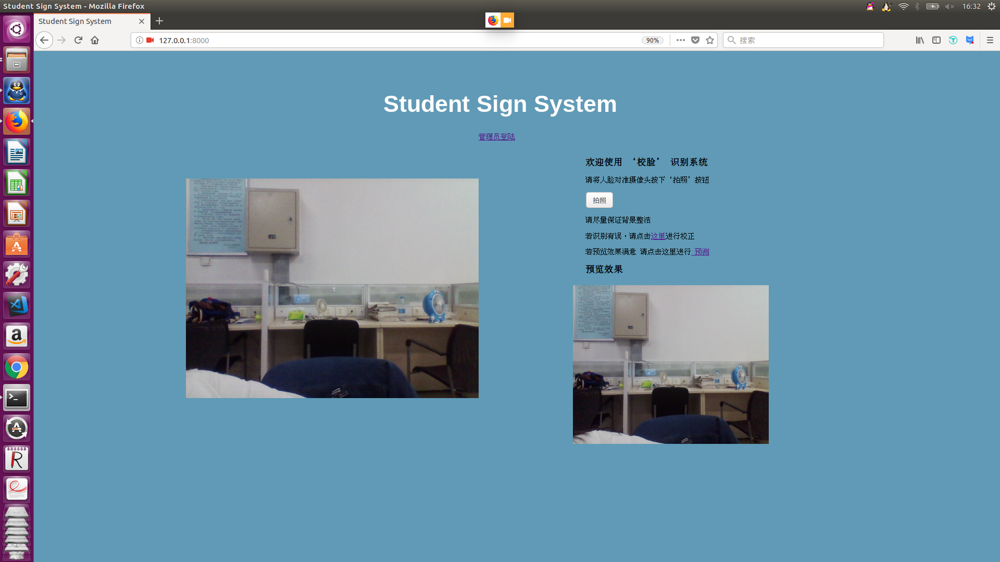
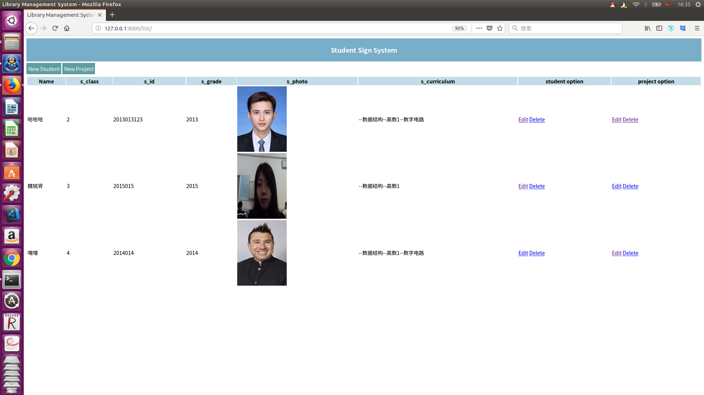

# 2015级项目实训成果展示 

## 《人脸识别签到系统》 - Python与机器学习

-  Github：[https://github.com/YangXueshu/18-Face_Recognition](https://github.com/YangXueshu/18-Face_Recognition)

### 项目简介

​	在大学生活中,课堂点名是老师评判学生平时成绩的一部分,也是督促学生按时上课的驱动力。但大学往往采用大班教学,一堂课一般都有百人以上人数,老师们每节课点名都会占用很多时间,不点名又无法得知学生的到课情况。为了解决这一问题,增加课堂的有效利用时间,我们团队尝试编写一个‘人脸识别签到系统’。首先搭建并训练yolo模型以获得好的人脸检测能力，再通过face_recognition模型进行人脸比对。此系统将通过调用摄像头,动态拍摄前来上课的学生照片,并将照片与数据库中原有的学生照片做比对,如果比对通过,则签到成功,后台自动添加一条此学生的签到记录。

### 项目成员信息

|成员姓名	|	角色		|	  邮箱		|			个人github地址|
|:---:|:---:|:---|:---|
| 魏铭潇|组长		|409691560@qq.com		|https://github.com/Salt-wmx|
|杨学淑|组员		|554557057@qq.com		|https://github.com/YangXueshu|
|陈亚楠|组员		|1970225568@qq.com		|https://github.com/chenyanancyn|

### 项目截图

#### 主页展示

#### 拍照效果

#### 人脸预测

#### 后台登录

#### 数据库展示

#### 签到成功信息

#### 将学生信息添加至数据库

