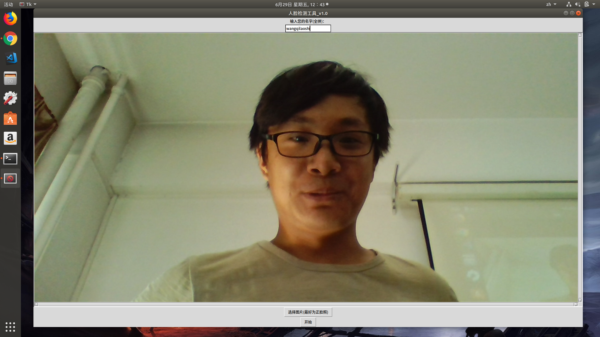
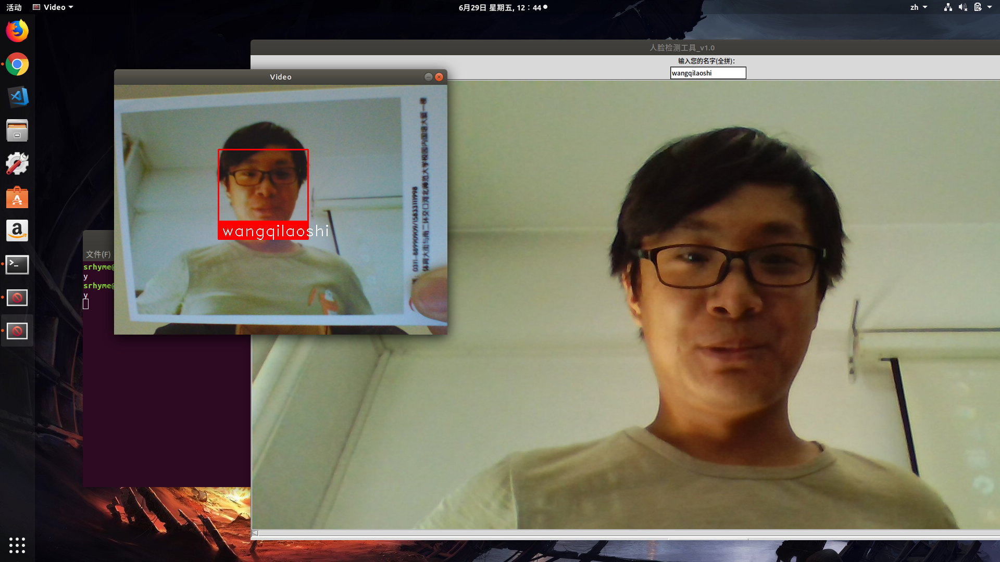
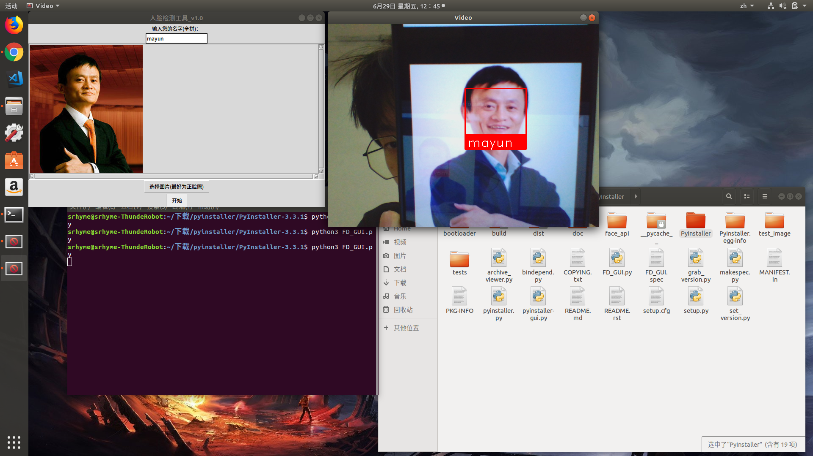
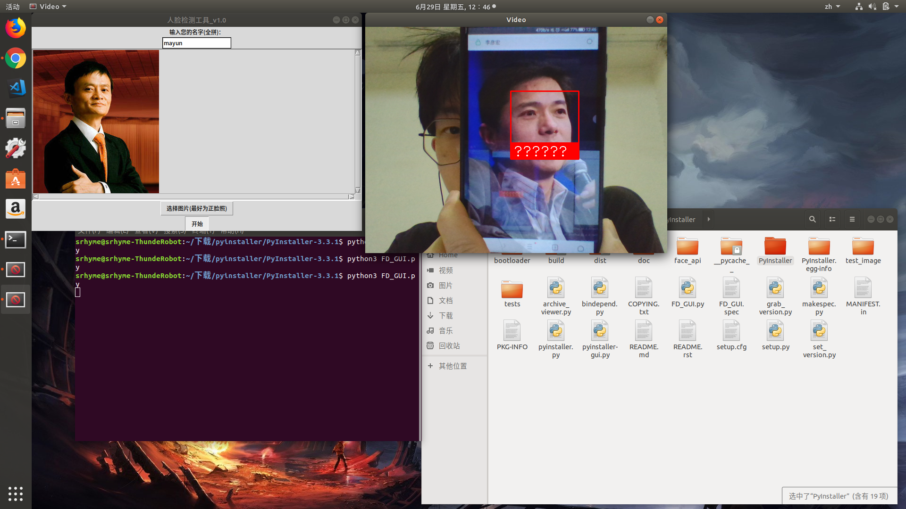
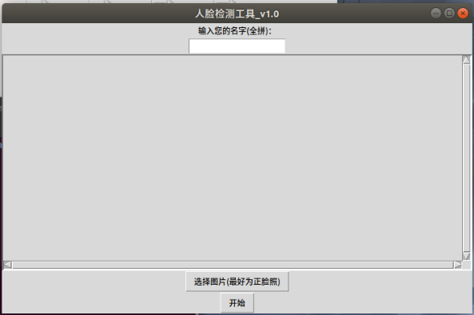

# 2015级项目实训成果展示 

## 《Face-Detection 全脸检测与识别系统》 - Python与机器学习

### 项目简介

**Face-Detection 全脸检测与识别系统**是一个主要利用深度学习分析比较人脸视觉特征信息进行身份鉴别的人脸识别系统。

Face-Detection 全脸检测与识别系统是对各种人脸识别库，例如face_recognition、opencv、tkinter等模块的深入了解和综合利用，通过face_recognition、opencv库对人脸库的训练实现了基本的人脸检测和人脸识别功能，通过tkinter模块实现了系统GUI的图形界面，具体过程是通过对训练的人脸的特征模型进行保存，然后对用户提供的一张测试照片进行识别，找到图片库中和测试图片最像的图，返回相关信息。

### 项目成员

* 张宝奇 (项目经理，算法开发) 
    * Email: <578392883@qq.com>
    * Github : [https://github.com/zh-bq](https://github.com/zh-bq)
* 王书韵 (GUI设计，算法开发) 
    * Email: <1085532005@qq.com>
    * Github : [https://github.com/wangsy1](https://github.com/wangsy1)

### 运行效果

