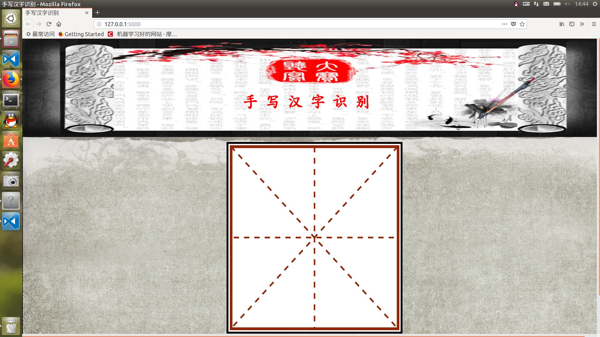
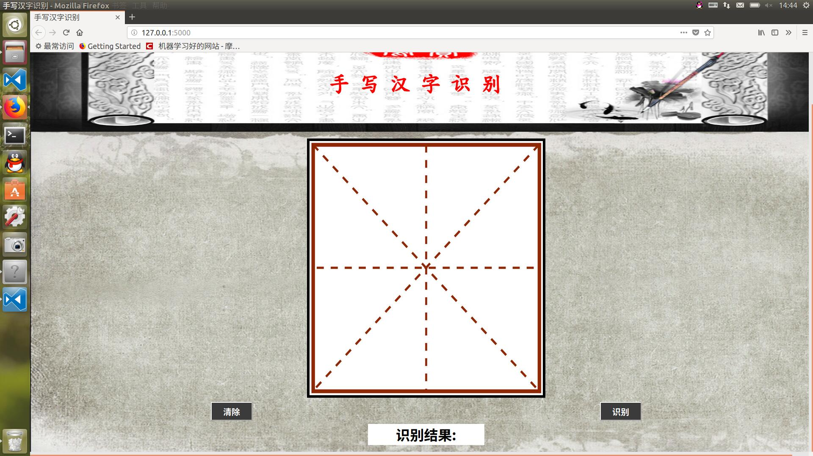
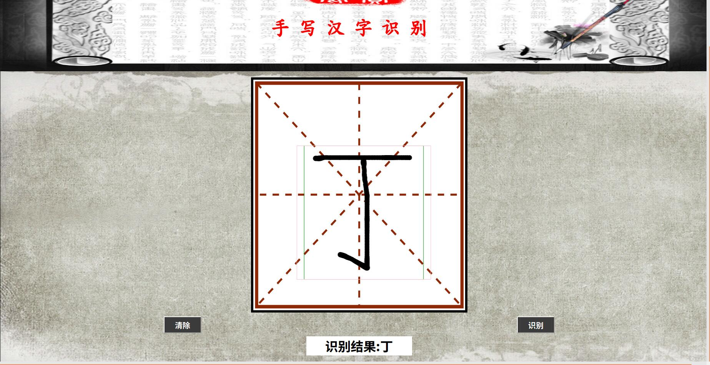
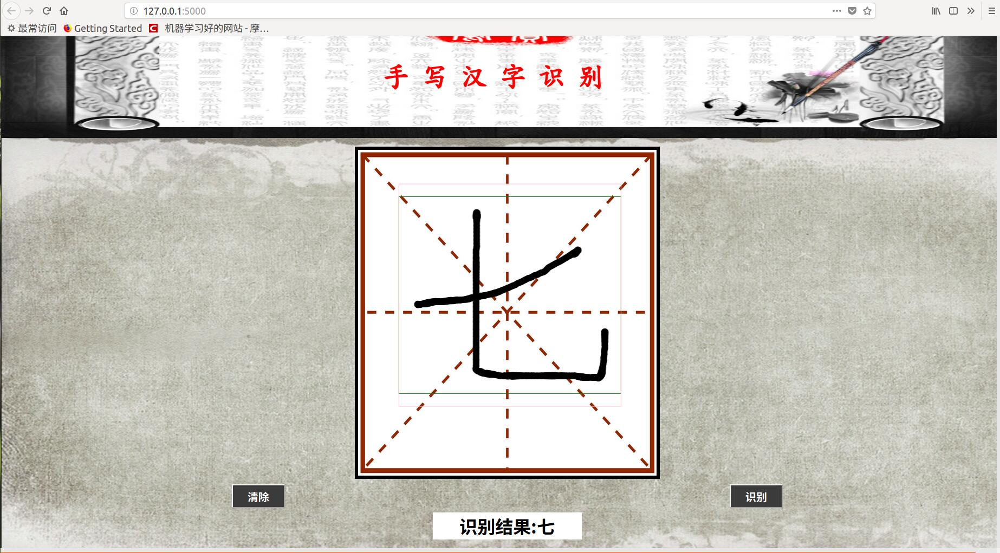
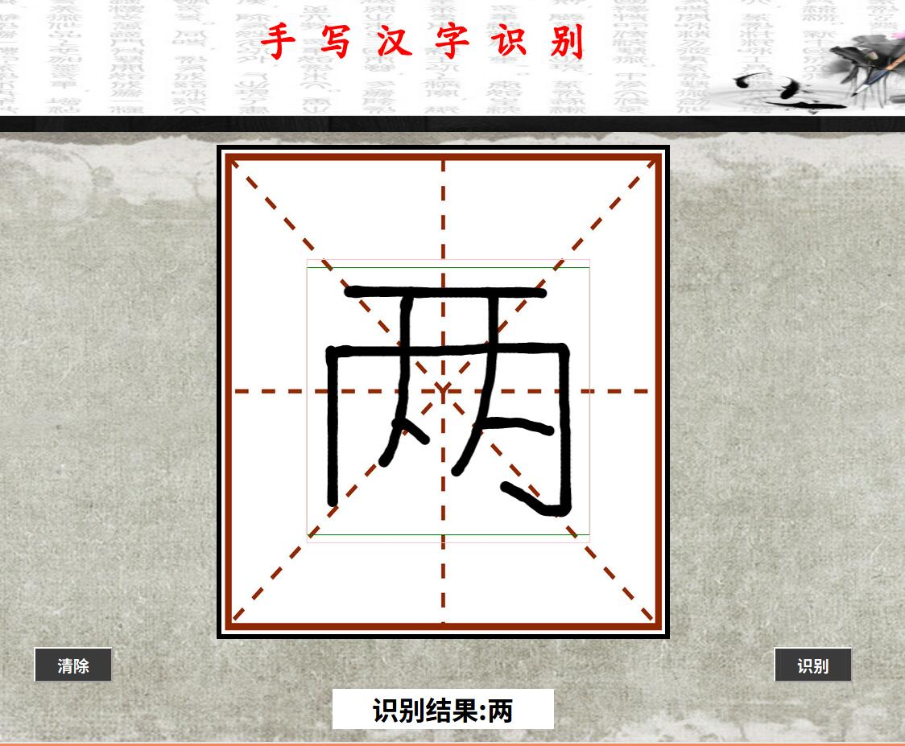
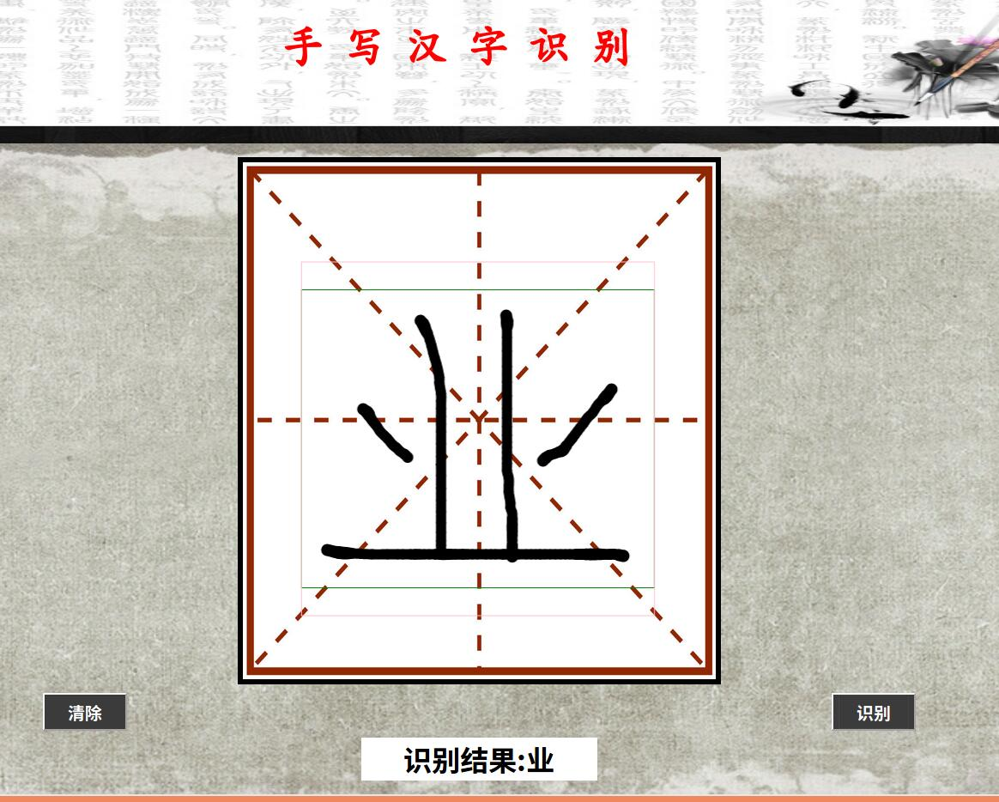
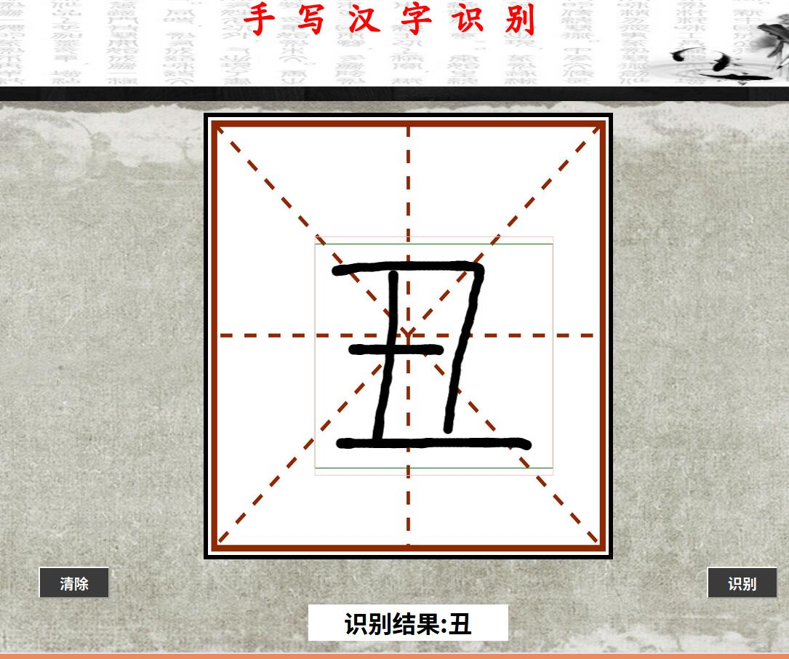
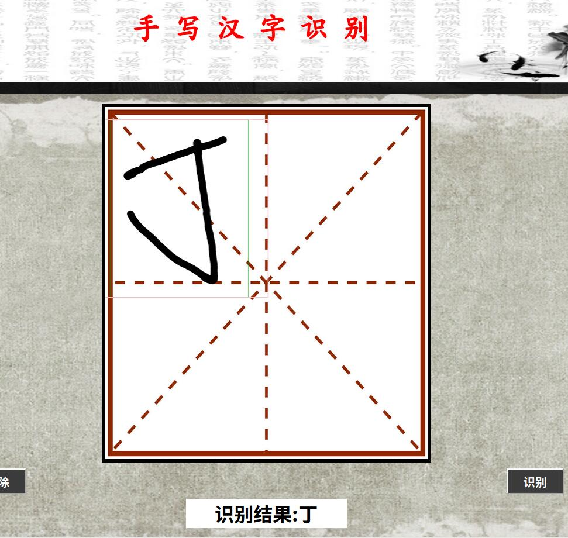
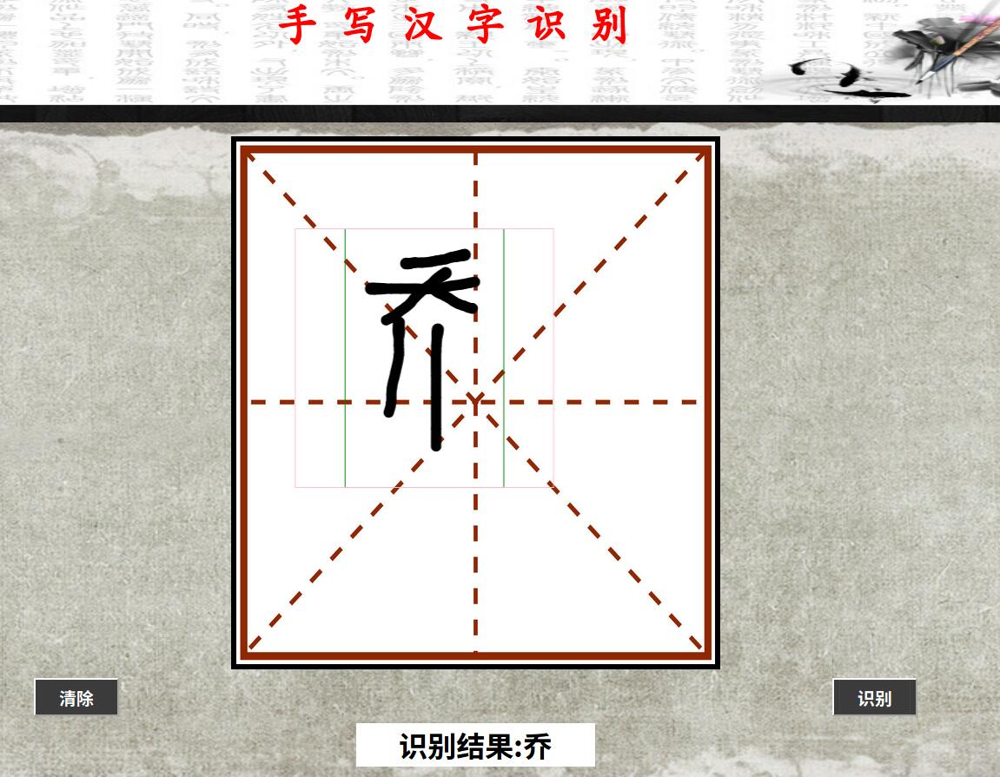
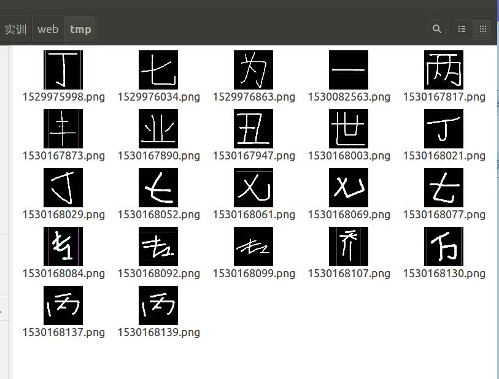

# 2015级项目实训成果展示 

## 《手写写汉字识别》 - Python与机器学习

* [Github](https://github.com/Chinesemodel) 
* [任务分配](https://github.com/Chinesemodel/chinese_model/blob/master/任务进度表.xlsx)

### 项目简介

**手写汉字识别**一个可以用鼠标在网站上书写汉字的平台,现如今各种输入法层出不穷，人们提笔忘字的几率也大大增加，这就产生了我们的手写汉字平台，可以让没事时间在纸上写字的人可以在电脑上写字。

### 项目成员

* 于淑新 (项目经理，产品，模型设计及模型开发) 
    * Email: <yushuxin1@foxmail.com>
    * Github : [https://github.com/Chinesemodel/chinese_model](https://github.com/Chinesemodel/chinese_model)
* 刘林微 (UI设计，客户端代码开发) 
    * Email: <1127644749@qq.com>
    * Github : [https://github.com/Chinesemodel/Chinese_model-liulinwei](https://github.com/Chinesemodel/Chinese_model-liulinwei)
### 项目截图

#### web界面

#### 运行效果

#### 生成的图片

